## 0.1 pitch type

### 0.1.1 pitch type (Pitchers throws RHP 2022)

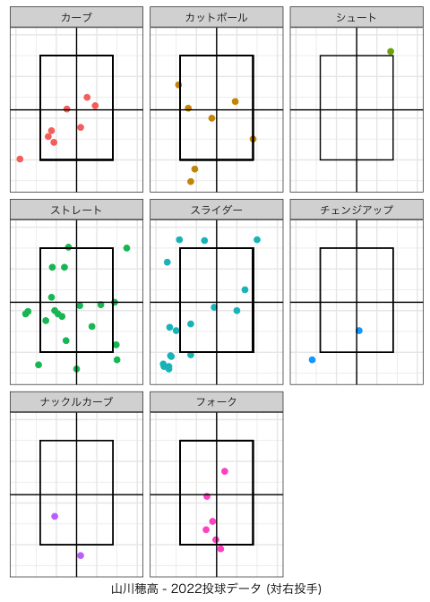

### 0.1.2 pitch type (Pitchers throws RHP 2021)

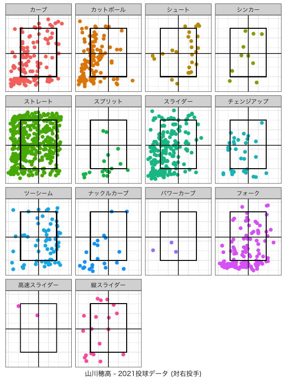

### 0.1.3 pitch type (Pitchers throws LHP 2022)

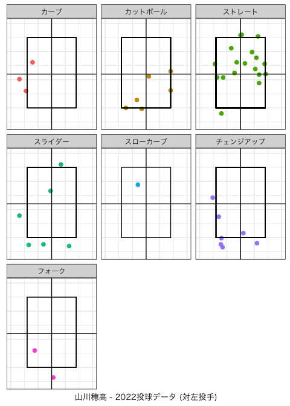

### 0.1.4 pitch type (Pitchers throws LHP 2021)

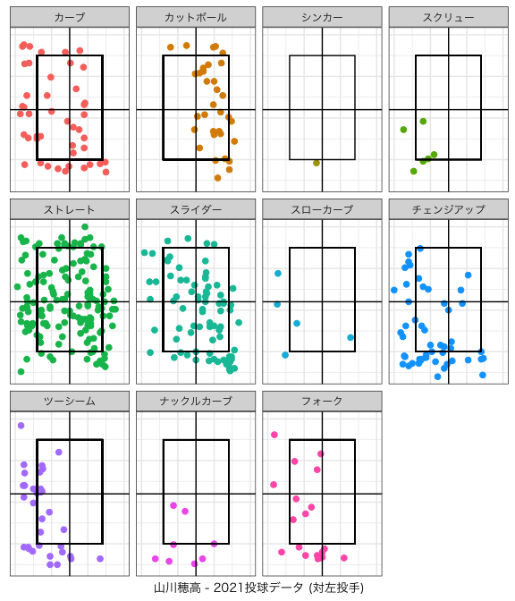

## 0.2 outcome

### 0.2.1 outcome (Pitchers throws RHP 2022)

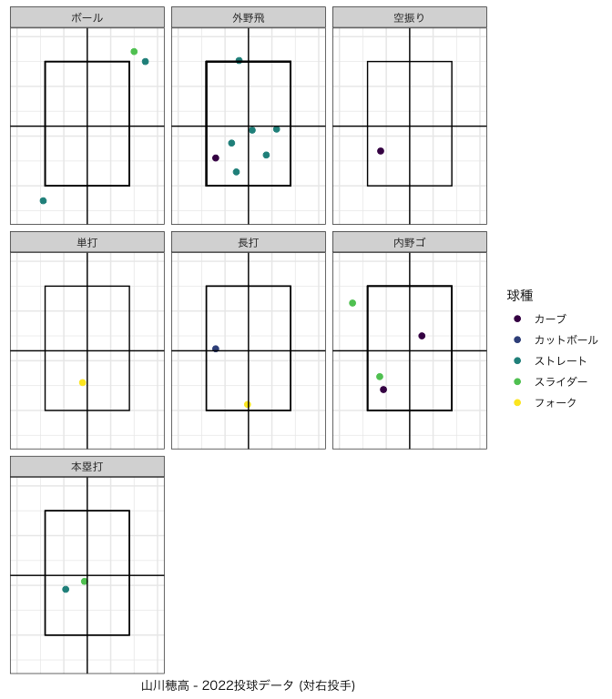

### 0.2.2 outcome (Pitchers throws RHP 2021)

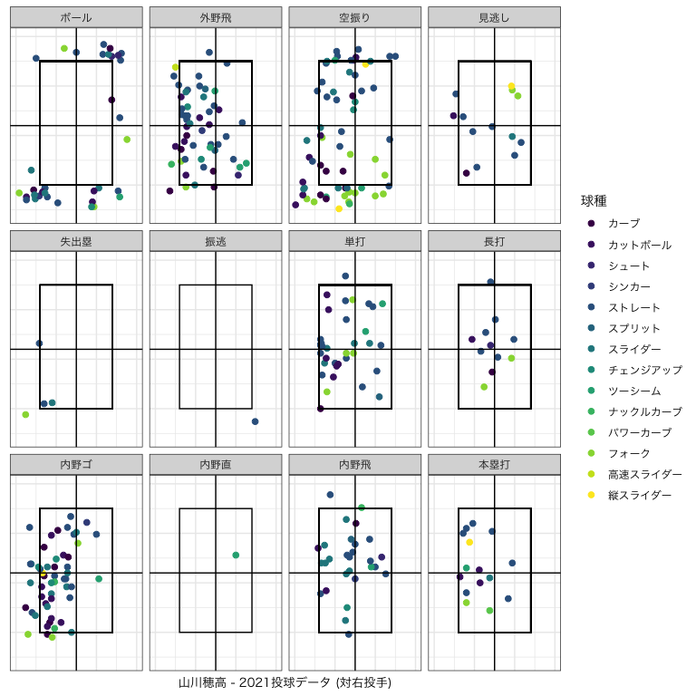

### 0.2.3 outcome (Pitchers throws LHP 2022)

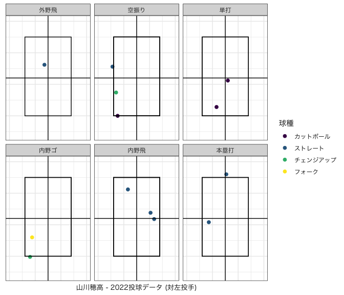

### 0.2.4 outcome (Pitchers throws LHP 2021)

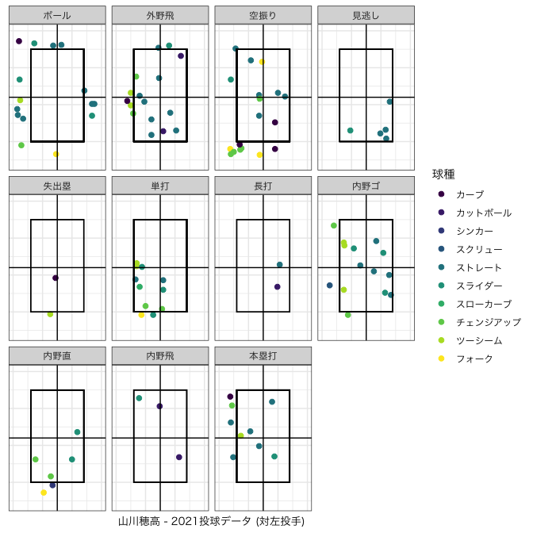

## 0.3 pitch data

### 0.3.1 swing & speed

<table>
<caption>2022</caption>
<thead>
<tr class="header">
<th style="text-align: left;"></th>
<th style="text-align: right;">swing (%)</th>
<th style="text-align: right;">contact (%)</th>
<th style="text-align: right;">swstr (%)</th>
<th style="text-align: right;">whiff (%)</th>
<th style="text-align: right;">球速(max)</th>
<th style="text-align: right;">球速(ave)</th>
<th style="text-align: right;">球速(min)</th>
</tr>
</thead>
<tbody>
<tr class="odd">
<td style="text-align: left;">カーブ</td>
<td style="text-align: right;">4.72</td>
<td style="text-align: right;">6.90</td>
<td style="text-align: right;">0.94</td>
<td style="text-align: right;">1.72</td>
<td style="text-align: right;">127</td>
<td style="text-align: right;">108.0</td>
<td style="text-align: right;">97</td>
</tr>
<tr class="even">
<td style="text-align: left;">カットボール</td>
<td style="text-align: right;">8.49</td>
<td style="text-align: right;">10.34</td>
<td style="text-align: right;">2.83</td>
<td style="text-align: right;">5.17</td>
<td style="text-align: right;">143</td>
<td style="text-align: right;">136.0</td>
<td style="text-align: right;">126</td>
</tr>
<tr class="odd">
<td style="text-align: left;">シュート</td>
<td style="text-align: right;">0.00</td>
<td style="text-align: right;">0.00</td>
<td style="text-align: right;">0.00</td>
<td style="text-align: right;">0.00</td>
<td style="text-align: right;">144</td>
<td style="text-align: right;">144.0</td>
<td style="text-align: right;">144</td>
</tr>
<tr class="even">
<td style="text-align: left;">ストレート</td>
<td style="text-align: right;">22.64</td>
<td style="text-align: right;">37.93</td>
<td style="text-align: right;">1.89</td>
<td style="text-align: right;">3.45</td>
<td style="text-align: right;">154</td>
<td style="text-align: right;">145.0</td>
<td style="text-align: right;">137</td>
</tr>
<tr class="odd">
<td style="text-align: left;">スライダー</td>
<td style="text-align: right;">4.72</td>
<td style="text-align: right;">5.17</td>
<td style="text-align: right;">1.89</td>
<td style="text-align: right;">3.45</td>
<td style="text-align: right;">143</td>
<td style="text-align: right;">129.5</td>
<td style="text-align: right;">125</td>
</tr>
<tr class="even">
<td style="text-align: left;">スローカーブ</td>
<td style="text-align: right;">0.94</td>
<td style="text-align: right;">1.72</td>
<td style="text-align: right;">0.00</td>
<td style="text-align: right;">0.00</td>
<td style="text-align: right;">102</td>
<td style="text-align: right;">102.0</td>
<td style="text-align: right;">102</td>
</tr>
<tr class="odd">
<td style="text-align: left;">チェンジアップ</td>
<td style="text-align: right;">4.72</td>
<td style="text-align: right;">3.45</td>
<td style="text-align: right;">2.83</td>
<td style="text-align: right;">5.17</td>
<td style="text-align: right;">135</td>
<td style="text-align: right;">132.0</td>
<td style="text-align: right;">118</td>
</tr>
<tr class="even">
<td style="text-align: left;">ナックルカーブ</td>
<td style="text-align: right;">0.94</td>
<td style="text-align: right;">1.72</td>
<td style="text-align: right;">0.00</td>
<td style="text-align: right;">0.00</td>
<td style="text-align: right;">116</td>
<td style="text-align: right;">116.0</td>
<td style="text-align: right;">116</td>
</tr>
<tr class="odd">
<td style="text-align: left;">フォーク</td>
<td style="text-align: right;">7.55</td>
<td style="text-align: right;">8.62</td>
<td style="text-align: right;">2.83</td>
<td style="text-align: right;">5.17</td>
<td style="text-align: right;">146</td>
<td style="text-align: right;">141.5</td>
<td style="text-align: right;">130</td>
</tr>
</tbody>
</table>

2022

<table>
<caption>2021</caption>
<thead>
<tr class="header">
<th style="text-align: left;"></th>
<th style="text-align: right;">swing (%)</th>
<th style="text-align: right;">contact (%)</th>
<th style="text-align: right;">swstr (%)</th>
<th style="text-align: right;">whiff (%)</th>
<th style="text-align: right;">球速(max)</th>
<th style="text-align: right;">球速(ave)</th>
<th style="text-align: right;">球速(min)</th>
</tr>
</thead>
<tbody>
<tr class="odd">
<td style="text-align: left;">カーブ</td>
<td style="text-align: right;">4.10</td>
<td style="text-align: right;">5.27</td>
<td style="text-align: right;">1.71</td>
<td style="text-align: right;">3.76</td>
<td style="text-align: right;">134</td>
<td style="text-align: right;">115.0</td>
<td style="text-align: right;">88</td>
</tr>
<tr class="even">
<td style="text-align: left;">カットボール</td>
<td style="text-align: right;">4.85</td>
<td style="text-align: right;">7.40</td>
<td style="text-align: right;">1.48</td>
<td style="text-align: right;">3.26</td>
<td style="text-align: right;">153</td>
<td style="text-align: right;">138.0</td>
<td style="text-align: right;">126</td>
</tr>
<tr class="odd">
<td style="text-align: left;">シュート</td>
<td style="text-align: right;">0.40</td>
<td style="text-align: right;">0.75</td>
<td style="text-align: right;">0.06</td>
<td style="text-align: right;">0.13</td>
<td style="text-align: right;">151</td>
<td style="text-align: right;">143.0</td>
<td style="text-align: right;">140</td>
</tr>
<tr class="even">
<td style="text-align: left;">シンカー</td>
<td style="text-align: right;">0.46</td>
<td style="text-align: right;">0.88</td>
<td style="text-align: right;">0.06</td>
<td style="text-align: right;">0.13</td>
<td style="text-align: right;">149</td>
<td style="text-align: right;">132.0</td>
<td style="text-align: right;">122</td>
</tr>
<tr class="odd">
<td style="text-align: left;">スクリュー</td>
<td style="text-align: right;">0.17</td>
<td style="text-align: right;">0.38</td>
<td style="text-align: right;">0.00</td>
<td style="text-align: right;">0.00</td>
<td style="text-align: right;">134</td>
<td style="text-align: right;">118.0</td>
<td style="text-align: right;">114</td>
</tr>
<tr class="even">
<td style="text-align: left;">ストレート</td>
<td style="text-align: right;">16.48</td>
<td style="text-align: right;">26.98</td>
<td style="text-align: right;">4.22</td>
<td style="text-align: right;">9.28</td>
<td style="text-align: right;">160</td>
<td style="text-align: right;">146.0</td>
<td style="text-align: right;">125</td>
</tr>
<tr class="odd">
<td style="text-align: left;">スプリット</td>
<td style="text-align: right;">0.40</td>
<td style="text-align: right;">0.63</td>
<td style="text-align: right;">0.11</td>
<td style="text-align: right;">0.25</td>
<td style="text-align: right;">141</td>
<td style="text-align: right;">139.0</td>
<td style="text-align: right;">134</td>
</tr>
<tr class="even">
<td style="text-align: left;">スライダー</td>
<td style="text-align: right;">7.41</td>
<td style="text-align: right;">10.54</td>
<td style="text-align: right;">2.62</td>
<td style="text-align: right;">5.77</td>
<td style="text-align: right;">146</td>
<td style="text-align: right;">130.0</td>
<td style="text-align: right;">104</td>
</tr>
<tr class="odd">
<td style="text-align: left;">スローカーブ</td>
<td style="text-align: right;">0.11</td>
<td style="text-align: right;">0.25</td>
<td style="text-align: right;">0.00</td>
<td style="text-align: right;">0.00</td>
<td style="text-align: right;">100</td>
<td style="text-align: right;">98.0</td>
<td style="text-align: right;">89</td>
</tr>
<tr class="even">
<td style="text-align: left;">チェンジアップ</td>
<td style="text-align: right;">2.39</td>
<td style="text-align: right;">3.26</td>
<td style="text-align: right;">0.91</td>
<td style="text-align: right;">2.01</td>
<td style="text-align: right;">142</td>
<td style="text-align: right;">130.0</td>
<td style="text-align: right;">112</td>
</tr>
<tr class="odd">
<td style="text-align: left;">ツーシーム</td>
<td style="text-align: right;">2.51</td>
<td style="text-align: right;">4.39</td>
<td style="text-align: right;">0.51</td>
<td style="text-align: right;">1.13</td>
<td style="text-align: right;">159</td>
<td style="text-align: right;">144.0</td>
<td style="text-align: right;">132</td>
</tr>
<tr class="even">
<td style="text-align: left;">ナックルカーブ</td>
<td style="text-align: right;">0.63</td>
<td style="text-align: right;">0.88</td>
<td style="text-align: right;">0.23</td>
<td style="text-align: right;">0.50</td>
<td style="text-align: right;">136</td>
<td style="text-align: right;">116.0</td>
<td style="text-align: right;">91</td>
</tr>
<tr class="odd">
<td style="text-align: left;">パワーカーブ</td>
<td style="text-align: right;">0.06</td>
<td style="text-align: right;">0.13</td>
<td style="text-align: right;">0.00</td>
<td style="text-align: right;">0.00</td>
<td style="text-align: right;">123</td>
<td style="text-align: right;">121.0</td>
<td style="text-align: right;">121</td>
</tr>
<tr class="even">
<td style="text-align: left;">フォーク</td>
<td style="text-align: right;">5.02</td>
<td style="text-align: right;">5.52</td>
<td style="text-align: right;">2.51</td>
<td style="text-align: right;">5.52</td>
<td style="text-align: right;">151</td>
<td style="text-align: right;">136.0</td>
<td style="text-align: right;">125</td>
</tr>
<tr class="odd">
<td style="text-align: left;">高速スライダー</td>
<td style="text-align: right;">0.06</td>
<td style="text-align: right;">0.13</td>
<td style="text-align: right;">0.00</td>
<td style="text-align: right;">0.00</td>
<td style="text-align: right;">133</td>
<td style="text-align: right;">131.5</td>
<td style="text-align: right;">130</td>
</tr>
<tr class="even">
<td style="text-align: left;">縦スライダー</td>
<td style="text-align: right;">0.40</td>
<td style="text-align: right;">0.38</td>
<td style="text-align: right;">0.23</td>
<td style="text-align: right;">0.50</td>
<td style="text-align: right;">143</td>
<td style="text-align: right;">132.0</td>
<td style="text-align: right;">123</td>
</tr>
</tbody>
</table>

2021

### 0.3.2 outcome

<table>
<caption>2022 全球割合(%)</caption>
<thead>
<tr class="header">
<th style="text-align: left;"></th>
<th style="text-align: right;">ファウル</th>
<th style="text-align: right;">ボール</th>
<th style="text-align: right;">外野飛</th>
<th style="text-align: right;">空振り</th>
<th style="text-align: right;">見逃し</th>
<th style="text-align: right;">単打</th>
<th style="text-align: right;">長打</th>
<th style="text-align: right;">内野ゴ</th>
<th style="text-align: right;">内野飛</th>
<th style="text-align: right;">本塁打</th>
</tr>
</thead>
<tbody>
<tr class="odd">
<td style="text-align: left;">カーブ</td>
<td style="text-align: right;">0.94</td>
<td style="text-align: right;">0.94</td>
<td style="text-align: right;">0.94</td>
<td style="text-align: right;">0.94</td>
<td style="text-align: right;">4.72</td>
<td style="text-align: right;">0.00</td>
<td style="text-align: right;">0.00</td>
<td style="text-align: right;">1.89</td>
<td style="text-align: right;">0.00</td>
<td style="text-align: right;">0.00</td>
</tr>
<tr class="even">
<td style="text-align: left;">カットボール</td>
<td style="text-align: right;">2.83</td>
<td style="text-align: right;">2.83</td>
<td style="text-align: right;">0.00</td>
<td style="text-align: right;">2.83</td>
<td style="text-align: right;">0.94</td>
<td style="text-align: right;">1.89</td>
<td style="text-align: right;">0.94</td>
<td style="text-align: right;">0.00</td>
<td style="text-align: right;">0.00</td>
<td style="text-align: right;">0.00</td>
</tr>
<tr class="odd">
<td style="text-align: left;">シュート</td>
<td style="text-align: right;">0.00</td>
<td style="text-align: right;">0.94</td>
<td style="text-align: right;">0.00</td>
<td style="text-align: right;">0.00</td>
<td style="text-align: right;">0.00</td>
<td style="text-align: right;">0.00</td>
<td style="text-align: right;">0.00</td>
<td style="text-align: right;">0.00</td>
<td style="text-align: right;">0.00</td>
<td style="text-align: right;">0.00</td>
</tr>
<tr class="even">
<td style="text-align: left;">ストレート</td>
<td style="text-align: right;">8.49</td>
<td style="text-align: right;">10.38</td>
<td style="text-align: right;">6.60</td>
<td style="text-align: right;">1.89</td>
<td style="text-align: right;">2.83</td>
<td style="text-align: right;">0.00</td>
<td style="text-align: right;">0.00</td>
<td style="text-align: right;">0.00</td>
<td style="text-align: right;">2.83</td>
<td style="text-align: right;">2.83</td>
</tr>
<tr class="odd">
<td style="text-align: left;">スライダー</td>
<td style="text-align: right;">0.00</td>
<td style="text-align: right;">13.21</td>
<td style="text-align: right;">0.00</td>
<td style="text-align: right;">1.89</td>
<td style="text-align: right;">3.77</td>
<td style="text-align: right;">0.00</td>
<td style="text-align: right;">0.00</td>
<td style="text-align: right;">1.89</td>
<td style="text-align: right;">0.00</td>
<td style="text-align: right;">0.94</td>
</tr>
<tr class="even">
<td style="text-align: left;">スローカーブ</td>
<td style="text-align: right;">0.94</td>
<td style="text-align: right;">0.00</td>
<td style="text-align: right;">0.00</td>
<td style="text-align: right;">0.00</td>
<td style="text-align: right;">0.00</td>
<td style="text-align: right;">0.00</td>
<td style="text-align: right;">0.00</td>
<td style="text-align: right;">0.00</td>
<td style="text-align: right;">0.00</td>
<td style="text-align: right;">0.00</td>
</tr>
<tr class="odd">
<td style="text-align: left;">チェンジアップ</td>
<td style="text-align: right;">0.94</td>
<td style="text-align: right;">2.83</td>
<td style="text-align: right;">0.00</td>
<td style="text-align: right;">2.83</td>
<td style="text-align: right;">0.94</td>
<td style="text-align: right;">0.00</td>
<td style="text-align: right;">0.00</td>
<td style="text-align: right;">0.94</td>
<td style="text-align: right;">0.00</td>
<td style="text-align: right;">0.00</td>
</tr>
<tr class="even">
<td style="text-align: left;">ナックルカーブ</td>
<td style="text-align: right;">0.94</td>
<td style="text-align: right;">0.94</td>
<td style="text-align: right;">0.00</td>
<td style="text-align: right;">0.00</td>
<td style="text-align: right;">0.00</td>
<td style="text-align: right;">0.00</td>
<td style="text-align: right;">0.00</td>
<td style="text-align: right;">0.00</td>
<td style="text-align: right;">0.00</td>
<td style="text-align: right;">0.00</td>
</tr>
<tr class="odd">
<td style="text-align: left;">フォーク</td>
<td style="text-align: right;">1.89</td>
<td style="text-align: right;">0.00</td>
<td style="text-align: right;">0.00</td>
<td style="text-align: right;">2.83</td>
<td style="text-align: right;">0.00</td>
<td style="text-align: right;">0.94</td>
<td style="text-align: right;">0.94</td>
<td style="text-align: right;">0.94</td>
<td style="text-align: right;">0.00</td>
<td style="text-align: right;">0.00</td>
</tr>
</tbody>
</table>

2022 全球割合(%)

<table>
<caption>2021 全球割合(%)</caption>
<thead>
<tr class="header">
<th style="text-align: left;"></th>
<th style="text-align: right;">ファウル</th>
<th style="text-align: right;">ボール</th>
<th style="text-align: right;">外野飛</th>
<th style="text-align: right;">空振り</th>
<th style="text-align: right;">見逃し</th>
<th style="text-align: right;">失出塁</th>
<th style="text-align: right;">振逃</th>
<th style="text-align: right;">単打</th>
<th style="text-align: right;">長打</th>
<th style="text-align: right;">内野ゴ</th>
<th style="text-align: right;">内野直</th>
<th style="text-align: right;">内野飛</th>
<th style="text-align: right;">本塁打</th>
</tr>
</thead>
<tbody>
<tr class="odd">
<td style="text-align: left;">カーブ</td>
<td style="text-align: right;">1.31</td>
<td style="text-align: right;">4.28</td>
<td style="text-align: right;">0.34</td>
<td style="text-align: right;">1.71</td>
<td style="text-align: right;">1.82</td>
<td style="text-align: right;">0.06</td>
<td style="text-align: right;">0.00</td>
<td style="text-align: right;">0.06</td>
<td style="text-align: right;">0.06</td>
<td style="text-align: right;">0.46</td>
<td style="text-align: right;">0.00</td>
<td style="text-align: right;">0.06</td>
<td style="text-align: right;">0.06</td>
</tr>
<tr class="even">
<td style="text-align: left;">カットボール</td>
<td style="text-align: right;">1.43</td>
<td style="text-align: right;">3.02</td>
<td style="text-align: right;">0.57</td>
<td style="text-align: right;">1.48</td>
<td style="text-align: right;">1.25</td>
<td style="text-align: right;">0.00</td>
<td style="text-align: right;">0.00</td>
<td style="text-align: right;">0.34</td>
<td style="text-align: right;">0.11</td>
<td style="text-align: right;">0.51</td>
<td style="text-align: right;">0.00</td>
<td style="text-align: right;">0.23</td>
<td style="text-align: right;">0.17</td>
</tr>
<tr class="odd">
<td style="text-align: left;">シュート</td>
<td style="text-align: right;">0.17</td>
<td style="text-align: right;">0.68</td>
<td style="text-align: right;">0.06</td>
<td style="text-align: right;">0.06</td>
<td style="text-align: right;">0.34</td>
<td style="text-align: right;">0.00</td>
<td style="text-align: right;">0.00</td>
<td style="text-align: right;">0.00</td>
<td style="text-align: right;">0.06</td>
<td style="text-align: right;">0.00</td>
<td style="text-align: right;">0.00</td>
<td style="text-align: right;">0.06</td>
<td style="text-align: right;">0.00</td>
</tr>
<tr class="even">
<td style="text-align: left;">シンカー</td>
<td style="text-align: right;">0.17</td>
<td style="text-align: right;">0.11</td>
<td style="text-align: right;">0.06</td>
<td style="text-align: right;">0.06</td>
<td style="text-align: right;">0.06</td>
<td style="text-align: right;">0.00</td>
<td style="text-align: right;">0.00</td>
<td style="text-align: right;">0.00</td>
<td style="text-align: right;">0.00</td>
<td style="text-align: right;">0.06</td>
<td style="text-align: right;">0.06</td>
<td style="text-align: right;">0.06</td>
<td style="text-align: right;">0.00</td>
</tr>
<tr class="odd">
<td style="text-align: left;">スクリュー</td>
<td style="text-align: right;">0.11</td>
<td style="text-align: right;">0.17</td>
<td style="text-align: right;">0.00</td>
<td style="text-align: right;">0.00</td>
<td style="text-align: right;">0.00</td>
<td style="text-align: right;">0.00</td>
<td style="text-align: right;">0.00</td>
<td style="text-align: right;">0.00</td>
<td style="text-align: right;">0.00</td>
<td style="text-align: right;">0.06</td>
<td style="text-align: right;">0.00</td>
<td style="text-align: right;">0.00</td>
<td style="text-align: right;">0.00</td>
</tr>
<tr class="even">
<td style="text-align: left;">ストレート</td>
<td style="text-align: right;">6.50</td>
<td style="text-align: right;">14.71</td>
<td style="text-align: right;">1.71</td>
<td style="text-align: right;">4.16</td>
<td style="text-align: right;">5.99</td>
<td style="text-align: right;">0.11</td>
<td style="text-align: right;">0.06</td>
<td style="text-align: right;">1.08</td>
<td style="text-align: right;">0.40</td>
<td style="text-align: right;">1.14</td>
<td style="text-align: right;">0.00</td>
<td style="text-align: right;">0.63</td>
<td style="text-align: right;">0.68</td>
</tr>
<tr class="odd">
<td style="text-align: left;">スプリット</td>
<td style="text-align: right;">0.06</td>
<td style="text-align: right;">0.57</td>
<td style="text-align: right;">0.11</td>
<td style="text-align: right;">0.11</td>
<td style="text-align: right;">0.06</td>
<td style="text-align: right;">0.00</td>
<td style="text-align: right;">0.00</td>
<td style="text-align: right;">0.06</td>
<td style="text-align: right;">0.00</td>
<td style="text-align: right;">0.00</td>
<td style="text-align: right;">0.00</td>
<td style="text-align: right;">0.06</td>
<td style="text-align: right;">0.00</td>
</tr>
<tr class="even">
<td style="text-align: left;">スライダー</td>
<td style="text-align: right;">2.57</td>
<td style="text-align: right;">6.96</td>
<td style="text-align: right;">0.29</td>
<td style="text-align: right;">2.62</td>
<td style="text-align: right;">2.96</td>
<td style="text-align: right;">0.06</td>
<td style="text-align: right;">0.00</td>
<td style="text-align: right;">0.40</td>
<td style="text-align: right;">0.00</td>
<td style="text-align: right;">0.74</td>
<td style="text-align: right;">0.11</td>
<td style="text-align: right;">0.51</td>
<td style="text-align: right;">0.11</td>
</tr>
<tr class="odd">
<td style="text-align: left;">スローカーブ</td>
<td style="text-align: right;">0.06</td>
<td style="text-align: right;">0.11</td>
<td style="text-align: right;">0.00</td>
<td style="text-align: right;">0.00</td>
<td style="text-align: right;">0.06</td>
<td style="text-align: right;">0.00</td>
<td style="text-align: right;">0.00</td>
<td style="text-align: right;">0.06</td>
<td style="text-align: right;">0.00</td>
<td style="text-align: right;">0.00</td>
<td style="text-align: right;">0.00</td>
<td style="text-align: right;">0.00</td>
<td style="text-align: right;">0.00</td>
</tr>
<tr class="even">
<td style="text-align: left;">チェンジアップ</td>
<td style="text-align: right;">0.63</td>
<td style="text-align: right;">1.71</td>
<td style="text-align: right;">0.23</td>
<td style="text-align: right;">0.91</td>
<td style="text-align: right;">0.68</td>
<td style="text-align: right;">0.00</td>
<td style="text-align: right;">0.00</td>
<td style="text-align: right;">0.11</td>
<td style="text-align: right;">0.00</td>
<td style="text-align: right;">0.29</td>
<td style="text-align: right;">0.11</td>
<td style="text-align: right;">0.06</td>
<td style="text-align: right;">0.06</td>
</tr>
<tr class="odd">
<td style="text-align: left;">ツーシーム</td>
<td style="text-align: right;">0.91</td>
<td style="text-align: right;">2.51</td>
<td style="text-align: right;">0.34</td>
<td style="text-align: right;">0.51</td>
<td style="text-align: right;">0.51</td>
<td style="text-align: right;">0.06</td>
<td style="text-align: right;">0.00</td>
<td style="text-align: right;">0.23</td>
<td style="text-align: right;">0.00</td>
<td style="text-align: right;">0.23</td>
<td style="text-align: right;">0.06</td>
<td style="text-align: right;">0.06</td>
<td style="text-align: right;">0.11</td>
</tr>
<tr class="even">
<td style="text-align: left;">ナックルカーブ</td>
<td style="text-align: right;">0.17</td>
<td style="text-align: right;">0.80</td>
<td style="text-align: right;">0.06</td>
<td style="text-align: right;">0.23</td>
<td style="text-align: right;">0.29</td>
<td style="text-align: right;">0.00</td>
<td style="text-align: right;">0.00</td>
<td style="text-align: right;">0.00</td>
<td style="text-align: right;">0.00</td>
<td style="text-align: right;">0.11</td>
<td style="text-align: right;">0.00</td>
<td style="text-align: right;">0.06</td>
<td style="text-align: right;">0.00</td>
</tr>
<tr class="odd">
<td style="text-align: left;">パワーカーブ</td>
<td style="text-align: right;">0.00</td>
<td style="text-align: right;">0.06</td>
<td style="text-align: right;">0.00</td>
<td style="text-align: right;">0.00</td>
<td style="text-align: right;">0.06</td>
<td style="text-align: right;">0.00</td>
<td style="text-align: right;">0.00</td>
<td style="text-align: right;">0.00</td>
<td style="text-align: right;">0.00</td>
<td style="text-align: right;">0.00</td>
<td style="text-align: right;">0.00</td>
<td style="text-align: right;">0.00</td>
<td style="text-align: right;">0.06</td>
</tr>
<tr class="even">
<td style="text-align: left;">フォーク</td>
<td style="text-align: right;">1.65</td>
<td style="text-align: right;">3.42</td>
<td style="text-align: right;">0.11</td>
<td style="text-align: right;">2.51</td>
<td style="text-align: right;">0.63</td>
<td style="text-align: right;">0.06</td>
<td style="text-align: right;">0.00</td>
<td style="text-align: right;">0.29</td>
<td style="text-align: right;">0.11</td>
<td style="text-align: right;">0.17</td>
<td style="text-align: right;">0.06</td>
<td style="text-align: right;">0.00</td>
<td style="text-align: right;">0.06</td>
</tr>
<tr class="odd">
<td style="text-align: left;">高速スライダー</td>
<td style="text-align: right;">0.00</td>
<td style="text-align: right;">0.00</td>
<td style="text-align: right;">0.06</td>
<td style="text-align: right;">0.00</td>
<td style="text-align: right;">0.06</td>
<td style="text-align: right;">0.00</td>
<td style="text-align: right;">0.00</td>
<td style="text-align: right;">0.00</td>
<td style="text-align: right;">0.00</td>
<td style="text-align: right;">0.00</td>
<td style="text-align: right;">0.00</td>
<td style="text-align: right;">0.00</td>
<td style="text-align: right;">0.00</td>
</tr>
<tr class="even">
<td style="text-align: left;">縦スライダー</td>
<td style="text-align: right;">0.06</td>
<td style="text-align: right;">0.51</td>
<td style="text-align: right;">0.00</td>
<td style="text-align: right;">0.23</td>
<td style="text-align: right;">0.17</td>
<td style="text-align: right;">0.00</td>
<td style="text-align: right;">0.00</td>
<td style="text-align: right;">0.00</td>
<td style="text-align: right;">0.00</td>
<td style="text-align: right;">0.06</td>
<td style="text-align: right;">0.00</td>
<td style="text-align: right;">0.00</td>
<td style="text-align: right;">0.06</td>
</tr>
</tbody>
</table>

2021 全球割合(%)

### 0.3.3 outcome

<table>
<caption>2022 投球結果 球種割合(%)</caption>
<thead>
<tr class="header">
<th style="text-align: left;"></th>
<th style="text-align: right;">カーブ</th>
<th style="text-align: right;">カットボール</th>
<th style="text-align: right;">シュート</th>
<th style="text-align: right;">ストレート</th>
<th style="text-align: right;">スライダー</th>
<th style="text-align: right;">スローカーブ</th>
<th style="text-align: right;">チェンジアップ</th>
<th style="text-align: right;">ナックルカーブ</th>
<th style="text-align: right;">フォーク</th>
</tr>
</thead>
<tbody>
<tr class="odd">
<td style="text-align: left;">ゴロによるアウト</td>
<td style="text-align: right;">33.33</td>
<td style="text-align: right;">0.00</td>
<td style="text-align: right;">0.00</td>
<td style="text-align: right;">0.00</td>
<td style="text-align: right;">33.33</td>
<td style="text-align: right;">0.00</td>
<td style="text-align: right;">16.67</td>
<td style="text-align: right;">0.00</td>
<td style="text-align: right;">16.67</td>
</tr>
<tr class="even">
<td style="text-align: left;">ゴロによる出塁</td>
<td style="text-align: right;">0.00</td>
<td style="text-align: right;">66.67</td>
<td style="text-align: right;">0.00</td>
<td style="text-align: right;">0.00</td>
<td style="text-align: right;">0.00</td>
<td style="text-align: right;">0.00</td>
<td style="text-align: right;">0.00</td>
<td style="text-align: right;">0.00</td>
<td style="text-align: right;">33.33</td>
</tr>
<tr class="odd">
<td style="text-align: left;">ファウル</td>
<td style="text-align: right;">5.56</td>
<td style="text-align: right;">16.67</td>
<td style="text-align: right;">0.00</td>
<td style="text-align: right;">50.00</td>
<td style="text-align: right;">0.00</td>
<td style="text-align: right;">5.56</td>
<td style="text-align: right;">5.56</td>
<td style="text-align: right;">5.56</td>
<td style="text-align: right;">11.11</td>
</tr>
<tr class="even">
<td style="text-align: left;">ファウルフライによるアウト</td>
<td style="text-align: right;">0.00</td>
<td style="text-align: right;">0.00</td>
<td style="text-align: right;">0.00</td>
<td style="text-align: right;">100.00</td>
<td style="text-align: right;">0.00</td>
<td style="text-align: right;">0.00</td>
<td style="text-align: right;">0.00</td>
<td style="text-align: right;">0.00</td>
<td style="text-align: right;">0.00</td>
</tr>
<tr class="odd">
<td style="text-align: left;">フェアフライによるアウト</td>
<td style="text-align: right;">10.00</td>
<td style="text-align: right;">0.00</td>
<td style="text-align: right;">0.00</td>
<td style="text-align: right;">90.00</td>
<td style="text-align: right;">0.00</td>
<td style="text-align: right;">0.00</td>
<td style="text-align: right;">0.00</td>
<td style="text-align: right;">0.00</td>
<td style="text-align: right;">0.00</td>
</tr>
<tr class="even">
<td style="text-align: left;">フライによる出塁</td>
<td style="text-align: right;">0.00</td>
<td style="text-align: right;">16.67</td>
<td style="text-align: right;">0.00</td>
<td style="text-align: right;">50.00</td>
<td style="text-align: right;">16.67</td>
<td style="text-align: right;">0.00</td>
<td style="text-align: right;">0.00</td>
<td style="text-align: right;">0.00</td>
<td style="text-align: right;">16.67</td>
</tr>
<tr class="odd">
<td style="text-align: left;">ボール</td>
<td style="text-align: right;">2.94</td>
<td style="text-align: right;">8.82</td>
<td style="text-align: right;">2.94</td>
<td style="text-align: right;">32.35</td>
<td style="text-align: right;">41.18</td>
<td style="text-align: right;">0.00</td>
<td style="text-align: right;">8.82</td>
<td style="text-align: right;">2.94</td>
<td style="text-align: right;">0.00</td>
</tr>
<tr class="even">
<td style="text-align: left;">空振り</td>
<td style="text-align: right;">7.14</td>
<td style="text-align: right;">21.43</td>
<td style="text-align: right;">0.00</td>
<td style="text-align: right;">14.29</td>
<td style="text-align: right;">14.29</td>
<td style="text-align: right;">0.00</td>
<td style="text-align: right;">21.43</td>
<td style="text-align: right;">0.00</td>
<td style="text-align: right;">21.43</td>
</tr>
<tr class="odd">
<td style="text-align: left;">見逃し</td>
<td style="text-align: right;">35.71</td>
<td style="text-align: right;">7.14</td>
<td style="text-align: right;">0.00</td>
<td style="text-align: right;">21.43</td>
<td style="text-align: right;">28.57</td>
<td style="text-align: right;">0.00</td>
<td style="text-align: right;">7.14</td>
<td style="text-align: right;">0.00</td>
<td style="text-align: right;">0.00</td>
</tr>
</tbody>
</table>

2022 投球結果 球種割合(%)

<table style="width:100%;">
<caption>2021 投球結果 球種割合(%)</caption>
<colgroup>
<col style="width: 12%" />
<col style="width: 3%" />
<col style="width: 6%" />
<col style="width: 4%" />
<col style="width: 4%" />
<col style="width: 5%" />
<col style="width: 5%" />
<col style="width: 5%" />
<col style="width: 5%" />
<col style="width: 6%" />
<col style="width: 7%" />
<col style="width: 5%" />
<col style="width: 7%" />
<col style="width: 6%" />
<col style="width: 4%" />
<col style="width: 7%" />
<col style="width: 6%" />
</colgroup>
<thead>
<tr class="header">
<th style="text-align: left;"></th>
<th style="text-align: right;">カーブ</th>
<th style="text-align: right;">カットボール</th>
<th style="text-align: right;">シュート</th>
<th style="text-align: right;">シンカー</th>
<th style="text-align: right;">スクリュー</th>
<th style="text-align: right;">ストレート</th>
<th style="text-align: right;">スプリット</th>
<th style="text-align: right;">スライダー</th>
<th style="text-align: right;">スローカーブ</th>
<th style="text-align: right;">チェンジアップ</th>
<th style="text-align: right;">ツーシーム</th>
<th style="text-align: right;">ナックルカーブ</th>
<th style="text-align: right;">パワーカーブ</th>
<th style="text-align: right;">フォーク</th>
<th style="text-align: right;">高速スライダー</th>
<th style="text-align: right;">縦スライダー</th>
</tr>
</thead>
<tbody>
<tr class="odd">
<td style="text-align: left;">ゴロによるアウト</td>
<td style="text-align: right;">11.94</td>
<td style="text-align: right;">13.43</td>
<td style="text-align: right;">0.00</td>
<td style="text-align: right;">1.49</td>
<td style="text-align: right;">1.49</td>
<td style="text-align: right;">29.85</td>
<td style="text-align: right;">0.00</td>
<td style="text-align: right;">19.40</td>
<td style="text-align: right;">0.00</td>
<td style="text-align: right;">7.46</td>
<td style="text-align: right;">5.97</td>
<td style="text-align: right;">2.99</td>
<td style="text-align: right;">0.00</td>
<td style="text-align: right;">4.48</td>
<td style="text-align: right;">0.00</td>
<td style="text-align: right;">1.49</td>
</tr>
<tr class="even">
<td style="text-align: left;">ゴロによる出塁</td>
<td style="text-align: right;">3.85</td>
<td style="text-align: right;">11.54</td>
<td style="text-align: right;">0.00</td>
<td style="text-align: right;">0.00</td>
<td style="text-align: right;">0.00</td>
<td style="text-align: right;">40.38</td>
<td style="text-align: right;">1.92</td>
<td style="text-align: right;">15.38</td>
<td style="text-align: right;">1.92</td>
<td style="text-align: right;">3.85</td>
<td style="text-align: right;">9.62</td>
<td style="text-align: right;">0.00</td>
<td style="text-align: right;">0.00</td>
<td style="text-align: right;">11.54</td>
<td style="text-align: right;">0.00</td>
<td style="text-align: right;">0.00</td>
</tr>
<tr class="odd">
<td style="text-align: left;">ファウル</td>
<td style="text-align: right;">8.30</td>
<td style="text-align: right;">9.03</td>
<td style="text-align: right;">1.08</td>
<td style="text-align: right;">1.08</td>
<td style="text-align: right;">0.72</td>
<td style="text-align: right;">41.16</td>
<td style="text-align: right;">0.36</td>
<td style="text-align: right;">16.25</td>
<td style="text-align: right;">0.36</td>
<td style="text-align: right;">3.97</td>
<td style="text-align: right;">5.78</td>
<td style="text-align: right;">1.08</td>
<td style="text-align: right;">0.00</td>
<td style="text-align: right;">10.47</td>
<td style="text-align: right;">0.00</td>
<td style="text-align: right;">0.36</td>
</tr>
<tr class="even">
<td style="text-align: left;">ファウルフライによるアウト</td>
<td style="text-align: right;">0.00</td>
<td style="text-align: right;">12.50</td>
<td style="text-align: right;">0.00</td>
<td style="text-align: right;">0.00</td>
<td style="text-align: right;">0.00</td>
<td style="text-align: right;">50.00</td>
<td style="text-align: right;">0.00</td>
<td style="text-align: right;">25.00</td>
<td style="text-align: right;">0.00</td>
<td style="text-align: right;">6.25</td>
<td style="text-align: right;">6.25</td>
<td style="text-align: right;">0.00</td>
<td style="text-align: right;">0.00</td>
<td style="text-align: right;">0.00</td>
<td style="text-align: right;">0.00</td>
<td style="text-align: right;">0.00</td>
</tr>
<tr class="odd">
<td style="text-align: left;">フェアフライによるアウト</td>
<td style="text-align: right;">8.33</td>
<td style="text-align: right;">14.29</td>
<td style="text-align: right;">2.38</td>
<td style="text-align: right;">2.38</td>
<td style="text-align: right;">0.00</td>
<td style="text-align: right;">39.29</td>
<td style="text-align: right;">3.57</td>
<td style="text-align: right;">11.90</td>
<td style="text-align: right;">0.00</td>
<td style="text-align: right;">4.76</td>
<td style="text-align: right;">7.14</td>
<td style="text-align: right;">2.38</td>
<td style="text-align: right;">0.00</td>
<td style="text-align: right;">2.38</td>
<td style="text-align: right;">1.19</td>
<td style="text-align: right;">0.00</td>
</tr>
<tr class="even">
<td style="text-align: left;">フライによる出塁</td>
<td style="text-align: right;">5.41</td>
<td style="text-align: right;">13.51</td>
<td style="text-align: right;">2.70</td>
<td style="text-align: right;">0.00</td>
<td style="text-align: right;">0.00</td>
<td style="text-align: right;">51.35</td>
<td style="text-align: right;">0.00</td>
<td style="text-align: right;">5.41</td>
<td style="text-align: right;">0.00</td>
<td style="text-align: right;">2.70</td>
<td style="text-align: right;">5.41</td>
<td style="text-align: right;">0.00</td>
<td style="text-align: right;">2.70</td>
<td style="text-align: right;">8.11</td>
<td style="text-align: right;">0.00</td>
<td style="text-align: right;">2.70</td>
</tr>
<tr class="odd">
<td style="text-align: left;">ボール</td>
<td style="text-align: right;">10.79</td>
<td style="text-align: right;">7.63</td>
<td style="text-align: right;">1.73</td>
<td style="text-align: right;">0.29</td>
<td style="text-align: right;">0.43</td>
<td style="text-align: right;">37.12</td>
<td style="text-align: right;">1.44</td>
<td style="text-align: right;">17.55</td>
<td style="text-align: right;">0.29</td>
<td style="text-align: right;">4.32</td>
<td style="text-align: right;">6.33</td>
<td style="text-align: right;">2.01</td>
<td style="text-align: right;">0.14</td>
<td style="text-align: right;">8.63</td>
<td style="text-align: right;">0.00</td>
<td style="text-align: right;">1.29</td>
</tr>
<tr class="even">
<td style="text-align: left;">ライナーによるアウト</td>
<td style="text-align: right;">0.00</td>
<td style="text-align: right;">0.00</td>
<td style="text-align: right;">0.00</td>
<td style="text-align: right;">14.29</td>
<td style="text-align: right;">0.00</td>
<td style="text-align: right;">0.00</td>
<td style="text-align: right;">0.00</td>
<td style="text-align: right;">28.57</td>
<td style="text-align: right;">0.00</td>
<td style="text-align: right;">28.57</td>
<td style="text-align: right;">14.29</td>
<td style="text-align: right;">0.00</td>
<td style="text-align: right;">0.00</td>
<td style="text-align: right;">14.29</td>
<td style="text-align: right;">0.00</td>
<td style="text-align: right;">0.00</td>
</tr>
<tr class="odd">
<td style="text-align: left;">空振り</td>
<td style="text-align: right;">11.72</td>
<td style="text-align: right;">10.16</td>
<td style="text-align: right;">0.39</td>
<td style="text-align: right;">0.39</td>
<td style="text-align: right;">0.00</td>
<td style="text-align: right;">28.52</td>
<td style="text-align: right;">0.78</td>
<td style="text-align: right;">17.97</td>
<td style="text-align: right;">0.00</td>
<td style="text-align: right;">6.25</td>
<td style="text-align: right;">3.52</td>
<td style="text-align: right;">1.56</td>
<td style="text-align: right;">0.00</td>
<td style="text-align: right;">17.19</td>
<td style="text-align: right;">0.00</td>
<td style="text-align: right;">1.56</td>
</tr>
<tr class="even">
<td style="text-align: left;">見逃し</td>
<td style="text-align: right;">12.21</td>
<td style="text-align: right;">8.40</td>
<td style="text-align: right;">2.29</td>
<td style="text-align: right;">0.38</td>
<td style="text-align: right;">0.00</td>
<td style="text-align: right;">40.08</td>
<td style="text-align: right;">0.38</td>
<td style="text-align: right;">19.85</td>
<td style="text-align: right;">0.38</td>
<td style="text-align: right;">4.58</td>
<td style="text-align: right;">3.44</td>
<td style="text-align: right;">1.91</td>
<td style="text-align: right;">0.38</td>
<td style="text-align: right;">4.20</td>
<td style="text-align: right;">0.38</td>
<td style="text-align: right;">1.15</td>
</tr>
<tr class="odd">
<td style="text-align: left;">振逃</td>
<td style="text-align: right;">0.00</td>
<td style="text-align: right;">0.00</td>
<td style="text-align: right;">0.00</td>
<td style="text-align: right;">0.00</td>
<td style="text-align: right;">0.00</td>
<td style="text-align: right;">100.00</td>
<td style="text-align: right;">0.00</td>
<td style="text-align: right;">0.00</td>
<td style="text-align: right;">0.00</td>
<td style="text-align: right;">0.00</td>
<td style="text-align: right;">0.00</td>
<td style="text-align: right;">0.00</td>
<td style="text-align: right;">0.00</td>
<td style="text-align: right;">0.00</td>
<td style="text-align: right;">0.00</td>
<td style="text-align: right;">0.00</td>
</tr>
</tbody>
</table>

2021 投球結果 球種割合(%)

## 0.4 speed range 2022

## 0.5 speed range 2021

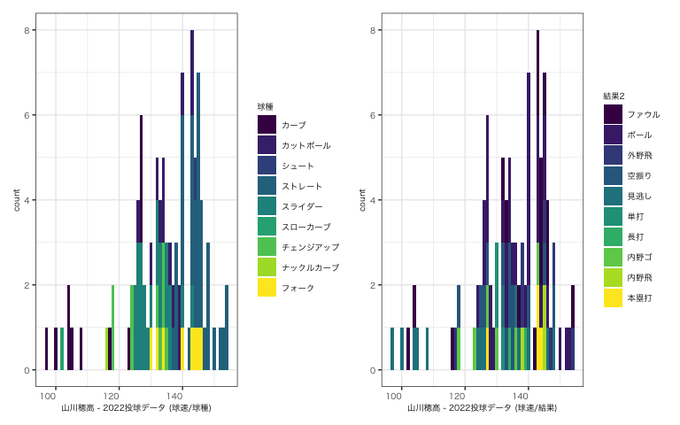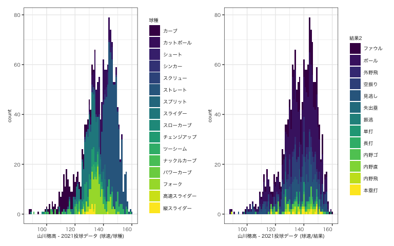

## 0.6 pitch types

<table>
<caption>2022 球種構成割合(%)</caption>
<thead>
<tr class="header">
<th style="text-align: left;"></th>
<th style="text-align: right;">カーブ</th>
<th style="text-align: right;">カットボール</th>
<th style="text-align: right;">シュート</th>
<th style="text-align: right;">ストレート</th>
<th style="text-align: right;">スライダー</th>
<th style="text-align: right;">チェンジアップ</th>
<th style="text-align: right;">ナックルカーブ</th>
<th style="text-align: right;">フォーク</th>
</tr>
</thead>
<tbody>
<tr class="odd">
<td style="text-align: left;">右投手(%)</td>
<td style="text-align: right;">12.7</td>
<td style="text-align: right;">11.11</td>
<td style="text-align: right;">1.59</td>
<td style="text-align: right;">31.75</td>
<td style="text-align: right;">26.98</td>
<td style="text-align: right;">3.17</td>
<td style="text-align: right;">3.17</td>
<td style="text-align: right;">9.52</td>
</tr>
</tbody>
</table>

2022 球種構成割合(%)

<table>
<thead>
<tr class="header">
<th style="text-align: left;"></th>
<th style="text-align: right;">カーブ</th>
<th style="text-align: right;">カットボール</th>
<th style="text-align: right;">ストレート</th>
<th style="text-align: right;">スライダー</th>
<th style="text-align: right;">スローカーブ</th>
<th style="text-align: right;">チェンジアップ</th>
<th style="text-align: right;">フォーク</th>
</tr>
</thead>
<tbody>
<tr class="odd">
<td style="text-align: left;">左投手(%)</td>
<td style="text-align: right;">6.98</td>
<td style="text-align: right;">13.95</td>
<td style="text-align: right;">41.86</td>
<td style="text-align: right;">13.95</td>
<td style="text-align: right;">2.33</td>
<td style="text-align: right;">16.28</td>
<td style="text-align: right;">4.65</td>
</tr>
</tbody>
</table>

<table>
<caption>2021 球種構成割合(%)</caption>
<colgroup>
<col style="width: 5%" />
<col style="width: 4%" />
<col style="width: 7%" />
<col style="width: 5%" />
<col style="width: 5%" />
<col style="width: 6%" />
<col style="width: 6%" />
<col style="width: 6%" />
<col style="width: 8%" />
<col style="width: 6%" />
<col style="width: 8%" />
<col style="width: 7%" />
<col style="width: 5%" />
<col style="width: 8%" />
<col style="width: 7%" />
</colgroup>
<thead>
<tr class="header">
<th style="text-align: left;"></th>
<th style="text-align: right;">カーブ</th>
<th style="text-align: right;">カットボール</th>
<th style="text-align: right;">シュート</th>
<th style="text-align: right;">シンカー</th>
<th style="text-align: right;">ストレート</th>
<th style="text-align: right;">スプリット</th>
<th style="text-align: right;">スライダー</th>
<th style="text-align: right;">チェンジアップ</th>
<th style="text-align: right;">ツーシーム</th>
<th style="text-align: right;">ナックルカーブ</th>
<th style="text-align: right;">パワーカーブ</th>
<th style="text-align: right;">フォーク</th>
<th style="text-align: right;">高速スライダー</th>
<th style="text-align: right;">縦スライダー</th>
</tr>
</thead>
<tbody>
<tr class="odd">
<td style="text-align: left;">右投手(%)</td>
<td style="text-align: right;">10.05</td>
<td style="text-align: right;">9.6</td>
<td style="text-align: right;">1.89</td>
<td style="text-align: right;">0.76</td>
<td style="text-align: right;">37.87</td>
<td style="text-align: right;">1.36</td>
<td style="text-align: right;">17.01</td>
<td style="text-align: right;">2.57</td>
<td style="text-align: right;">4.84</td>
<td style="text-align: right;">1.66</td>
<td style="text-align: right;">0.23</td>
<td style="text-align: right;">10.58</td>
<td style="text-align: right;">0.15</td>
<td style="text-align: right;">1.44</td>
</tr>
</tbody>
</table>

2021 球種構成割合(%)

<table>
<thead>
<tr class="header">
<th style="text-align: left;"></th>
<th style="text-align: right;">カーブ</th>
<th style="text-align: right;">カットボール</th>
<th style="text-align: right;">シンカー</th>
<th style="text-align: right;">スクリュー</th>
<th style="text-align: right;">ストレート</th>
<th style="text-align: right;">スライダー</th>
<th style="text-align: right;">スローカーブ</th>
<th style="text-align: right;">チェンジアップ</th>
<th style="text-align: right;">ツーシーム</th>
<th style="text-align: right;">ナックルカーブ</th>
<th style="text-align: right;">フォーク</th>
</tr>
</thead>
<tbody>
<tr class="odd">
<td style="text-align: left;">左投手(%)</td>
<td style="text-align: right;">10.67</td>
<td style="text-align: right;">7.66</td>
<td style="text-align: right;">0.23</td>
<td style="text-align: right;">1.39</td>
<td style="text-align: right;">35.03</td>
<td style="text-align: right;">18.33</td>
<td style="text-align: right;">1.16</td>
<td style="text-align: right;">11.6</td>
<td style="text-align: right;">7.66</td>
<td style="text-align: right;">1.86</td>
<td style="text-align: right;">4.41</td>
</tr>
</tbody>
</table>

## 0.7 swing data

### 0.7.1 swstr map

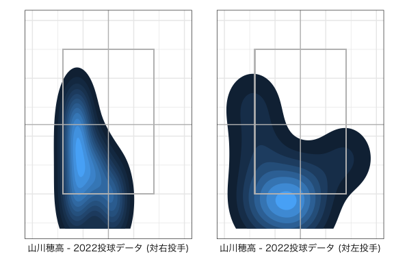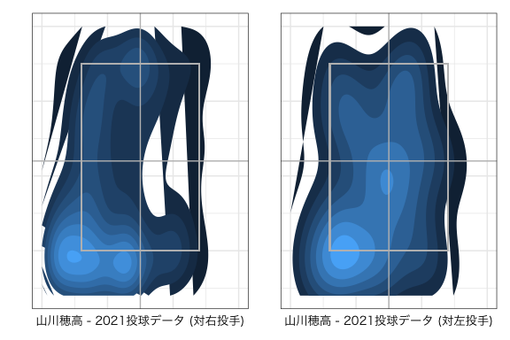

### 0.7.2 strike out map

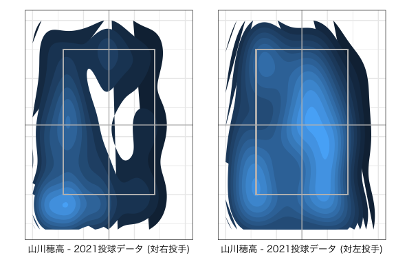

### 0.7.3 contact map

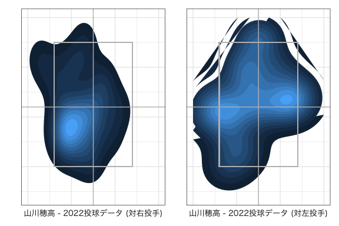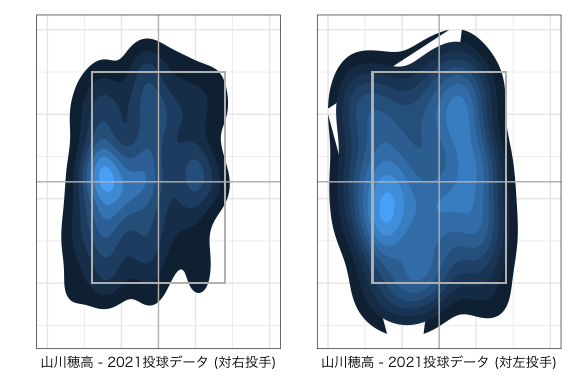

### 0.7.4 hit map

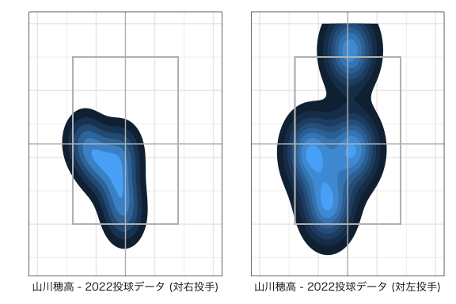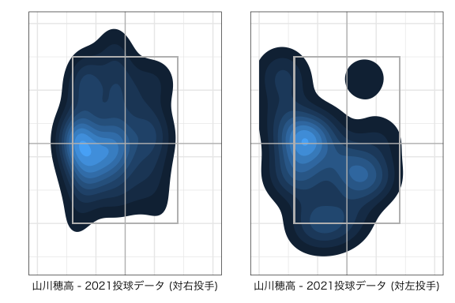

## 0.8 pitch data

### 0.8.1 swing data (teams)

<table>
<caption>2022</caption>
<thead>
<tr class="header">
<th style="text-align: left;"></th>
<th style="text-align: right;">swing (%)</th>
<th style="text-align: right;">contact (%)</th>
<th style="text-align: right;">swstr (%)</th>
<th style="text-align: right;">whiff (%)</th>
<th style="text-align: right;">球速(max)</th>
<th style="text-align: right;">球速(ave)</th>
<th style="text-align: right;">球速(min)</th>
</tr>
</thead>
<tbody>
<tr class="odd">
<td style="text-align: left;">オリックス・バファローズ</td>
<td style="text-align: right;">15.09</td>
<td style="text-align: right;">18.97</td>
<td style="text-align: right;">4.72</td>
<td style="text-align: right;">8.62</td>
<td style="text-align: right;">154</td>
<td style="text-align: right;">140.0</td>
<td style="text-align: right;">104</td>
</tr>
<tr class="even">
<td style="text-align: left;">千葉ロッテマリーンズ</td>
<td style="text-align: right;">12.26</td>
<td style="text-align: right;">15.52</td>
<td style="text-align: right;">3.77</td>
<td style="text-align: right;">6.90</td>
<td style="text-align: right;">154</td>
<td style="text-align: right;">134.0</td>
<td style="text-align: right;">123</td>
</tr>
<tr class="odd">
<td style="text-align: left;">東北楽天ゴールデンイーグルス</td>
<td style="text-align: right;">13.21</td>
<td style="text-align: right;">18.97</td>
<td style="text-align: right;">2.83</td>
<td style="text-align: right;">5.17</td>
<td style="text-align: right;">150</td>
<td style="text-align: right;">136.5</td>
<td style="text-align: right;">97</td>
</tr>
<tr class="even">
<td style="text-align: left;">北海道日本ハムファイターズ</td>
<td style="text-align: right;">14.15</td>
<td style="text-align: right;">22.41</td>
<td style="text-align: right;">1.89</td>
<td style="text-align: right;">3.45</td>
<td style="text-align: right;">148</td>
<td style="text-align: right;">133.0</td>
<td style="text-align: right;">102</td>
</tr>
</tbody>
</table>

2022

<table>
<caption>2021</caption>
<thead>
<tr class="header">
<th style="text-align: left;"></th>
<th style="text-align: right;">swing (%)</th>
<th style="text-align: right;">contact (%)</th>
<th style="text-align: right;">swstr (%)</th>
<th style="text-align: right;">whiff (%)</th>
<th style="text-align: right;">球速(max)</th>
<th style="text-align: right;">球速(ave)</th>
<th style="text-align: right;">球速(min)</th>
</tr>
</thead>
<tbody>
<tr class="odd">
<td style="text-align: left;">オリックス・バファローズ</td>
<td style="text-align: right;">8.32</td>
<td style="text-align: right;">11.54</td>
<td style="text-align: right;">3.08</td>
<td style="text-align: right;">6.78</td>
<td style="text-align: right;">157</td>
<td style="text-align: right;">139.5</td>
<td style="text-align: right;">91</td>
</tr>
<tr class="even">
<td style="text-align: left;">横浜DeNAベイスターズ</td>
<td style="text-align: right;">1.54</td>
<td style="text-align: right;">2.13</td>
<td style="text-align: right;">0.57</td>
<td style="text-align: right;">1.25</td>
<td style="text-align: right;">156</td>
<td style="text-align: right;">141.0</td>
<td style="text-align: right;">112</td>
</tr>
<tr class="odd">
<td style="text-align: left;">広島東洋カープ</td>
<td style="text-align: right;">1.20</td>
<td style="text-align: right;">1.38</td>
<td style="text-align: right;">0.57</td>
<td style="text-align: right;">1.25</td>
<td style="text-align: right;">156</td>
<td style="text-align: right;">138.0</td>
<td style="text-align: right;">119</td>
</tr>
<tr class="even">
<td style="text-align: left;">阪神タイガース</td>
<td style="text-align: right;">1.03</td>
<td style="text-align: right;">1.38</td>
<td style="text-align: right;">0.40</td>
<td style="text-align: right;">0.88</td>
<td style="text-align: right;">159</td>
<td style="text-align: right;">134.0</td>
<td style="text-align: right;">108</td>
</tr>
<tr class="odd">
<td style="text-align: left;">千葉ロッテマリーンズ</td>
<td style="text-align: right;">8.44</td>
<td style="text-align: right;">13.30</td>
<td style="text-align: right;">2.39</td>
<td style="text-align: right;">5.27</td>
<td style="text-align: right;">154</td>
<td style="text-align: right;">137.0</td>
<td style="text-align: right;">107</td>
</tr>
<tr class="even">
<td style="text-align: left;">中日ドラゴンズ</td>
<td style="text-align: right;">1.03</td>
<td style="text-align: right;">2.01</td>
<td style="text-align: right;">0.11</td>
<td style="text-align: right;">0.25</td>
<td style="text-align: right;">149</td>
<td style="text-align: right;">140.5</td>
<td style="text-align: right;">113</td>
</tr>
<tr class="odd">
<td style="text-align: left;">東京ヤクルトスワローズ</td>
<td style="text-align: right;">0.68</td>
<td style="text-align: right;">1.25</td>
<td style="text-align: right;">0.11</td>
<td style="text-align: right;">0.25</td>
<td style="text-align: right;">148</td>
<td style="text-align: right;">138.0</td>
<td style="text-align: right;">114</td>
</tr>
<tr class="even">
<td style="text-align: left;">東北楽天ゴールデンイーグルス</td>
<td style="text-align: right;">8.44</td>
<td style="text-align: right;">13.93</td>
<td style="text-align: right;">2.11</td>
<td style="text-align: right;">4.64</td>
<td style="text-align: right;">152</td>
<td style="text-align: right;">135.0</td>
<td style="text-align: right;">88</td>
</tr>
<tr class="odd">
<td style="text-align: left;">読売ジャイアンツ</td>
<td style="text-align: right;">1.37</td>
<td style="text-align: right;">2.38</td>
<td style="text-align: right;">0.29</td>
<td style="text-align: right;">0.63</td>
<td style="text-align: right;">160</td>
<td style="text-align: right;">137.0</td>
<td style="text-align: right;">111</td>
</tr>
<tr class="even">
<td style="text-align: left;">福岡ソフトバンクホークス</td>
<td style="text-align: right;">7.30</td>
<td style="text-align: right;">9.54</td>
<td style="text-align: right;">2.96</td>
<td style="text-align: right;">6.52</td>
<td style="text-align: right;">157</td>
<td style="text-align: right;">143.0</td>
<td style="text-align: right;">109</td>
</tr>
<tr class="odd">
<td style="text-align: left;">北海道日本ハムファイターズ</td>
<td style="text-align: right;">6.10</td>
<td style="text-align: right;">8.91</td>
<td style="text-align: right;">2.05</td>
<td style="text-align: right;">4.52</td>
<td style="text-align: right;">154</td>
<td style="text-align: right;">137.0</td>
<td style="text-align: right;">89</td>
</tr>
</tbody>
</table>

2021

### 0.8.2 swing data (pitcher)

<table>
<caption>2022</caption>
<thead>
<tr class="header">
<th style="text-align: left;"></th>
<th style="text-align: right;">swing (%)</th>
<th style="text-align: right;">contact (%)</th>
<th style="text-align: right;">swstr (%)</th>
<th style="text-align: right;">whiff (%)</th>
<th style="text-align: right;">球速(max)</th>
<th style="text-align: right;">球速(ave)</th>
<th style="text-align: right;">球速(min)</th>
</tr>
</thead>
<tbody>
<tr class="odd">
<td style="text-align: left;">ゲレーロ</td>
<td style="text-align: right;">0.94</td>
<td style="text-align: right;">1.72</td>
<td style="text-align: right;">0.00</td>
<td style="text-align: right;">0.00</td>
<td style="text-align: right;">154</td>
<td style="text-align: right;">154.0</td>
<td style="text-align: right;">154</td>
</tr>
<tr class="even">
<td style="text-align: left;">加藤貴之</td>
<td style="text-align: right;">4.72</td>
<td style="text-align: right;">6.90</td>
<td style="text-align: right;">0.94</td>
<td style="text-align: right;">1.72</td>
<td style="text-align: right;">138</td>
<td style="text-align: right;">130.0</td>
<td style="text-align: right;">102</td>
</tr>
<tr class="odd">
<td style="text-align: left;">宮城大弥</td>
<td style="text-align: right;">6.60</td>
<td style="text-align: right;">8.62</td>
<td style="text-align: right;">1.89</td>
<td style="text-align: right;">3.45</td>
<td style="text-align: right;">148</td>
<td style="text-align: right;">126.0</td>
<td style="text-align: right;">104</td>
</tr>
<tr class="even">
<td style="text-align: left;">黒木優太</td>
<td style="text-align: right;">1.89</td>
<td style="text-align: right;">1.72</td>
<td style="text-align: right;">0.94</td>
<td style="text-align: right;">1.72</td>
<td style="text-align: right;">136</td>
<td style="text-align: right;">135.0</td>
<td style="text-align: right;">134</td>
</tr>
<tr class="odd">
<td style="text-align: left;">山本由伸</td>
<td style="text-align: right;">5.66</td>
<td style="text-align: right;">6.90</td>
<td style="text-align: right;">1.89</td>
<td style="text-align: right;">3.45</td>
<td style="text-align: right;">154</td>
<td style="text-align: right;">144.0</td>
<td style="text-align: right;">127</td>
</tr>
<tr class="even">
<td style="text-align: left;">小島和哉</td>
<td style="text-align: right;">8.49</td>
<td style="text-align: right;">10.34</td>
<td style="text-align: right;">2.83</td>
<td style="text-align: right;">5.17</td>
<td style="text-align: right;">145</td>
<td style="text-align: right;">134.0</td>
<td style="text-align: right;">126</td>
</tr>
<tr class="odd">
<td style="text-align: left;">松井裕樹</td>
<td style="text-align: right;">1.89</td>
<td style="text-align: right;">1.72</td>
<td style="text-align: right;">0.94</td>
<td style="text-align: right;">1.72</td>
<td style="text-align: right;">148</td>
<td style="text-align: right;">143.0</td>
<td style="text-align: right;">140</td>
</tr>
<tr class="even">
<td style="text-align: left;">上沢直之</td>
<td style="text-align: right;">9.43</td>
<td style="text-align: right;">15.52</td>
<td style="text-align: right;">0.94</td>
<td style="text-align: right;">1.72</td>
<td style="text-align: right;">148</td>
<td style="text-align: right;">136.0</td>
<td style="text-align: right;">116</td>
</tr>
<tr class="odd">
<td style="text-align: left;">西口直人</td>
<td style="text-align: right;">0.00</td>
<td style="text-align: right;">0.00</td>
<td style="text-align: right;">0.00</td>
<td style="text-align: right;">0.00</td>
<td style="text-align: right;">150</td>
<td style="text-align: right;">146.5</td>
<td style="text-align: right;">143</td>
</tr>
<tr class="even">
<td style="text-align: left;">石橋良太</td>
<td style="text-align: right;">1.89</td>
<td style="text-align: right;">3.45</td>
<td style="text-align: right;">0.00</td>
<td style="text-align: right;">0.00</td>
<td style="text-align: right;">144</td>
<td style="text-align: right;">139.0</td>
<td style="text-align: right;">125</td>
</tr>
<tr class="odd">
<td style="text-align: left;">早川隆久</td>
<td style="text-align: right;">4.72</td>
<td style="text-align: right;">5.17</td>
<td style="text-align: right;">1.89</td>
<td style="text-align: right;">3.45</td>
<td style="text-align: right;">146</td>
<td style="text-align: right;">135.0</td>
<td style="text-align: right;">132</td>
</tr>
<tr class="even">
<td style="text-align: left;">村西良太</td>
<td style="text-align: right;">0.94</td>
<td style="text-align: right;">1.72</td>
<td style="text-align: right;">0.00</td>
<td style="text-align: right;">0.00</td>
<td style="text-align: right;">147</td>
<td style="text-align: right;">146.5</td>
<td style="text-align: right;">146</td>
</tr>
<tr class="odd">
<td style="text-align: left;">瀧中瞭太</td>
<td style="text-align: right;">1.89</td>
<td style="text-align: right;">3.45</td>
<td style="text-align: right;">0.00</td>
<td style="text-align: right;">0.00</td>
<td style="text-align: right;">138</td>
<td style="text-align: right;">129.0</td>
<td style="text-align: right;">97</td>
</tr>
<tr class="even">
<td style="text-align: left;">美馬学</td>
<td style="text-align: right;">2.83</td>
<td style="text-align: right;">3.45</td>
<td style="text-align: right;">0.94</td>
<td style="text-align: right;">1.72</td>
<td style="text-align: right;">140</td>
<td style="text-align: right;">132.0</td>
<td style="text-align: right;">123</td>
</tr>
<tr class="odd">
<td style="text-align: left;">涌井秀章</td>
<td style="text-align: right;">2.83</td>
<td style="text-align: right;">5.17</td>
<td style="text-align: right;">0.00</td>
<td style="text-align: right;">0.00</td>
<td style="text-align: right;">145</td>
<td style="text-align: right;">135.5</td>
<td style="text-align: right;">108</td>
</tr>
</tbody>
</table>

2022

<table>
<caption>2021</caption>
<thead>
<tr class="header">
<th style="text-align: left;"></th>
<th style="text-align: right;">swing (%)</th>
<th style="text-align: right;">contact (%)</th>
<th style="text-align: right;">swstr (%)</th>
<th style="text-align: right;">whiff (%)</th>
<th style="text-align: right;">球速(max)</th>
<th style="text-align: right;">球速(ave)</th>
<th style="text-align: right;">球速(min)</th>
</tr>
</thead>
<tbody>
<tr class="odd">
<td style="text-align: left;">B.ロドリゲス</td>
<td style="text-align: right;">0.34</td>
<td style="text-align: right;">0.50</td>
<td style="text-align: right;">0.11</td>
<td style="text-align: right;">0.25</td>
<td style="text-align: right;">154</td>
<td style="text-align: right;">150.0</td>
<td style="text-align: right;">134</td>
</tr>
<tr class="even">
<td style="text-align: left;">K-鈴木</td>
<td style="text-align: right;">0.29</td>
<td style="text-align: right;">0.63</td>
<td style="text-align: right;">0.00</td>
<td style="text-align: right;">0.00</td>
<td style="text-align: right;">155</td>
<td style="text-align: right;">150.5</td>
<td style="text-align: right;">126</td>
</tr>
<tr class="odd">
<td style="text-align: left;">アーリン</td>
<td style="text-align: right;">0.46</td>
<td style="text-align: right;">0.88</td>
<td style="text-align: right;">0.06</td>
<td style="text-align: right;">0.13</td>
<td style="text-align: right;">140</td>
<td style="text-align: right;">127.0</td>
<td style="text-align: right;">116</td>
</tr>
<tr class="even">
<td style="text-align: left;">エスコバー</td>
<td style="text-align: right;">0.17</td>
<td style="text-align: right;">0.13</td>
<td style="text-align: right;">0.11</td>
<td style="text-align: right;">0.25</td>
<td style="text-align: right;">156</td>
<td style="text-align: right;">156.0</td>
<td style="text-align: right;">135</td>
</tr>
<tr class="odd">
<td style="text-align: left;">コルニエル</td>
<td style="text-align: right;">0.11</td>
<td style="text-align: right;">0.00</td>
<td style="text-align: right;">0.11</td>
<td style="text-align: right;">0.25</td>
<td style="text-align: right;">156</td>
<td style="text-align: right;">144.0</td>
<td style="text-align: right;">134</td>
</tr>
<tr class="even">
<td style="text-align: left;">サンチェス</td>
<td style="text-align: right;">0.29</td>
<td style="text-align: right;">0.38</td>
<td style="text-align: right;">0.11</td>
<td style="text-align: right;">0.25</td>
<td style="text-align: right;">151</td>
<td style="text-align: right;">144.0</td>
<td style="text-align: right;">130</td>
</tr>
<tr class="odd">
<td style="text-align: left;">スアレス</td>
<td style="text-align: right;">0.11</td>
<td style="text-align: right;">0.25</td>
<td style="text-align: right;">0.00</td>
<td style="text-align: right;">0.00</td>
<td style="text-align: right;">159</td>
<td style="text-align: right;">156.5</td>
<td style="text-align: right;">156</td>
</tr>
<tr class="even">
<td style="text-align: left;">スパークマン</td>
<td style="text-align: right;">0.17</td>
<td style="text-align: right;">0.25</td>
<td style="text-align: right;">0.06</td>
<td style="text-align: right;">0.13</td>
<td style="text-align: right;">152</td>
<td style="text-align: right;">137.0</td>
<td style="text-align: right;">136</td>
</tr>
<tr class="odd">
<td style="text-align: left;">バーヘイゲン</td>
<td style="text-align: right;">0.46</td>
<td style="text-align: right;">0.25</td>
<td style="text-align: right;">0.34</td>
<td style="text-align: right;">0.75</td>
<td style="text-align: right;">153</td>
<td style="text-align: right;">149.0</td>
<td style="text-align: right;">121</td>
</tr>
<tr class="even">
<td style="text-align: left;">ハーマン</td>
<td style="text-align: right;">0.17</td>
<td style="text-align: right;">0.25</td>
<td style="text-align: right;">0.06</td>
<td style="text-align: right;">0.13</td>
<td style="text-align: right;">146</td>
<td style="text-align: right;">141.5</td>
<td style="text-align: right;">123</td>
</tr>
<tr class="odd">
<td style="text-align: left;">バルガス</td>
<td style="text-align: right;">0.11</td>
<td style="text-align: right;">0.13</td>
<td style="text-align: right;">0.06</td>
<td style="text-align: right;">0.13</td>
<td style="text-align: right;">147</td>
<td style="text-align: right;">143.5</td>
<td style="text-align: right;">132</td>
</tr>
<tr class="even">
<td style="text-align: left;">ピープルズ</td>
<td style="text-align: right;">0.11</td>
<td style="text-align: right;">0.25</td>
<td style="text-align: right;">0.00</td>
<td style="text-align: right;">0.00</td>
<td style="text-align: right;">145</td>
<td style="text-align: right;">141.5</td>
<td style="text-align: right;">120</td>
</tr>
<tr class="odd">
<td style="text-align: left;">ビエイラ</td>
<td style="text-align: right;">0.29</td>
<td style="text-align: right;">0.50</td>
<td style="text-align: right;">0.06</td>
<td style="text-align: right;">0.13</td>
<td style="text-align: right;">160</td>
<td style="text-align: right;">157.0</td>
<td style="text-align: right;">138</td>
</tr>
<tr class="even">
<td style="text-align: left;">ヒギンス</td>
<td style="text-align: right;">0.29</td>
<td style="text-align: right;">0.25</td>
<td style="text-align: right;">0.17</td>
<td style="text-align: right;">0.38</td>
<td style="text-align: right;">152</td>
<td style="text-align: right;">140.0</td>
<td style="text-align: right;">124</td>
</tr>
<tr class="odd">
<td style="text-align: left;">ブセニッツ</td>
<td style="text-align: right;">0.17</td>
<td style="text-align: right;">0.25</td>
<td style="text-align: right;">0.06</td>
<td style="text-align: right;">0.13</td>
<td style="text-align: right;">152</td>
<td style="text-align: right;">132.0</td>
<td style="text-align: right;">131</td>
</tr>
<tr class="even">
<td style="text-align: left;">フローレス</td>
<td style="text-align: right;">0.17</td>
<td style="text-align: right;">0.38</td>
<td style="text-align: right;">0.00</td>
<td style="text-align: right;">0.00</td>
<td style="text-align: right;">150</td>
<td style="text-align: right;">148.0</td>
<td style="text-align: right;">128</td>
</tr>
<tr class="odd">
<td style="text-align: left;">マクガフ</td>
<td style="text-align: right;">0.06</td>
<td style="text-align: right;">0.13</td>
<td style="text-align: right;">0.00</td>
<td style="text-align: right;">0.00</td>
<td style="text-align: right;">148</td>
<td style="text-align: right;">139.0</td>
<td style="text-align: right;">138</td>
</tr>
<tr class="even">
<td style="text-align: left;">マルティネス</td>
<td style="text-align: right;">0.34</td>
<td style="text-align: right;">0.25</td>
<td style="text-align: right;">0.23</td>
<td style="text-align: right;">0.50</td>
<td style="text-align: right;">153</td>
<td style="text-align: right;">146.5</td>
<td style="text-align: right;">133</td>
</tr>
<tr class="odd">
<td style="text-align: left;">モイネロ</td>
<td style="text-align: right;">0.46</td>
<td style="text-align: right;">0.50</td>
<td style="text-align: right;">0.23</td>
<td style="text-align: right;">0.50</td>
<td style="text-align: right;">156</td>
<td style="text-align: right;">146.0</td>
<td style="text-align: right;">123</td>
</tr>
<tr class="even">
<td style="text-align: left;">レイ</td>
<td style="text-align: right;">0.29</td>
<td style="text-align: right;">0.63</td>
<td style="text-align: right;">0.00</td>
<td style="text-align: right;">0.00</td>
<td style="text-align: right;">152</td>
<td style="text-align: right;">149.0</td>
<td style="text-align: right;">126</td>
</tr>
<tr class="odd">
<td style="text-align: left;">安樂 智大</td>
<td style="text-align: right;">0.46</td>
<td style="text-align: right;">1.00</td>
<td style="text-align: right;">0.00</td>
<td style="text-align: right;">0.00</td>
<td style="text-align: right;">149</td>
<td style="text-align: right;">136.5</td>
<td style="text-align: right;">129</td>
</tr>
<tr class="even">
<td style="text-align: left;">伊藤 将司</td>
<td style="text-align: right;">0.23</td>
<td style="text-align: right;">0.38</td>
<td style="text-align: right;">0.06</td>
<td style="text-align: right;">0.13</td>
<td style="text-align: right;">142</td>
<td style="text-align: right;">130.5</td>
<td style="text-align: right;">110</td>
</tr>
<tr class="odd">
<td style="text-align: left;">伊藤 大海</td>
<td style="text-align: right;">1.14</td>
<td style="text-align: right;">1.51</td>
<td style="text-align: right;">0.46</td>
<td style="text-align: right;">1.00</td>
<td style="text-align: right;">150</td>
<td style="text-align: right;">135.0</td>
<td style="text-align: right;">105</td>
</tr>
<tr class="even">
<td style="text-align: left;">井口 和朋</td>
<td style="text-align: right;">0.23</td>
<td style="text-align: right;">0.38</td>
<td style="text-align: right;">0.06</td>
<td style="text-align: right;">0.13</td>
<td style="text-align: right;">150</td>
<td style="text-align: right;">130.0</td>
<td style="text-align: right;">120</td>
</tr>
<tr class="odd">
<td style="text-align: left;">益田 直也</td>
<td style="text-align: right;">0.46</td>
<td style="text-align: right;">0.50</td>
<td style="text-align: right;">0.23</td>
<td style="text-align: right;">0.50</td>
<td style="text-align: right;">151</td>
<td style="text-align: right;">150.0</td>
<td style="text-align: right;">126</td>
</tr>
<tr class="even">
<td style="text-align: left;">横川 凱</td>
<td style="text-align: right;">0.29</td>
<td style="text-align: right;">0.50</td>
<td style="text-align: right;">0.06</td>
<td style="text-align: right;">0.13</td>
<td style="text-align: right;">139</td>
<td style="text-align: right;">132.5</td>
<td style="text-align: right;">118</td>
</tr>
<tr class="odd">
<td style="text-align: left;">岡野 祐一郎</td>
<td style="text-align: right;">0.11</td>
<td style="text-align: right;">0.25</td>
<td style="text-align: right;">0.00</td>
<td style="text-align: right;">0.00</td>
<td style="text-align: right;">144</td>
<td style="text-align: right;">132.0</td>
<td style="text-align: right;">113</td>
</tr>
<tr class="even">
<td style="text-align: left;">加藤 貴之</td>
<td style="text-align: right;">0.34</td>
<td style="text-align: right;">0.63</td>
<td style="text-align: right;">0.06</td>
<td style="text-align: right;">0.13</td>
<td style="text-align: right;">139</td>
<td style="text-align: right;">129.5</td>
<td style="text-align: right;">89</td>
</tr>
<tr class="odd">
<td style="text-align: left;">河村 説人</td>
<td style="text-align: right;">0.51</td>
<td style="text-align: right;">0.75</td>
<td style="text-align: right;">0.17</td>
<td style="text-align: right;">0.38</td>
<td style="text-align: right;">147</td>
<td style="text-align: right;">134.0</td>
<td style="text-align: right;">115</td>
</tr>
<tr class="even">
<td style="text-align: left;">河野 竜生</td>
<td style="text-align: right;">0.63</td>
<td style="text-align: right;">1.13</td>
<td style="text-align: right;">0.11</td>
<td style="text-align: right;">0.25</td>
<td style="text-align: right;">146</td>
<td style="text-align: right;">134.0</td>
<td style="text-align: right;">108</td>
</tr>
<tr class="odd">
<td style="text-align: left;">海田 智行</td>
<td style="text-align: right;">0.06</td>
<td style="text-align: right;">0.13</td>
<td style="text-align: right;">0.00</td>
<td style="text-align: right;">0.00</td>
<td style="text-align: right;">134</td>
<td style="text-align: right;">134.0</td>
<td style="text-align: right;">134</td>
</tr>
<tr class="even">
<td style="text-align: left;">岸 孝之</td>
<td style="text-align: right;">1.82</td>
<td style="text-align: right;">3.14</td>
<td style="text-align: right;">0.40</td>
<td style="text-align: right;">0.88</td>
<td style="text-align: right;">145</td>
<td style="text-align: right;">129.0</td>
<td style="text-align: right;">109</td>
</tr>
<tr class="odd">
<td style="text-align: left;">岩下 大輝</td>
<td style="text-align: right;">0.68</td>
<td style="text-align: right;">0.88</td>
<td style="text-align: right;">0.29</td>
<td style="text-align: right;">0.63</td>
<td style="text-align: right;">150</td>
<td style="text-align: right;">137.0</td>
<td style="text-align: right;">129</td>
</tr>
<tr class="even">
<td style="text-align: left;">岩貞 祐太</td>
<td style="text-align: right;">0.06</td>
<td style="text-align: right;">0.00</td>
<td style="text-align: right;">0.06</td>
<td style="text-align: right;">0.13</td>
<td style="text-align: right;">146</td>
<td style="text-align: right;">134.5</td>
<td style="text-align: right;">132</td>
</tr>
<tr class="odd">
<td style="text-align: left;">岩嵜 翔</td>
<td style="text-align: right;">0.34</td>
<td style="text-align: right;">0.38</td>
<td style="text-align: right;">0.17</td>
<td style="text-align: right;">0.38</td>
<td style="text-align: right;">157</td>
<td style="text-align: right;">149.0</td>
<td style="text-align: right;">113</td>
</tr>
<tr class="even">
<td style="text-align: left;">菊池 保則</td>
<td style="text-align: right;">0.06</td>
<td style="text-align: right;">0.13</td>
<td style="text-align: right;">0.00</td>
<td style="text-align: right;">0.00</td>
<td style="text-align: right;">139</td>
<td style="text-align: right;">134.0</td>
<td style="text-align: right;">129</td>
</tr>
<tr class="odd">
<td style="text-align: left;">吉田 凌</td>
<td style="text-align: right;">0.29</td>
<td style="text-align: right;">0.38</td>
<td style="text-align: right;">0.11</td>
<td style="text-align: right;">0.25</td>
<td style="text-align: right;">144</td>
<td style="text-align: right;">133.0</td>
<td style="text-align: right;">129</td>
</tr>
<tr class="even">
<td style="text-align: left;">及川 雅貴</td>
<td style="text-align: right;">0.06</td>
<td style="text-align: right;">0.13</td>
<td style="text-align: right;">0.00</td>
<td style="text-align: right;">0.00</td>
<td style="text-align: right;">148</td>
<td style="text-align: right;">146.0</td>
<td style="text-align: right;">138</td>
</tr>
<tr class="odd">
<td style="text-align: left;">宮城 大弥</td>
<td style="text-align: right;">1.71</td>
<td style="text-align: right;">2.38</td>
<td style="text-align: right;">0.63</td>
<td style="text-align: right;">1.38</td>
<td style="text-align: right;">148</td>
<td style="text-align: right;">128.0</td>
<td style="text-align: right;">100</td>
</tr>
<tr class="even">
<td style="text-align: left;">橋本 侑樹</td>
<td style="text-align: right;">0.11</td>
<td style="text-align: right;">0.13</td>
<td style="text-align: right;">0.06</td>
<td style="text-align: right;">0.13</td>
<td style="text-align: right;">147</td>
<td style="text-align: right;">138.5</td>
<td style="text-align: right;">130</td>
</tr>
<tr class="odd">
<td style="text-align: left;">玉井 大翔</td>
<td style="text-align: right;">0.40</td>
<td style="text-align: right;">0.63</td>
<td style="text-align: right;">0.11</td>
<td style="text-align: right;">0.25</td>
<td style="text-align: right;">145</td>
<td style="text-align: right;">139.0</td>
<td style="text-align: right;">120</td>
</tr>
<tr class="even">
<td style="text-align: left;">金子 弌大</td>
<td style="text-align: right;">0.06</td>
<td style="text-align: right;">0.00</td>
<td style="text-align: right;">0.06</td>
<td style="text-align: right;">0.13</td>
<td style="text-align: right;">145</td>
<td style="text-align: right;">141.0</td>
<td style="text-align: right;">134</td>
</tr>
<tr class="odd">
<td style="text-align: left;">栗林 良吏</td>
<td style="text-align: right;">0.17</td>
<td style="text-align: right;">0.00</td>
<td style="text-align: right;">0.17</td>
<td style="text-align: right;">0.38</td>
<td style="text-align: right;">148</td>
<td style="text-align: right;">136.0</td>
<td style="text-align: right;">125</td>
</tr>
<tr class="even">
<td style="text-align: left;">古谷 優人</td>
<td style="text-align: right;">0.17</td>
<td style="text-align: right;">0.13</td>
<td style="text-align: right;">0.11</td>
<td style="text-align: right;">0.25</td>
<td style="text-align: right;">152</td>
<td style="text-align: right;">149.0</td>
<td style="text-align: right;">122</td>
</tr>
<tr class="odd">
<td style="text-align: left;">戸根 千明</td>
<td style="text-align: right;">0.11</td>
<td style="text-align: right;">0.25</td>
<td style="text-align: right;">0.00</td>
<td style="text-align: right;">0.00</td>
<td style="text-align: right;">123</td>
<td style="text-align: right;">122.0</td>
<td style="text-align: right;">122</td>
</tr>
<tr class="even">
<td style="text-align: left;">甲斐野 央</td>
<td style="text-align: right;">0.29</td>
<td style="text-align: right;">0.38</td>
<td style="text-align: right;">0.11</td>
<td style="text-align: right;">0.25</td>
<td style="text-align: right;">153</td>
<td style="text-align: right;">138.0</td>
<td style="text-align: right;">136</td>
</tr>
<tr class="odd">
<td style="text-align: left;">高橋 礼</td>
<td style="text-align: right;">0.06</td>
<td style="text-align: right;">0.13</td>
<td style="text-align: right;">0.00</td>
<td style="text-align: right;">0.00</td>
<td style="text-align: right;">133</td>
<td style="text-align: right;">132.0</td>
<td style="text-align: right;">131</td>
</tr>
<tr class="even">
<td style="text-align: left;">高田 孝一</td>
<td style="text-align: right;">0.11</td>
<td style="text-align: right;">0.13</td>
<td style="text-align: right;">0.06</td>
<td style="text-align: right;">0.13</td>
<td style="text-align: right;">146</td>
<td style="text-align: right;">138.0</td>
<td style="text-align: right;">127</td>
</tr>
<tr class="odd">
<td style="text-align: left;">高梨 裕稔</td>
<td style="text-align: right;">0.00</td>
<td style="text-align: right;">0.00</td>
<td style="text-align: right;">0.00</td>
<td style="text-align: right;">0.00</td>
<td style="text-align: right;">143</td>
<td style="text-align: right;">124.0</td>
<td style="text-align: right;">114</td>
</tr>
<tr class="even">
<td style="text-align: left;">高梨 雄平</td>
<td style="text-align: right;">0.00</td>
<td style="text-align: right;">0.00</td>
<td style="text-align: right;">0.00</td>
<td style="text-align: right;">0.00</td>
<td style="text-align: right;">130</td>
<td style="text-align: right;">130.0</td>
<td style="text-align: right;">128</td>
</tr>
<tr class="odd">
<td style="text-align: left;">国吉 佑樹</td>
<td style="text-align: right;">0.34</td>
<td style="text-align: right;">0.50</td>
<td style="text-align: right;">0.11</td>
<td style="text-align: right;">0.25</td>
<td style="text-align: right;">154</td>
<td style="text-align: right;">150.5</td>
<td style="text-align: right;">122</td>
</tr>
<tr class="even">
<td style="text-align: left;">佐々木 千隼</td>
<td style="text-align: right;">0.40</td>
<td style="text-align: right;">0.50</td>
<td style="text-align: right;">0.17</td>
<td style="text-align: right;">0.38</td>
<td style="text-align: right;">143</td>
<td style="text-align: right;">129.0</td>
<td style="text-align: right;">114</td>
</tr>
<tr class="odd">
<td style="text-align: left;">佐々木 朗希</td>
<td style="text-align: right;">0.34</td>
<td style="text-align: right;">0.50</td>
<td style="text-align: right;">0.11</td>
<td style="text-align: right;">0.25</td>
<td style="text-align: right;">153</td>
<td style="text-align: right;">150.5</td>
<td style="text-align: right;">136</td>
</tr>
<tr class="even">
<td style="text-align: left;">砂田 毅樹</td>
<td style="text-align: right;">0.29</td>
<td style="text-align: right;">0.38</td>
<td style="text-align: right;">0.11</td>
<td style="text-align: right;">0.25</td>
<td style="text-align: right;">143</td>
<td style="text-align: right;">133.5</td>
<td style="text-align: right;">124</td>
</tr>
<tr class="odd">
<td style="text-align: left;">坂本 光士郎</td>
<td style="text-align: right;">0.06</td>
<td style="text-align: right;">0.13</td>
<td style="text-align: right;">0.00</td>
<td style="text-align: right;">0.00</td>
<td style="text-align: right;">147</td>
<td style="text-align: right;">146.0</td>
<td style="text-align: right;">138</td>
</tr>
<tr class="even">
<td style="text-align: left;">坂本 裕哉</td>
<td style="text-align: right;">0.40</td>
<td style="text-align: right;">0.75</td>
<td style="text-align: right;">0.06</td>
<td style="text-align: right;">0.13</td>
<td style="text-align: right;">143</td>
<td style="text-align: right;">130.0</td>
<td style="text-align: right;">113</td>
</tr>
<tr class="odd">
<td style="text-align: left;">三嶋 一輝</td>
<td style="text-align: right;">0.11</td>
<td style="text-align: right;">0.00</td>
<td style="text-align: right;">0.11</td>
<td style="text-align: right;">0.25</td>
<td style="text-align: right;">155</td>
<td style="text-align: right;">141.0</td>
<td style="text-align: right;">140</td>
</tr>
<tr class="even">
<td style="text-align: left;">山岡 泰輔</td>
<td style="text-align: right;">0.46</td>
<td style="text-align: right;">0.38</td>
<td style="text-align: right;">0.29</td>
<td style="text-align: right;">0.63</td>
<td style="text-align: right;">148</td>
<td style="text-align: right;">134.0</td>
<td style="text-align: right;">131</td>
</tr>
<tr class="odd">
<td style="text-align: left;">山田 修義</td>
<td style="text-align: right;">0.29</td>
<td style="text-align: right;">0.50</td>
<td style="text-align: right;">0.06</td>
<td style="text-align: right;">0.13</td>
<td style="text-align: right;">142</td>
<td style="text-align: right;">128.0</td>
<td style="text-align: right;">106</td>
</tr>
<tr class="even">
<td style="text-align: left;">山本 拓実</td>
<td style="text-align: right;">0.06</td>
<td style="text-align: right;">0.13</td>
<td style="text-align: right;">0.00</td>
<td style="text-align: right;">0.00</td>
<td style="text-align: right;">147</td>
<td style="text-align: right;">146.0</td>
<td style="text-align: right;">128</td>
</tr>
<tr class="odd">
<td style="text-align: left;">山本 由伸</td>
<td style="text-align: right;">2.17</td>
<td style="text-align: right;">2.38</td>
<td style="text-align: right;">1.08</td>
<td style="text-align: right;">2.38</td>
<td style="text-align: right;">157</td>
<td style="text-align: right;">147.0</td>
<td style="text-align: right;">119</td>
</tr>
<tr class="even">
<td style="text-align: left;">山﨑 福也</td>
<td style="text-align: right;">1.08</td>
<td style="text-align: right;">2.01</td>
<td style="text-align: right;">0.17</td>
<td style="text-align: right;">0.38</td>
<td style="text-align: right;">146</td>
<td style="text-align: right;">126.5</td>
<td style="text-align: right;">91</td>
</tr>
<tr class="odd">
<td style="text-align: left;">漆原 大晟</td>
<td style="text-align: right;">0.06</td>
<td style="text-align: right;">0.13</td>
<td style="text-align: right;">0.00</td>
<td style="text-align: right;">0.00</td>
<td style="text-align: right;">149</td>
<td style="text-align: right;">149.0</td>
<td style="text-align: right;">149</td>
</tr>
<tr class="even">
<td style="text-align: left;">酒居 知史</td>
<td style="text-align: right;">0.29</td>
<td style="text-align: right;">0.13</td>
<td style="text-align: right;">0.23</td>
<td style="text-align: right;">0.50</td>
<td style="text-align: right;">143</td>
<td style="text-align: right;">135.0</td>
<td style="text-align: right;">128</td>
</tr>
<tr class="odd">
<td style="text-align: left;">小川 泰弘</td>
<td style="text-align: right;">0.29</td>
<td style="text-align: right;">0.50</td>
<td style="text-align: right;">0.06</td>
<td style="text-align: right;">0.13</td>
<td style="text-align: right;">145</td>
<td style="text-align: right;">138.0</td>
<td style="text-align: right;">126</td>
</tr>
<tr class="even">
<td style="text-align: left;">小島 和哉</td>
<td style="text-align: right;">1.14</td>
<td style="text-align: right;">2.01</td>
<td style="text-align: right;">0.23</td>
<td style="text-align: right;">0.50</td>
<td style="text-align: right;">146</td>
<td style="text-align: right;">137.5</td>
<td style="text-align: right;">127</td>
</tr>
<tr class="odd">
<td style="text-align: left;">小野 郁</td>
<td style="text-align: right;">0.11</td>
<td style="text-align: right;">0.25</td>
<td style="text-align: right;">0.00</td>
<td style="text-align: right;">0.00</td>
<td style="text-align: right;">136</td>
<td style="text-align: right;">135.0</td>
<td style="text-align: right;">129</td>
</tr>
<tr class="even">
<td style="text-align: left;">小林 慶祐</td>
<td style="text-align: right;">0.11</td>
<td style="text-align: right;">0.13</td>
<td style="text-align: right;">0.06</td>
<td style="text-align: right;">0.13</td>
<td style="text-align: right;">137</td>
<td style="text-align: right;">134.5</td>
<td style="text-align: right;">128</td>
</tr>
<tr class="odd">
<td style="text-align: left;">床田 寛樹</td>
<td style="text-align: right;">0.29</td>
<td style="text-align: right;">0.38</td>
<td style="text-align: right;">0.11</td>
<td style="text-align: right;">0.25</td>
<td style="text-align: right;">149</td>
<td style="text-align: right;">137.5</td>
<td style="text-align: right;">119</td>
</tr>
<tr class="even">
<td style="text-align: left;">松井 裕樹</td>
<td style="text-align: right;">0.11</td>
<td style="text-align: right;">0.13</td>
<td style="text-align: right;">0.06</td>
<td style="text-align: right;">0.13</td>
<td style="text-align: right;">148</td>
<td style="text-align: right;">143.0</td>
<td style="text-align: right;">125</td>
</tr>
<tr class="odd">
<td style="text-align: left;">松本 裕樹</td>
<td style="text-align: right;">0.68</td>
<td style="text-align: right;">0.88</td>
<td style="text-align: right;">0.29</td>
<td style="text-align: right;">0.63</td>
<td style="text-align: right;">152</td>
<td style="text-align: right;">141.5</td>
<td style="text-align: right;">113</td>
</tr>
<tr class="even">
<td style="text-align: left;">上原 健太</td>
<td style="text-align: right;">0.17</td>
<td style="text-align: right;">0.13</td>
<td style="text-align: right;">0.11</td>
<td style="text-align: right;">0.25</td>
<td style="text-align: right;">148</td>
<td style="text-align: right;">135.0</td>
<td style="text-align: right;">129</td>
</tr>
<tr class="odd">
<td style="text-align: left;">上沢 直之</td>
<td style="text-align: right;">0.68</td>
<td style="text-align: right;">0.88</td>
<td style="text-align: right;">0.29</td>
<td style="text-align: right;">0.63</td>
<td style="text-align: right;">147</td>
<td style="text-align: right;">137.5</td>
<td style="text-align: right;">111</td>
</tr>
<tr class="even">
<td style="text-align: left;">森 唯斗</td>
<td style="text-align: right;">0.11</td>
<td style="text-align: right;">0.25</td>
<td style="text-align: right;">0.00</td>
<td style="text-align: right;">0.00</td>
<td style="text-align: right;">144</td>
<td style="text-align: right;">143.0</td>
<td style="text-align: right;">136</td>
</tr>
<tr class="odd">
<td style="text-align: left;">森原 康平</td>
<td style="text-align: right;">0.17</td>
<td style="text-align: right;">0.38</td>
<td style="text-align: right;">0.00</td>
<td style="text-align: right;">0.00</td>
<td style="text-align: right;">149</td>
<td style="text-align: right;">147.0</td>
<td style="text-align: right;">136</td>
</tr>
<tr class="even">
<td style="text-align: left;">杉浦 稔大</td>
<td style="text-align: right;">0.17</td>
<td style="text-align: right;">0.13</td>
<td style="text-align: right;">0.11</td>
<td style="text-align: right;">0.25</td>
<td style="text-align: right;">149</td>
<td style="text-align: right;">130.5</td>
<td style="text-align: right;">129</td>
</tr>
<tr class="odd">
<td style="text-align: left;">杉山 一樹</td>
<td style="text-align: right;">0.17</td>
<td style="text-align: right;">0.25</td>
<td style="text-align: right;">0.06</td>
<td style="text-align: right;">0.13</td>
<td style="text-align: right;">153</td>
<td style="text-align: right;">141.0</td>
<td style="text-align: right;">126</td>
</tr>
<tr class="even">
<td style="text-align: left;">成田 翔</td>
<td style="text-align: right;">0.00</td>
<td style="text-align: right;">0.00</td>
<td style="text-align: right;">0.00</td>
<td style="text-align: right;">0.00</td>
<td style="text-align: right;">138</td>
<td style="text-align: right;">135.0</td>
<td style="text-align: right;">120</td>
</tr>
<tr class="odd">
<td style="text-align: left;">生田目 翼</td>
<td style="text-align: right;">0.29</td>
<td style="text-align: right;">0.50</td>
<td style="text-align: right;">0.06</td>
<td style="text-align: right;">0.13</td>
<td style="text-align: right;">151</td>
<td style="text-align: right;">142.0</td>
<td style="text-align: right;">133</td>
</tr>
<tr class="even">
<td style="text-align: left;">西口 直人</td>
<td style="text-align: right;">0.34</td>
<td style="text-align: right;">0.63</td>
<td style="text-align: right;">0.06</td>
<td style="text-align: right;">0.13</td>
<td style="text-align: right;">149</td>
<td style="text-align: right;">140.0</td>
<td style="text-align: right;">116</td>
</tr>
<tr class="odd">
<td style="text-align: left;">青柳 晃洋</td>
<td style="text-align: right;">0.40</td>
<td style="text-align: right;">0.38</td>
<td style="text-align: right;">0.23</td>
<td style="text-align: right;">0.50</td>
<td style="text-align: right;">146</td>
<td style="text-align: right;">128.0</td>
<td style="text-align: right;">108</td>
</tr>
<tr class="even">
<td style="text-align: left;">石橋 良太</td>
<td style="text-align: right;">0.17</td>
<td style="text-align: right;">0.25</td>
<td style="text-align: right;">0.06</td>
<td style="text-align: right;">0.13</td>
<td style="text-align: right;">145</td>
<td style="text-align: right;">131.0</td>
<td style="text-align: right;">114</td>
</tr>
<tr class="odd">
<td style="text-align: left;">石山 泰稚</td>
<td style="text-align: right;">0.17</td>
<td style="text-align: right;">0.25</td>
<td style="text-align: right;">0.06</td>
<td style="text-align: right;">0.13</td>
<td style="text-align: right;">148</td>
<td style="text-align: right;">145.5</td>
<td style="text-align: right;">145</td>
</tr>
<tr class="even">
<td style="text-align: left;">石川 雅規</td>
<td style="text-align: right;">0.11</td>
<td style="text-align: right;">0.25</td>
<td style="text-align: right;">0.00</td>
<td style="text-align: right;">0.00</td>
<td style="text-align: right;">134</td>
<td style="text-align: right;">133.0</td>
<td style="text-align: right;">120</td>
</tr>
<tr class="odd">
<td style="text-align: left;">石川 柊太</td>
<td style="text-align: right;">0.86</td>
<td style="text-align: right;">1.38</td>
<td style="text-align: right;">0.23</td>
<td style="text-align: right;">0.50</td>
<td style="text-align: right;">148</td>
<td style="text-align: right;">136.5</td>
<td style="text-align: right;">121</td>
</tr>
<tr class="even">
<td style="text-align: left;">石川 歩</td>
<td style="text-align: right;">0.80</td>
<td style="text-align: right;">1.63</td>
<td style="text-align: right;">0.06</td>
<td style="text-align: right;">0.13</td>
<td style="text-align: right;">146</td>
<td style="text-align: right;">137.0</td>
<td style="text-align: right;">107</td>
</tr>
<tr class="odd">
<td style="text-align: left;">石田 健大</td>
<td style="text-align: right;">0.00</td>
<td style="text-align: right;">0.00</td>
<td style="text-align: right;">0.00</td>
<td style="text-align: right;">0.00</td>
<td style="text-align: right;">143</td>
<td style="text-align: right;">128.0</td>
<td style="text-align: right;">112</td>
</tr>
<tr class="even">
<td style="text-align: left;">千賀 滉大</td>
<td style="text-align: right;">0.97</td>
<td style="text-align: right;">0.88</td>
<td style="text-align: right;">0.57</td>
<td style="text-align: right;">1.25</td>
<td style="text-align: right;">157</td>
<td style="text-align: right;">151.0</td>
<td style="text-align: right;">134</td>
</tr>
<tr class="odd">
<td style="text-align: left;">泉 圭輔</td>
<td style="text-align: right;">0.46</td>
<td style="text-align: right;">0.63</td>
<td style="text-align: right;">0.17</td>
<td style="text-align: right;">0.38</td>
<td style="text-align: right;">150</td>
<td style="text-align: right;">143.5</td>
<td style="text-align: right;">128</td>
</tr>
<tr class="even">
<td style="text-align: left;">宋 家豪</td>
<td style="text-align: right;">0.68</td>
<td style="text-align: right;">1.25</td>
<td style="text-align: right;">0.11</td>
<td style="text-align: right;">0.25</td>
<td style="text-align: right;">151</td>
<td style="text-align: right;">141.0</td>
<td style="text-align: right;">114</td>
</tr>
<tr class="odd">
<td style="text-align: left;">早川 隆久</td>
<td style="text-align: right;">0.23</td>
<td style="text-align: right;">0.13</td>
<td style="text-align: right;">0.17</td>
<td style="text-align: right;">0.38</td>
<td style="text-align: right;">133</td>
<td style="text-align: right;">132.5</td>
<td style="text-align: right;">121</td>
</tr>
<tr class="even">
<td style="text-align: left;">増井 浩俊</td>
<td style="text-align: right;">0.29</td>
<td style="text-align: right;">0.13</td>
<td style="text-align: right;">0.23</td>
<td style="text-align: right;">0.50</td>
<td style="text-align: right;">149</td>
<td style="text-align: right;">133.0</td>
<td style="text-align: right;">113</td>
</tr>
<tr class="odd">
<td style="text-align: left;">則本 昂大</td>
<td style="text-align: right;">0.34</td>
<td style="text-align: right;">0.50</td>
<td style="text-align: right;">0.11</td>
<td style="text-align: right;">0.25</td>
<td style="text-align: right;">149</td>
<td style="text-align: right;">146.5</td>
<td style="text-align: right;">127</td>
</tr>
<tr class="even">
<td style="text-align: left;">村上 頌樹</td>
<td style="text-align: right;">0.06</td>
<td style="text-align: right;">0.13</td>
<td style="text-align: right;">0.00</td>
<td style="text-align: right;">0.00</td>
<td style="text-align: right;">143</td>
<td style="text-align: right;">143.0</td>
<td style="text-align: right;">122</td>
</tr>
<tr class="odd">
<td style="text-align: left;">村田 透</td>
<td style="text-align: right;">0.11</td>
<td style="text-align: right;">0.13</td>
<td style="text-align: right;">0.06</td>
<td style="text-align: right;">0.13</td>
<td style="text-align: right;">142</td>
<td style="text-align: right;">127.0</td>
<td style="text-align: right;">123</td>
</tr>
<tr class="even">
<td style="text-align: left;">大江 竜聖</td>
<td style="text-align: right;">0.11</td>
<td style="text-align: right;">0.13</td>
<td style="text-align: right;">0.06</td>
<td style="text-align: right;">0.13</td>
<td style="text-align: right;">139</td>
<td style="text-align: right;">130.0</td>
<td style="text-align: right;">116</td>
</tr>
<tr class="odd">
<td style="text-align: left;">大瀬良 大地</td>
<td style="text-align: right;">0.29</td>
<td style="text-align: right;">0.38</td>
<td style="text-align: right;">0.11</td>
<td style="text-align: right;">0.25</td>
<td style="text-align: right;">149</td>
<td style="text-align: right;">138.0</td>
<td style="text-align: right;">125</td>
</tr>
<tr class="even">
<td style="text-align: left;">大道 温貴</td>
<td style="text-align: right;">0.06</td>
<td style="text-align: right;">0.13</td>
<td style="text-align: right;">0.00</td>
<td style="text-align: right;">0.00</td>
<td style="text-align: right;">148</td>
<td style="text-align: right;">135.0</td>
<td style="text-align: right;">130</td>
</tr>
<tr class="odd">
<td style="text-align: left;">大野 雄大</td>
<td style="text-align: right;">0.40</td>
<td style="text-align: right;">0.75</td>
<td style="text-align: right;">0.06</td>
<td style="text-align: right;">0.13</td>
<td style="text-align: right;">146</td>
<td style="text-align: right;">137.0</td>
<td style="text-align: right;">134</td>
</tr>
<tr class="even">
<td style="text-align: left;">瀧中 瞭太</td>
<td style="text-align: right;">0.91</td>
<td style="text-align: right;">1.63</td>
<td style="text-align: right;">0.17</td>
<td style="text-align: right;">0.38</td>
<td style="text-align: right;">144</td>
<td style="text-align: right;">130.0</td>
<td style="text-align: right;">99</td>
</tr>
<tr class="odd">
<td style="text-align: left;">谷元 圭介</td>
<td style="text-align: right;">0.11</td>
<td style="text-align: right;">0.25</td>
<td style="text-align: right;">0.00</td>
<td style="text-align: right;">0.00</td>
<td style="text-align: right;">145</td>
<td style="text-align: right;">142.0</td>
<td style="text-align: right;">139</td>
</tr>
<tr class="even">
<td style="text-align: left;">谷川 昌希</td>
<td style="text-align: right;">0.06</td>
<td style="text-align: right;">0.13</td>
<td style="text-align: right;">0.00</td>
<td style="text-align: right;">0.00</td>
<td style="text-align: right;">144</td>
<td style="text-align: right;">143.0</td>
<td style="text-align: right;">142</td>
</tr>
<tr class="odd">
<td style="text-align: left;">池田 隆英</td>
<td style="text-align: right;">0.11</td>
<td style="text-align: right;">0.25</td>
<td style="text-align: right;">0.00</td>
<td style="text-align: right;">0.00</td>
<td style="text-align: right;">145</td>
<td style="text-align: right;">133.0</td>
<td style="text-align: right;">114</td>
</tr>
<tr class="even">
<td style="text-align: left;">中川 虎大</td>
<td style="text-align: right;">0.23</td>
<td style="text-align: right;">0.38</td>
<td style="text-align: right;">0.06</td>
<td style="text-align: right;">0.13</td>
<td style="text-align: right;">150</td>
<td style="text-align: right;">139.0</td>
<td style="text-align: right;">123</td>
</tr>
<tr class="odd">
<td style="text-align: left;">中川 皓太</td>
<td style="text-align: right;">0.06</td>
<td style="text-align: right;">0.13</td>
<td style="text-align: right;">0.00</td>
<td style="text-align: right;">0.00</td>
<td style="text-align: right;">149</td>
<td style="text-align: right;">147.5</td>
<td style="text-align: right;">130</td>
</tr>
<tr class="even">
<td style="text-align: left;">中村 稔弥</td>
<td style="text-align: right;">0.51</td>
<td style="text-align: right;">0.50</td>
<td style="text-align: right;">0.29</td>
<td style="text-align: right;">0.63</td>
<td style="text-align: right;">145</td>
<td style="text-align: right;">133.0</td>
<td style="text-align: right;">111</td>
</tr>
<tr class="odd">
<td style="text-align: left;">中田 廉</td>
<td style="text-align: right;">0.00</td>
<td style="text-align: right;">0.00</td>
<td style="text-align: right;">0.00</td>
<td style="text-align: right;">0.00</td>
<td style="text-align: right;">141</td>
<td style="text-align: right;">134.0</td>
<td style="text-align: right;">121</td>
</tr>
<tr class="even">
<td style="text-align: left;">張 奕</td>
<td style="text-align: right;">0.06</td>
<td style="text-align: right;">0.13</td>
<td style="text-align: right;">0.00</td>
<td style="text-align: right;">0.00</td>
<td style="text-align: right;">154</td>
<td style="text-align: right;">152.5</td>
<td style="text-align: right;">151</td>
</tr>
<tr class="odd">
<td style="text-align: left;">津森 宥紀</td>
<td style="text-align: right;">0.29</td>
<td style="text-align: right;">0.38</td>
<td style="text-align: right;">0.11</td>
<td style="text-align: right;">0.25</td>
<td style="text-align: right;">149</td>
<td style="text-align: right;">148.0</td>
<td style="text-align: right;">147</td>
</tr>
<tr class="even">
<td style="text-align: left;">田中 将大</td>
<td style="text-align: right;">1.54</td>
<td style="text-align: right;">2.38</td>
<td style="text-align: right;">0.46</td>
<td style="text-align: right;">1.00</td>
<td style="text-align: right;">149</td>
<td style="text-align: right;">138.0</td>
<td style="text-align: right;">114</td>
</tr>
<tr class="odd">
<td style="text-align: left;">田中 正義</td>
<td style="text-align: right;">0.06</td>
<td style="text-align: right;">0.13</td>
<td style="text-align: right;">0.00</td>
<td style="text-align: right;">0.00</td>
<td style="text-align: right;">150</td>
<td style="text-align: right;">149.5</td>
<td style="text-align: right;">149</td>
</tr>
<tr class="even">
<td style="text-align: left;">田中 靖洋</td>
<td style="text-align: right;">0.17</td>
<td style="text-align: right;">0.38</td>
<td style="text-align: right;">0.00</td>
<td style="text-align: right;">0.00</td>
<td style="text-align: right;">146</td>
<td style="text-align: right;">144.0</td>
<td style="text-align: right;">130</td>
</tr>
<tr class="odd">
<td style="text-align: left;">唐川 侑己</td>
<td style="text-align: right;">0.17</td>
<td style="text-align: right;">0.38</td>
<td style="text-align: right;">0.00</td>
<td style="text-align: right;">0.00</td>
<td style="text-align: right;">148</td>
<td style="text-align: right;">144.0</td>
<td style="text-align: right;">119</td>
</tr>
<tr class="even">
<td style="text-align: left;">東妻 勇輔</td>
<td style="text-align: right;">0.34</td>
<td style="text-align: right;">0.50</td>
<td style="text-align: right;">0.11</td>
<td style="text-align: right;">0.25</td>
<td style="text-align: right;">151</td>
<td style="text-align: right;">147.5</td>
<td style="text-align: right;">129</td>
</tr>
<tr class="odd">
<td style="text-align: left;">東浜 巨</td>
<td style="text-align: right;">0.97</td>
<td style="text-align: right;">1.25</td>
<td style="text-align: right;">0.40</td>
<td style="text-align: right;">0.88</td>
<td style="text-align: right;">148</td>
<td style="text-align: right;">139.0</td>
<td style="text-align: right;">115</td>
</tr>
<tr class="even">
<td style="text-align: left;">二木 康太</td>
<td style="text-align: right;">0.51</td>
<td style="text-align: right;">0.75</td>
<td style="text-align: right;">0.17</td>
<td style="text-align: right;">0.38</td>
<td style="text-align: right;">147</td>
<td style="text-align: right;">135.0</td>
<td style="text-align: right;">109</td>
</tr>
<tr class="odd">
<td style="text-align: left;">能見 篤史</td>
<td style="text-align: right;">0.17</td>
<td style="text-align: right;">0.25</td>
<td style="text-align: right;">0.06</td>
<td style="text-align: right;">0.13</td>
<td style="text-align: right;">140</td>
<td style="text-align: right;">130.0</td>
<td style="text-align: right;">128</td>
</tr>
<tr class="even">
<td style="text-align: left;">畠 世周</td>
<td style="text-align: right;">0.06</td>
<td style="text-align: right;">0.13</td>
<td style="text-align: right;">0.00</td>
<td style="text-align: right;">0.00</td>
<td style="text-align: right;">151</td>
<td style="text-align: right;">149.0</td>
<td style="text-align: right;">145</td>
</tr>
<tr class="odd">
<td style="text-align: left;">尾形 崇斗</td>
<td style="text-align: right;">0.06</td>
<td style="text-align: right;">0.13</td>
<td style="text-align: right;">0.00</td>
<td style="text-align: right;">0.00</td>
<td style="text-align: right;">150</td>
<td style="text-align: right;">145.0</td>
<td style="text-align: right;">127</td>
</tr>
<tr class="even">
<td style="text-align: left;">美馬 学</td>
<td style="text-align: right;">1.65</td>
<td style="text-align: right;">2.51</td>
<td style="text-align: right;">0.51</td>
<td style="text-align: right;">1.13</td>
<td style="text-align: right;">148</td>
<td style="text-align: right;">132.0</td>
<td style="text-align: right;">114</td>
</tr>
<tr class="odd">
<td style="text-align: left;">武田 翔太</td>
<td style="text-align: right;">0.74</td>
<td style="text-align: right;">1.00</td>
<td style="text-align: right;">0.29</td>
<td style="text-align: right;">0.63</td>
<td style="text-align: right;">145</td>
<td style="text-align: right;">141.0</td>
<td style="text-align: right;">109</td>
</tr>
<tr class="even">
<td style="text-align: left;">福井 優也</td>
<td style="text-align: right;">0.29</td>
<td style="text-align: right;">0.63</td>
<td style="text-align: right;">0.00</td>
<td style="text-align: right;">0.00</td>
<td style="text-align: right;">146</td>
<td style="text-align: right;">136.0</td>
<td style="text-align: right;">134</td>
</tr>
<tr class="odd">
<td style="text-align: left;">福谷 浩司</td>
<td style="text-align: right;">0.23</td>
<td style="text-align: right;">0.50</td>
<td style="text-align: right;">0.00</td>
<td style="text-align: right;">0.00</td>
<td style="text-align: right;">149</td>
<td style="text-align: right;">146.0</td>
<td style="text-align: right;">131</td>
</tr>
<tr class="even">
<td style="text-align: left;">平田 真吾</td>
<td style="text-align: right;">0.00</td>
<td style="text-align: right;">0.00</td>
<td style="text-align: right;">0.00</td>
<td style="text-align: right;">0.00</td>
<td style="text-align: right;">143</td>
<td style="text-align: right;">136.0</td>
<td style="text-align: right;">126</td>
</tr>
<tr class="odd">
<td style="text-align: left;">平野 佳寿</td>
<td style="text-align: right;">0.46</td>
<td style="text-align: right;">1.00</td>
<td style="text-align: right;">0.00</td>
<td style="text-align: right;">0.00</td>
<td style="text-align: right;">148</td>
<td style="text-align: right;">146.0</td>
<td style="text-align: right;">136</td>
</tr>
<tr class="even">
<td style="text-align: left;">望月 大希</td>
<td style="text-align: right;">0.06</td>
<td style="text-align: right;">0.13</td>
<td style="text-align: right;">0.00</td>
<td style="text-align: right;">0.00</td>
<td style="text-align: right;">142</td>
<td style="text-align: right;">140.5</td>
<td style="text-align: right;">119</td>
</tr>
<tr class="odd">
<td style="text-align: left;">牧田 和久</td>
<td style="text-align: right;">0.40</td>
<td style="text-align: right;">0.75</td>
<td style="text-align: right;">0.06</td>
<td style="text-align: right;">0.13</td>
<td style="text-align: right;">131</td>
<td style="text-align: right;">118.5</td>
<td style="text-align: right;">88</td>
</tr>
<tr class="even">
<td style="text-align: left;">堀 瑞輝</td>
<td style="text-align: right;">0.23</td>
<td style="text-align: right;">0.38</td>
<td style="text-align: right;">0.06</td>
<td style="text-align: right;">0.13</td>
<td style="text-align: right;">148</td>
<td style="text-align: right;">144.5</td>
<td style="text-align: right;">119</td>
</tr>
<tr class="odd">
<td style="text-align: left;">本田 仁海</td>
<td style="text-align: right;">0.40</td>
<td style="text-align: right;">0.50</td>
<td style="text-align: right;">0.17</td>
<td style="text-align: right;">0.38</td>
<td style="text-align: right;">155</td>
<td style="text-align: right;">139.5</td>
<td style="text-align: right;">123</td>
</tr>
<tr class="even">
<td style="text-align: left;">薮田 和樹</td>
<td style="text-align: right;">0.23</td>
<td style="text-align: right;">0.38</td>
<td style="text-align: right;">0.06</td>
<td style="text-align: right;">0.13</td>
<td style="text-align: right;">146</td>
<td style="text-align: right;">141.5</td>
<td style="text-align: right;">138</td>
</tr>
<tr class="odd">
<td style="text-align: left;">涌井 秀章</td>
<td style="text-align: right;">0.34</td>
<td style="text-align: right;">0.50</td>
<td style="text-align: right;">0.11</td>
<td style="text-align: right;">0.25</td>
<td style="text-align: right;">145</td>
<td style="text-align: right;">140.0</td>
<td style="text-align: right;">111</td>
</tr>
<tr class="even">
<td style="text-align: left;">立野 和明</td>
<td style="text-align: right;">0.11</td>
<td style="text-align: right;">0.25</td>
<td style="text-align: right;">0.00</td>
<td style="text-align: right;">0.00</td>
<td style="text-align: right;">143</td>
<td style="text-align: right;">138.0</td>
<td style="text-align: right;">119</td>
</tr>
<tr class="odd">
<td style="text-align: left;">鈴木 健矢</td>
<td style="text-align: right;">0.06</td>
<td style="text-align: right;">0.13</td>
<td style="text-align: right;">0.00</td>
<td style="text-align: right;">0.00</td>
<td style="text-align: right;">145</td>
<td style="text-align: right;">144.5</td>
<td style="text-align: right;">144</td>
</tr>
<tr class="even">
<td style="text-align: left;">鈴木 昭汰</td>
<td style="text-align: right;">0.17</td>
<td style="text-align: right;">0.38</td>
<td style="text-align: right;">0.00</td>
<td style="text-align: right;">0.00</td>
<td style="text-align: right;">149</td>
<td style="text-align: right;">147.0</td>
<td style="text-align: right;">133</td>
</tr>
<tr class="odd">
<td style="text-align: left;">塹江 敦哉</td>
<td style="text-align: right;">0.00</td>
<td style="text-align: right;">0.00</td>
<td style="text-align: right;">0.00</td>
<td style="text-align: right;">0.00</td>
<td style="text-align: right;">149</td>
<td style="text-align: right;">149.0</td>
<td style="text-align: right;">149</td>
</tr>
<tr class="even">
<td style="text-align: left;">髙橋 優貴</td>
<td style="text-align: right;">0.17</td>
<td style="text-align: right;">0.38</td>
<td style="text-align: right;">0.00</td>
<td style="text-align: right;">0.00</td>
<td style="text-align: right;">145</td>
<td style="text-align: right;">120.0</td>
<td style="text-align: right;">111</td>
</tr>
<tr class="odd">
<td style="text-align: left;">髙田 萌生</td>
<td style="text-align: right;">0.06</td>
<td style="text-align: right;">0.13</td>
<td style="text-align: right;">0.00</td>
<td style="text-align: right;">0.00</td>
<td style="text-align: right;">140</td>
<td style="text-align: right;">140.0</td>
<td style="text-align: right;">140</td>
</tr>
</tbody>
</table>

2021

### 0.8.3 outcome data (teams)

<table>
<caption>2022 チーム別割合(%)</caption>
<thead>
<tr class="header">
<th style="text-align: left;"></th>
<th style="text-align: right;">ファウル</th>
<th style="text-align: right;">ボール</th>
<th style="text-align: right;">外野飛</th>
<th style="text-align: right;">空振り</th>
<th style="text-align: right;">見逃し</th>
<th style="text-align: right;">単打</th>
<th style="text-align: right;">長打</th>
<th style="text-align: right;">内野ゴ</th>
<th style="text-align: right;">内野飛</th>
<th style="text-align: right;">本塁打</th>
</tr>
</thead>
<tbody>
<tr class="odd">
<td style="text-align: left;">オリックス・バファローズ</td>
<td style="text-align: right;">20.69</td>
<td style="text-align: right;">31.03</td>
<td style="text-align: right;">3.45</td>
<td style="text-align: right;">17.24</td>
<td style="text-align: right;">13.79</td>
<td style="text-align: right;">0.00</td>
<td style="text-align: right;">3.45</td>
<td style="text-align: right;">6.90</td>
<td style="text-align: right;">0.00</td>
<td style="text-align: right;">3.45</td>
</tr>
<tr class="even">
<td style="text-align: left;">千葉ロッテマリーンズ</td>
<td style="text-align: right;">19.05</td>
<td style="text-align: right;">38.10</td>
<td style="text-align: right;">4.76</td>
<td style="text-align: right;">19.05</td>
<td style="text-align: right;">0.00</td>
<td style="text-align: right;">9.52</td>
<td style="text-align: right;">0.00</td>
<td style="text-align: right;">4.76</td>
<td style="text-align: right;">4.76</td>
<td style="text-align: right;">0.00</td>
</tr>
<tr class="odd">
<td style="text-align: left;">東北楽天ゴールデンイーグルス</td>
<td style="text-align: right;">6.67</td>
<td style="text-align: right;">30.00</td>
<td style="text-align: right;">10.00</td>
<td style="text-align: right;">10.00</td>
<td style="text-align: right;">23.33</td>
<td style="text-align: right;">0.00</td>
<td style="text-align: right;">3.33</td>
<td style="text-align: right;">10.00</td>
<td style="text-align: right;">3.33</td>
<td style="text-align: right;">3.33</td>
</tr>
<tr class="even">
<td style="text-align: left;">北海道日本ハムファイターズ</td>
<td style="text-align: right;">23.08</td>
<td style="text-align: right;">30.77</td>
<td style="text-align: right;">11.54</td>
<td style="text-align: right;">7.69</td>
<td style="text-align: right;">11.54</td>
<td style="text-align: right;">3.85</td>
<td style="text-align: right;">0.00</td>
<td style="text-align: right;">0.00</td>
<td style="text-align: right;">3.85</td>
<td style="text-align: right;">7.69</td>
</tr>
</tbody>
</table>

2022 チーム別割合(%)

<table>
<caption>2021 チーム別割合(%)</caption>
<thead>
<tr class="header">
<th style="text-align: left;"></th>
<th style="text-align: right;">ファウル</th>
<th style="text-align: right;">ボール</th>
<th style="text-align: right;">外野飛</th>
<th style="text-align: right;">空振り</th>
<th style="text-align: right;">見逃し</th>
<th style="text-align: right;">失出塁</th>
<th style="text-align: right;">振逃</th>
<th style="text-align: right;">単打</th>
<th style="text-align: right;">長打</th>
<th style="text-align: right;">内野ゴ</th>
<th style="text-align: right;">内野直</th>
<th style="text-align: right;">内野飛</th>
<th style="text-align: right;">本塁打</th>
</tr>
</thead>
<tbody>
<tr class="odd">
<td style="text-align: left;">オリックス・バファローズ</td>
<td style="text-align: right;">17.23</td>
<td style="text-align: right;">35.14</td>
<td style="text-align: right;">4.05</td>
<td style="text-align: right;">18.24</td>
<td style="text-align: right;">15.54</td>
<td style="text-align: right;">0.34</td>
<td style="text-align: right;">0.00</td>
<td style="text-align: right;">2.70</td>
<td style="text-align: right;">1.35</td>
<td style="text-align: right;">4.39</td>
<td style="text-align: right;">0.34</td>
<td style="text-align: right;">0.34</td>
<td style="text-align: right;">0.34</td>
</tr>
<tr class="even">
<td style="text-align: left;">横浜DeNAベイスターズ</td>
<td style="text-align: right;">18.31</td>
<td style="text-align: right;">43.66</td>
<td style="text-align: right;">1.41</td>
<td style="text-align: right;">14.08</td>
<td style="text-align: right;">18.31</td>
<td style="text-align: right;">0.00</td>
<td style="text-align: right;">0.00</td>
<td style="text-align: right;">1.41</td>
<td style="text-align: right;">0.00</td>
<td style="text-align: right;">1.41</td>
<td style="text-align: right;">1.41</td>
<td style="text-align: right;">0.00</td>
<td style="text-align: right;">0.00</td>
</tr>
<tr class="odd">
<td style="text-align: left;">広島東洋カープ</td>
<td style="text-align: right;">6.12</td>
<td style="text-align: right;">40.82</td>
<td style="text-align: right;">2.04</td>
<td style="text-align: right;">18.37</td>
<td style="text-align: right;">16.33</td>
<td style="text-align: right;">0.00</td>
<td style="text-align: right;">2.04</td>
<td style="text-align: right;">4.08</td>
<td style="text-align: right;">2.04</td>
<td style="text-align: right;">6.12</td>
<td style="text-align: right;">0.00</td>
<td style="text-align: right;">0.00</td>
<td style="text-align: right;">2.04</td>
</tr>
<tr class="even">
<td style="text-align: left;">阪神タイガース</td>
<td style="text-align: right;">7.41</td>
<td style="text-align: right;">55.56</td>
<td style="text-align: right;">3.70</td>
<td style="text-align: right;">12.96</td>
<td style="text-align: right;">11.11</td>
<td style="text-align: right;">0.00</td>
<td style="text-align: right;">0.00</td>
<td style="text-align: right;">1.85</td>
<td style="text-align: right;">0.00</td>
<td style="text-align: right;">3.70</td>
<td style="text-align: right;">0.00</td>
<td style="text-align: right;">1.85</td>
<td style="text-align: right;">1.85</td>
</tr>
<tr class="odd">
<td style="text-align: left;">千葉ロッテマリーンズ</td>
<td style="text-align: right;">18.34</td>
<td style="text-align: right;">37.02</td>
<td style="text-align: right;">5.19</td>
<td style="text-align: right;">14.53</td>
<td style="text-align: right;">11.76</td>
<td style="text-align: right;">0.69</td>
<td style="text-align: right;">0.00</td>
<td style="text-align: right;">2.42</td>
<td style="text-align: right;">0.35</td>
<td style="text-align: right;">4.84</td>
<td style="text-align: right;">0.69</td>
<td style="text-align: right;">2.08</td>
<td style="text-align: right;">2.08</td>
</tr>
<tr class="even">
<td style="text-align: left;">中日ドラゴンズ</td>
<td style="text-align: right;">15.00</td>
<td style="text-align: right;">35.00</td>
<td style="text-align: right;">5.00</td>
<td style="text-align: right;">5.00</td>
<td style="text-align: right;">20.00</td>
<td style="text-align: right;">2.50</td>
<td style="text-align: right;">0.00</td>
<td style="text-align: right;">2.50</td>
<td style="text-align: right;">2.50</td>
<td style="text-align: right;">5.00</td>
<td style="text-align: right;">0.00</td>
<td style="text-align: right;">5.00</td>
<td style="text-align: right;">2.50</td>
</tr>
<tr class="odd">
<td style="text-align: left;">東京ヤクルトスワローズ</td>
<td style="text-align: right;">10.26</td>
<td style="text-align: right;">43.59</td>
<td style="text-align: right;">2.56</td>
<td style="text-align: right;">5.13</td>
<td style="text-align: right;">25.64</td>
<td style="text-align: right;">0.00</td>
<td style="text-align: right;">0.00</td>
<td style="text-align: right;">0.00</td>
<td style="text-align: right;">0.00</td>
<td style="text-align: right;">2.56</td>
<td style="text-align: right;">2.56</td>
<td style="text-align: right;">2.56</td>
<td style="text-align: right;">5.13</td>
</tr>
<tr class="even">
<td style="text-align: left;">東北楽天ゴールデンイーグルス</td>
<td style="text-align: right;">19.50</td>
<td style="text-align: right;">39.32</td>
<td style="text-align: right;">3.72</td>
<td style="text-align: right;">11.46</td>
<td style="text-align: right;">14.86</td>
<td style="text-align: right;">0.00</td>
<td style="text-align: right;">0.00</td>
<td style="text-align: right;">2.48</td>
<td style="text-align: right;">1.24</td>
<td style="text-align: right;">3.10</td>
<td style="text-align: right;">0.31</td>
<td style="text-align: right;">2.79</td>
<td style="text-align: right;">1.24</td>
</tr>
<tr class="odd">
<td style="text-align: left;">読売ジャイアンツ</td>
<td style="text-align: right;">14.29</td>
<td style="text-align: right;">52.86</td>
<td style="text-align: right;">2.86</td>
<td style="text-align: right;">7.14</td>
<td style="text-align: right;">12.86</td>
<td style="text-align: right;">0.00</td>
<td style="text-align: right;">0.00</td>
<td style="text-align: right;">2.86</td>
<td style="text-align: right;">0.00</td>
<td style="text-align: right;">5.71</td>
<td style="text-align: right;">0.00</td>
<td style="text-align: right;">0.00</td>
<td style="text-align: right;">1.43</td>
</tr>
<tr class="even">
<td style="text-align: left;">福岡ソフトバンクホークス</td>
<td style="text-align: right;">13.19</td>
<td style="text-align: right;">40.28</td>
<td style="text-align: right;">4.51</td>
<td style="text-align: right;">18.06</td>
<td style="text-align: right;">15.28</td>
<td style="text-align: right;">0.35</td>
<td style="text-align: right;">0.00</td>
<td style="text-align: right;">3.47</td>
<td style="text-align: right;">0.35</td>
<td style="text-align: right;">3.12</td>
<td style="text-align: right;">0.00</td>
<td style="text-align: right;">1.04</td>
<td style="text-align: right;">0.35</td>
</tr>
<tr class="odd">
<td style="text-align: left;">北海道日本ハムファイターズ</td>
<td style="text-align: right;">13.62</td>
<td style="text-align: right;">39.15</td>
<td style="text-align: right;">3.40</td>
<td style="text-align: right;">15.32</td>
<td style="text-align: right;">15.32</td>
<td style="text-align: right;">0.43</td>
<td style="text-align: right;">0.00</td>
<td style="text-align: right;">2.55</td>
<td style="text-align: right;">0.43</td>
<td style="text-align: right;">3.40</td>
<td style="text-align: right;">0.43</td>
<td style="text-align: right;">3.40</td>
<td style="text-align: right;">2.55</td>
</tr>
</tbody>
</table>

2021 チーム別割合(%)

### 0.8.4 outcome data (pitcher)

<table>
<caption>2022 投手別割合(%)</caption>
<thead>
<tr class="header">
<th style="text-align: left;"></th>
<th style="text-align: right;">ファウル</th>
<th style="text-align: right;">ボール</th>
<th style="text-align: right;">外野飛</th>
<th style="text-align: right;">空振り</th>
<th style="text-align: right;">見逃し</th>
<th style="text-align: right;">単打</th>
<th style="text-align: right;">長打</th>
<th style="text-align: right;">内野ゴ</th>
<th style="text-align: right;">内野飛</th>
<th style="text-align: right;">本塁打</th>
</tr>
</thead>
<tbody>
<tr class="odd">
<td style="text-align: left;">ゲレーロ</td>
<td style="text-align: right;">0.00</td>
<td style="text-align: right;">0.00</td>
<td style="text-align: right;">100.00</td>
<td style="text-align: right;">0.00</td>
<td style="text-align: right;">0.00</td>
<td style="text-align: right;">0.00</td>
<td style="text-align: right;">0.00</td>
<td style="text-align: right;">0.00</td>
<td style="text-align: right;">0.00</td>
<td style="text-align: right;">0.00</td>
</tr>
<tr class="even">
<td style="text-align: left;">加藤貴之</td>
<td style="text-align: right;">14.29</td>
<td style="text-align: right;">14.29</td>
<td style="text-align: right;">14.29</td>
<td style="text-align: right;">14.29</td>
<td style="text-align: right;">14.29</td>
<td style="text-align: right;">14.29</td>
<td style="text-align: right;">0.00</td>
<td style="text-align: right;">0.00</td>
<td style="text-align: right;">14.29</td>
<td style="text-align: right;">0.00</td>
</tr>
<tr class="odd">
<td style="text-align: left;">宮城大弥</td>
<td style="text-align: right;">23.08</td>
<td style="text-align: right;">23.08</td>
<td style="text-align: right;">0.00</td>
<td style="text-align: right;">15.38</td>
<td style="text-align: right;">23.08</td>
<td style="text-align: right;">0.00</td>
<td style="text-align: right;">0.00</td>
<td style="text-align: right;">7.69</td>
<td style="text-align: right;">0.00</td>
<td style="text-align: right;">7.69</td>
</tr>
<tr class="even">
<td style="text-align: left;">黒木優太</td>
<td style="text-align: right;">0.00</td>
<td style="text-align: right;">0.00</td>
<td style="text-align: right;">0.00</td>
<td style="text-align: right;">33.33</td>
<td style="text-align: right;">33.33</td>
<td style="text-align: right;">0.00</td>
<td style="text-align: right;">33.33</td>
<td style="text-align: right;">0.00</td>
<td style="text-align: right;">0.00</td>
<td style="text-align: right;">0.00</td>
</tr>
<tr class="odd">
<td style="text-align: left;">山本由伸</td>
<td style="text-align: right;">27.27</td>
<td style="text-align: right;">45.45</td>
<td style="text-align: right;">0.00</td>
<td style="text-align: right;">18.18</td>
<td style="text-align: right;">0.00</td>
<td style="text-align: right;">0.00</td>
<td style="text-align: right;">0.00</td>
<td style="text-align: right;">9.09</td>
<td style="text-align: right;">0.00</td>
<td style="text-align: right;">0.00</td>
</tr>
<tr class="even">
<td style="text-align: left;">小島和哉</td>
<td style="text-align: right;">30.77</td>
<td style="text-align: right;">30.77</td>
<td style="text-align: right;">0.00</td>
<td style="text-align: right;">23.08</td>
<td style="text-align: right;">0.00</td>
<td style="text-align: right;">7.69</td>
<td style="text-align: right;">0.00</td>
<td style="text-align: right;">0.00</td>
<td style="text-align: right;">7.69</td>
<td style="text-align: right;">0.00</td>
</tr>
<tr class="odd">
<td style="text-align: left;">松井裕樹</td>
<td style="text-align: right;">0.00</td>
<td style="text-align: right;">0.00</td>
<td style="text-align: right;">0.00</td>
<td style="text-align: right;">33.33</td>
<td style="text-align: right;">33.33</td>
<td style="text-align: right;">0.00</td>
<td style="text-align: right;">0.00</td>
<td style="text-align: right;">33.33</td>
<td style="text-align: right;">0.00</td>
<td style="text-align: right;">0.00</td>
</tr>
<tr class="even">
<td style="text-align: left;">上沢直之</td>
<td style="text-align: right;">26.32</td>
<td style="text-align: right;">36.84</td>
<td style="text-align: right;">10.53</td>
<td style="text-align: right;">5.26</td>
<td style="text-align: right;">10.53</td>
<td style="text-align: right;">0.00</td>
<td style="text-align: right;">0.00</td>
<td style="text-align: right;">0.00</td>
<td style="text-align: right;">0.00</td>
<td style="text-align: right;">10.53</td>
</tr>
<tr class="odd">
<td style="text-align: left;">西口直人</td>
<td style="text-align: right;">0.00</td>
<td style="text-align: right;">100.00</td>
<td style="text-align: right;">0.00</td>
<td style="text-align: right;">0.00</td>
<td style="text-align: right;">0.00</td>
<td style="text-align: right;">0.00</td>
<td style="text-align: right;">0.00</td>
<td style="text-align: right;">0.00</td>
<td style="text-align: right;">0.00</td>
<td style="text-align: right;">0.00</td>
</tr>
<tr class="even">
<td style="text-align: left;">石橋良太</td>
<td style="text-align: right;">20.00</td>
<td style="text-align: right;">40.00</td>
<td style="text-align: right;">0.00</td>
<td style="text-align: right;">0.00</td>
<td style="text-align: right;">20.00</td>
<td style="text-align: right;">0.00</td>
<td style="text-align: right;">20.00</td>
<td style="text-align: right;">0.00</td>
<td style="text-align: right;">0.00</td>
<td style="text-align: right;">0.00</td>
</tr>
<tr class="odd">
<td style="text-align: left;">早川隆久</td>
<td style="text-align: right;">14.29</td>
<td style="text-align: right;">14.29</td>
<td style="text-align: right;">0.00</td>
<td style="text-align: right;">28.57</td>
<td style="text-align: right;">14.29</td>
<td style="text-align: right;">0.00</td>
<td style="text-align: right;">0.00</td>
<td style="text-align: right;">0.00</td>
<td style="text-align: right;">14.29</td>
<td style="text-align: right;">14.29</td>
</tr>
<tr class="even">
<td style="text-align: left;">村西良太</td>
<td style="text-align: right;">0.00</td>
<td style="text-align: right;">50.00</td>
<td style="text-align: right;">50.00</td>
<td style="text-align: right;">0.00</td>
<td style="text-align: right;">0.00</td>
<td style="text-align: right;">0.00</td>
<td style="text-align: right;">0.00</td>
<td style="text-align: right;">0.00</td>
<td style="text-align: right;">0.00</td>
<td style="text-align: right;">0.00</td>
</tr>
<tr class="odd">
<td style="text-align: left;">瀧中瞭太</td>
<td style="text-align: right;">0.00</td>
<td style="text-align: right;">28.57</td>
<td style="text-align: right;">14.29</td>
<td style="text-align: right;">0.00</td>
<td style="text-align: right;">42.86</td>
<td style="text-align: right;">0.00</td>
<td style="text-align: right;">0.00</td>
<td style="text-align: right;">14.29</td>
<td style="text-align: right;">0.00</td>
<td style="text-align: right;">0.00</td>
</tr>
<tr class="even">
<td style="text-align: left;">美馬学</td>
<td style="text-align: right;">0.00</td>
<td style="text-align: right;">57.14</td>
<td style="text-align: right;">0.00</td>
<td style="text-align: right;">14.29</td>
<td style="text-align: right;">0.00</td>
<td style="text-align: right;">14.29</td>
<td style="text-align: right;">0.00</td>
<td style="text-align: right;">14.29</td>
<td style="text-align: right;">0.00</td>
<td style="text-align: right;">0.00</td>
</tr>
<tr class="odd">
<td style="text-align: left;">涌井秀章</td>
<td style="text-align: right;">0.00</td>
<td style="text-align: right;">33.33</td>
<td style="text-align: right;">33.33</td>
<td style="text-align: right;">0.00</td>
<td style="text-align: right;">16.67</td>
<td style="text-align: right;">0.00</td>
<td style="text-align: right;">0.00</td>
<td style="text-align: right;">16.67</td>
<td style="text-align: right;">0.00</td>
<td style="text-align: right;">0.00</td>
</tr>
</tbody>
</table>

2022 投手別割合(%)

<table>
<caption>2021 投手別割合(%)</caption>
<thead>
<tr class="header">
<th style="text-align: left;"></th>
<th style="text-align: right;">ファウル</th>
<th style="text-align: right;">ボール</th>
<th style="text-align: right;">外野飛</th>
<th style="text-align: right;">空振り</th>
<th style="text-align: right;">見逃し</th>
<th style="text-align: right;">失出塁</th>
<th style="text-align: right;">振逃</th>
<th style="text-align: right;">単打</th>
<th style="text-align: right;">長打</th>
<th style="text-align: right;">内野ゴ</th>
<th style="text-align: right;">内野直</th>
<th style="text-align: right;">内野飛</th>
<th style="text-align: right;">本塁打</th>
</tr>
</thead>
<tbody>
<tr class="odd">
<td style="text-align: left;">B.ロドリゲス</td>
<td style="text-align: right;">7.14</td>
<td style="text-align: right;">50.00</td>
<td style="text-align: right;">7.14</td>
<td style="text-align: right;">14.29</td>
<td style="text-align: right;">7.14</td>
<td style="text-align: right;">0.00</td>
<td style="text-align: right;">0</td>
<td style="text-align: right;">0.00</td>
<td style="text-align: right;">0.00</td>
<td style="text-align: right;">0.00</td>
<td style="text-align: right;">0.00</td>
<td style="text-align: right;">7.14</td>
<td style="text-align: right;">7.14</td>
</tr>
<tr class="even">
<td style="text-align: left;">K-鈴木</td>
<td style="text-align: right;">33.33</td>
<td style="text-align: right;">33.33</td>
<td style="text-align: right;">0.00</td>
<td style="text-align: right;">0.00</td>
<td style="text-align: right;">11.11</td>
<td style="text-align: right;">0.00</td>
<td style="text-align: right;">0</td>
<td style="text-align: right;">0.00</td>
<td style="text-align: right;">0.00</td>
<td style="text-align: right;">22.22</td>
<td style="text-align: right;">0.00</td>
<td style="text-align: right;">0.00</td>
<td style="text-align: right;">0.00</td>
</tr>
<tr class="odd">
<td style="text-align: left;">アーリン</td>
<td style="text-align: right;">10.00</td>
<td style="text-align: right;">40.00</td>
<td style="text-align: right;">5.00</td>
<td style="text-align: right;">5.00</td>
<td style="text-align: right;">20.00</td>
<td style="text-align: right;">5.00</td>
<td style="text-align: right;">0</td>
<td style="text-align: right;">10.00</td>
<td style="text-align: right;">0.00</td>
<td style="text-align: right;">0.00</td>
<td style="text-align: right;">0.00</td>
<td style="text-align: right;">0.00</td>
<td style="text-align: right;">5.00</td>
</tr>
<tr class="even">
<td style="text-align: left;">エスコバー</td>
<td style="text-align: right;">25.00</td>
<td style="text-align: right;">25.00</td>
<td style="text-align: right;">0.00</td>
<td style="text-align: right;">50.00</td>
<td style="text-align: right;">0.00</td>
<td style="text-align: right;">0.00</td>
<td style="text-align: right;">0</td>
<td style="text-align: right;">0.00</td>
<td style="text-align: right;">0.00</td>
<td style="text-align: right;">0.00</td>
<td style="text-align: right;">0.00</td>
<td style="text-align: right;">0.00</td>
<td style="text-align: right;">0.00</td>
</tr>
<tr class="odd">
<td style="text-align: left;">コルニエル</td>
<td style="text-align: right;">0.00</td>
<td style="text-align: right;">25.00</td>
<td style="text-align: right;">0.00</td>
<td style="text-align: right;">25.00</td>
<td style="text-align: right;">25.00</td>
<td style="text-align: right;">0.00</td>
<td style="text-align: right;">25</td>
<td style="text-align: right;">0.00</td>
<td style="text-align: right;">0.00</td>
<td style="text-align: right;">0.00</td>
<td style="text-align: right;">0.00</td>
<td style="text-align: right;">0.00</td>
<td style="text-align: right;">0.00</td>
</tr>
<tr class="even">
<td style="text-align: left;">サンチェス</td>
<td style="text-align: right;">12.50</td>
<td style="text-align: right;">56.25</td>
<td style="text-align: right;">0.00</td>
<td style="text-align: right;">12.50</td>
<td style="text-align: right;">12.50</td>
<td style="text-align: right;">0.00</td>
<td style="text-align: right;">0</td>
<td style="text-align: right;">6.25</td>
<td style="text-align: right;">0.00</td>
<td style="text-align: right;">0.00</td>
<td style="text-align: right;">0.00</td>
<td style="text-align: right;">0.00</td>
<td style="text-align: right;">0.00</td>
</tr>
<tr class="odd">
<td style="text-align: left;">スアレス</td>
<td style="text-align: right;">25.00</td>
<td style="text-align: right;">25.00</td>
<td style="text-align: right;">0.00</td>
<td style="text-align: right;">0.00</td>
<td style="text-align: right;">25.00</td>
<td style="text-align: right;">0.00</td>
<td style="text-align: right;">0</td>
<td style="text-align: right;">25.00</td>
<td style="text-align: right;">0.00</td>
<td style="text-align: right;">0.00</td>
<td style="text-align: right;">0.00</td>
<td style="text-align: right;">0.00</td>
<td style="text-align: right;">0.00</td>
</tr>
<tr class="even">
<td style="text-align: left;">スパークマン</td>
<td style="text-align: right;">25.00</td>
<td style="text-align: right;">0.00</td>
<td style="text-align: right;">25.00</td>
<td style="text-align: right;">25.00</td>
<td style="text-align: right;">25.00</td>
<td style="text-align: right;">0.00</td>
<td style="text-align: right;">0</td>
<td style="text-align: right;">0.00</td>
<td style="text-align: right;">0.00</td>
<td style="text-align: right;">0.00</td>
<td style="text-align: right;">0.00</td>
<td style="text-align: right;">0.00</td>
<td style="text-align: right;">0.00</td>
</tr>
<tr class="odd">
<td style="text-align: left;">バーヘイゲン</td>
<td style="text-align: right;">4.35</td>
<td style="text-align: right;">43.48</td>
<td style="text-align: right;">0.00</td>
<td style="text-align: right;">26.09</td>
<td style="text-align: right;">21.74</td>
<td style="text-align: right;">0.00</td>
<td style="text-align: right;">0</td>
<td style="text-align: right;">4.35</td>
<td style="text-align: right;">0.00</td>
<td style="text-align: right;">0.00</td>
<td style="text-align: right;">0.00</td>
<td style="text-align: right;">0.00</td>
<td style="text-align: right;">0.00</td>
</tr>
<tr class="even">
<td style="text-align: left;">ハーマン</td>
<td style="text-align: right;">20.00</td>
<td style="text-align: right;">40.00</td>
<td style="text-align: right;">0.00</td>
<td style="text-align: right;">20.00</td>
<td style="text-align: right;">0.00</td>
<td style="text-align: right;">0.00</td>
<td style="text-align: right;">0</td>
<td style="text-align: right;">0.00</td>
<td style="text-align: right;">0.00</td>
<td style="text-align: right;">20.00</td>
<td style="text-align: right;">0.00</td>
<td style="text-align: right;">0.00</td>
<td style="text-align: right;">0.00</td>
</tr>
<tr class="odd">
<td style="text-align: left;">バルガス</td>
<td style="text-align: right;">0.00</td>
<td style="text-align: right;">33.33</td>
<td style="text-align: right;">0.00</td>
<td style="text-align: right;">16.67</td>
<td style="text-align: right;">33.33</td>
<td style="text-align: right;">0.00</td>
<td style="text-align: right;">0</td>
<td style="text-align: right;">0.00</td>
<td style="text-align: right;">16.67</td>
<td style="text-align: right;">0.00</td>
<td style="text-align: right;">0.00</td>
<td style="text-align: right;">0.00</td>
<td style="text-align: right;">0.00</td>
</tr>
<tr class="even">
<td style="text-align: left;">ピープルズ</td>
<td style="text-align: right;">0.00</td>
<td style="text-align: right;">57.14</td>
<td style="text-align: right;">0.00</td>
<td style="text-align: right;">0.00</td>
<td style="text-align: right;">14.29</td>
<td style="text-align: right;">0.00</td>
<td style="text-align: right;">0</td>
<td style="text-align: right;">14.29</td>
<td style="text-align: right;">0.00</td>
<td style="text-align: right;">0.00</td>
<td style="text-align: right;">14.29</td>
<td style="text-align: right;">0.00</td>
<td style="text-align: right;">0.00</td>
</tr>
<tr class="odd">
<td style="text-align: left;">ビエイラ</td>
<td style="text-align: right;">28.57</td>
<td style="text-align: right;">28.57</td>
<td style="text-align: right;">28.57</td>
<td style="text-align: right;">14.29</td>
<td style="text-align: right;">0.00</td>
<td style="text-align: right;">0.00</td>
<td style="text-align: right;">0</td>
<td style="text-align: right;">0.00</td>
<td style="text-align: right;">0.00</td>
<td style="text-align: right;">0.00</td>
<td style="text-align: right;">0.00</td>
<td style="text-align: right;">0.00</td>
<td style="text-align: right;">0.00</td>
</tr>
<tr class="even">
<td style="text-align: left;">ヒギンス</td>
<td style="text-align: right;">9.09</td>
<td style="text-align: right;">36.36</td>
<td style="text-align: right;">9.09</td>
<td style="text-align: right;">27.27</td>
<td style="text-align: right;">18.18</td>
<td style="text-align: right;">0.00</td>
<td style="text-align: right;">0</td>
<td style="text-align: right;">0.00</td>
<td style="text-align: right;">0.00</td>
<td style="text-align: right;">0.00</td>
<td style="text-align: right;">0.00</td>
<td style="text-align: right;">0.00</td>
<td style="text-align: right;">0.00</td>
</tr>
<tr class="odd">
<td style="text-align: left;">ブセニッツ</td>
<td style="text-align: right;">20.00</td>
<td style="text-align: right;">20.00</td>
<td style="text-align: right;">0.00</td>
<td style="text-align: right;">20.00</td>
<td style="text-align: right;">20.00</td>
<td style="text-align: right;">0.00</td>
<td style="text-align: right;">0</td>
<td style="text-align: right;">0.00</td>
<td style="text-align: right;">0.00</td>
<td style="text-align: right;">20.00</td>
<td style="text-align: right;">0.00</td>
<td style="text-align: right;">0.00</td>
<td style="text-align: right;">0.00</td>
</tr>
<tr class="even">
<td style="text-align: left;">フローレス</td>
<td style="text-align: right;">28.57</td>
<td style="text-align: right;">42.86</td>
<td style="text-align: right;">0.00</td>
<td style="text-align: right;">0.00</td>
<td style="text-align: right;">14.29</td>
<td style="text-align: right;">0.00</td>
<td style="text-align: right;">0</td>
<td style="text-align: right;">0.00</td>
<td style="text-align: right;">0.00</td>
<td style="text-align: right;">0.00</td>
<td style="text-align: right;">0.00</td>
<td style="text-align: right;">14.29</td>
<td style="text-align: right;">0.00</td>
</tr>
<tr class="odd">
<td style="text-align: left;">マクガフ</td>
<td style="text-align: right;">0.00</td>
<td style="text-align: right;">33.33</td>
<td style="text-align: right;">0.00</td>
<td style="text-align: right;">0.00</td>
<td style="text-align: right;">33.33</td>
<td style="text-align: right;">0.00</td>
<td style="text-align: right;">0</td>
<td style="text-align: right;">0.00</td>
<td style="text-align: right;">0.00</td>
<td style="text-align: right;">0.00</td>
<td style="text-align: right;">0.00</td>
<td style="text-align: right;">0.00</td>
<td style="text-align: right;">33.33</td>
</tr>
<tr class="even">
<td style="text-align: left;">マルティネス</td>
<td style="text-align: right;">7.14</td>
<td style="text-align: right;">42.86</td>
<td style="text-align: right;">7.14</td>
<td style="text-align: right;">28.57</td>
<td style="text-align: right;">14.29</td>
<td style="text-align: right;">0.00</td>
<td style="text-align: right;">0</td>
<td style="text-align: right;">0.00</td>
<td style="text-align: right;">0.00</td>
<td style="text-align: right;">0.00</td>
<td style="text-align: right;">0.00</td>
<td style="text-align: right;">0.00</td>
<td style="text-align: right;">0.00</td>
</tr>
<tr class="odd">
<td style="text-align: left;">モイネロ</td>
<td style="text-align: right;">19.05</td>
<td style="text-align: right;">42.86</td>
<td style="text-align: right;">0.00</td>
<td style="text-align: right;">19.05</td>
<td style="text-align: right;">19.05</td>
<td style="text-align: right;">0.00</td>
<td style="text-align: right;">0</td>
<td style="text-align: right;">0.00</td>
<td style="text-align: right;">0.00</td>
<td style="text-align: right;">0.00</td>
<td style="text-align: right;">0.00</td>
<td style="text-align: right;">0.00</td>
<td style="text-align: right;">0.00</td>
</tr>
<tr class="even">
<td style="text-align: left;">レイ</td>
<td style="text-align: right;">16.67</td>
<td style="text-align: right;">50.00</td>
<td style="text-align: right;">8.33</td>
<td style="text-align: right;">0.00</td>
<td style="text-align: right;">8.33</td>
<td style="text-align: right;">0.00</td>
<td style="text-align: right;">0</td>
<td style="text-align: right;">0.00</td>
<td style="text-align: right;">0.00</td>
<td style="text-align: right;">0.00</td>
<td style="text-align: right;">0.00</td>
<td style="text-align: right;">16.67</td>
<td style="text-align: right;">0.00</td>
</tr>
<tr class="odd">
<td style="text-align: left;">安樂 智大</td>
<td style="text-align: right;">36.36</td>
<td style="text-align: right;">54.55</td>
<td style="text-align: right;">0.00</td>
<td style="text-align: right;">0.00</td>
<td style="text-align: right;">9.09</td>
<td style="text-align: right;">0.00</td>
<td style="text-align: right;">0</td>
<td style="text-align: right;">0.00</td>
<td style="text-align: right;">0.00</td>
<td style="text-align: right;">0.00</td>
<td style="text-align: right;">0.00</td>
<td style="text-align: right;">0.00</td>
<td style="text-align: right;">0.00</td>
</tr>
<tr class="even">
<td style="text-align: left;">伊藤 将司</td>
<td style="text-align: right;">12.50</td>
<td style="text-align: right;">68.75</td>
<td style="text-align: right;">0.00</td>
<td style="text-align: right;">6.25</td>
<td style="text-align: right;">6.25</td>
<td style="text-align: right;">0.00</td>
<td style="text-align: right;">0</td>
<td style="text-align: right;">0.00</td>
<td style="text-align: right;">0.00</td>
<td style="text-align: right;">0.00</td>
<td style="text-align: right;">0.00</td>
<td style="text-align: right;">0.00</td>
<td style="text-align: right;">6.25</td>
</tr>
<tr class="odd">
<td style="text-align: left;">伊藤 大海</td>
<td style="text-align: right;">10.87</td>
<td style="text-align: right;">43.48</td>
<td style="text-align: right;">2.17</td>
<td style="text-align: right;">17.39</td>
<td style="text-align: right;">13.04</td>
<td style="text-align: right;">0.00</td>
<td style="text-align: right;">0</td>
<td style="text-align: right;">2.17</td>
<td style="text-align: right;">0.00</td>
<td style="text-align: right;">4.35</td>
<td style="text-align: right;">0.00</td>
<td style="text-align: right;">4.35</td>
<td style="text-align: right;">2.17</td>
</tr>
<tr class="even">
<td style="text-align: left;">井口 和朋</td>
<td style="text-align: right;">14.29</td>
<td style="text-align: right;">28.57</td>
<td style="text-align: right;">0.00</td>
<td style="text-align: right;">14.29</td>
<td style="text-align: right;">14.29</td>
<td style="text-align: right;">0.00</td>
<td style="text-align: right;">0</td>
<td style="text-align: right;">0.00</td>
<td style="text-align: right;">0.00</td>
<td style="text-align: right;">14.29</td>
<td style="text-align: right;">0.00</td>
<td style="text-align: right;">0.00</td>
<td style="text-align: right;">14.29</td>
</tr>
<tr class="odd">
<td style="text-align: left;">益田 直也</td>
<td style="text-align: right;">6.67</td>
<td style="text-align: right;">40.00</td>
<td style="text-align: right;">6.67</td>
<td style="text-align: right;">26.67</td>
<td style="text-align: right;">6.67</td>
<td style="text-align: right;">0.00</td>
<td style="text-align: right;">0</td>
<td style="text-align: right;">0.00</td>
<td style="text-align: right;">0.00</td>
<td style="text-align: right;">6.67</td>
<td style="text-align: right;">0.00</td>
<td style="text-align: right;">6.67</td>
<td style="text-align: right;">0.00</td>
</tr>
<tr class="even">
<td style="text-align: left;">横川 凱</td>
<td style="text-align: right;">23.08</td>
<td style="text-align: right;">46.15</td>
<td style="text-align: right;">0.00</td>
<td style="text-align: right;">7.69</td>
<td style="text-align: right;">15.38</td>
<td style="text-align: right;">0.00</td>
<td style="text-align: right;">0</td>
<td style="text-align: right;">0.00</td>
<td style="text-align: right;">0.00</td>
<td style="text-align: right;">0.00</td>
<td style="text-align: right;">0.00</td>
<td style="text-align: right;">0.00</td>
<td style="text-align: right;">7.69</td>
</tr>
<tr class="odd">
<td style="text-align: left;">岡野 祐一郎</td>
<td style="text-align: right;">12.50</td>
<td style="text-align: right;">50.00</td>
<td style="text-align: right;">0.00</td>
<td style="text-align: right;">0.00</td>
<td style="text-align: right;">25.00</td>
<td style="text-align: right;">0.00</td>
<td style="text-align: right;">0</td>
<td style="text-align: right;">0.00</td>
<td style="text-align: right;">0.00</td>
<td style="text-align: right;">12.50</td>
<td style="text-align: right;">0.00</td>
<td style="text-align: right;">0.00</td>
<td style="text-align: right;">0.00</td>
</tr>
<tr class="even">
<td style="text-align: left;">加藤 貴之</td>
<td style="text-align: right;">30.77</td>
<td style="text-align: right;">38.46</td>
<td style="text-align: right;">0.00</td>
<td style="text-align: right;">7.69</td>
<td style="text-align: right;">15.38</td>
<td style="text-align: right;">0.00</td>
<td style="text-align: right;">0</td>
<td style="text-align: right;">0.00</td>
<td style="text-align: right;">0.00</td>
<td style="text-align: right;">0.00</td>
<td style="text-align: right;">7.69</td>
<td style="text-align: right;">0.00</td>
<td style="text-align: right;">0.00</td>
</tr>
<tr class="odd">
<td style="text-align: left;">河村 説人</td>
<td style="text-align: right;">5.88</td>
<td style="text-align: right;">35.29</td>
<td style="text-align: right;">11.76</td>
<td style="text-align: right;">17.65</td>
<td style="text-align: right;">11.76</td>
<td style="text-align: right;">0.00</td>
<td style="text-align: right;">0</td>
<td style="text-align: right;">5.88</td>
<td style="text-align: right;">0.00</td>
<td style="text-align: right;">11.76</td>
<td style="text-align: right;">0.00</td>
<td style="text-align: right;">0.00</td>
<td style="text-align: right;">0.00</td>
</tr>
<tr class="even">
<td style="text-align: left;">河野 竜生</td>
<td style="text-align: right;">30.00</td>
<td style="text-align: right;">35.00</td>
<td style="text-align: right;">0.00</td>
<td style="text-align: right;">10.00</td>
<td style="text-align: right;">10.00</td>
<td style="text-align: right;">0.00</td>
<td style="text-align: right;">0</td>
<td style="text-align: right;">0.00</td>
<td style="text-align: right;">0.00</td>
<td style="text-align: right;">0.00</td>
<td style="text-align: right;">0.00</td>
<td style="text-align: right;">10.00</td>
<td style="text-align: right;">5.00</td>
</tr>
<tr class="odd">
<td style="text-align: left;">海田 智行</td>
<td style="text-align: right;">0.00</td>
<td style="text-align: right;">50.00</td>
<td style="text-align: right;">50.00</td>
<td style="text-align: right;">0.00</td>
<td style="text-align: right;">0.00</td>
<td style="text-align: right;">0.00</td>
<td style="text-align: right;">0</td>
<td style="text-align: right;">0.00</td>
<td style="text-align: right;">0.00</td>
<td style="text-align: right;">0.00</td>
<td style="text-align: right;">0.00</td>
<td style="text-align: right;">0.00</td>
<td style="text-align: right;">0.00</td>
</tr>
<tr class="even">
<td style="text-align: left;">岸 孝之</td>
<td style="text-align: right;">18.29</td>
<td style="text-align: right;">40.24</td>
<td style="text-align: right;">4.88</td>
<td style="text-align: right;">8.54</td>
<td style="text-align: right;">20.73</td>
<td style="text-align: right;">0.00</td>
<td style="text-align: right;">0</td>
<td style="text-align: right;">1.22</td>
<td style="text-align: right;">1.22</td>
<td style="text-align: right;">2.44</td>
<td style="text-align: right;">0.00</td>
<td style="text-align: right;">2.44</td>
<td style="text-align: right;">0.00</td>
</tr>
<tr class="odd">
<td style="text-align: left;">岩下 大輝</td>
<td style="text-align: right;">6.90</td>
<td style="text-align: right;">37.93</td>
<td style="text-align: right;">3.45</td>
<td style="text-align: right;">17.24</td>
<td style="text-align: right;">20.69</td>
<td style="text-align: right;">0.00</td>
<td style="text-align: right;">0</td>
<td style="text-align: right;">3.45</td>
<td style="text-align: right;">0.00</td>
<td style="text-align: right;">3.45</td>
<td style="text-align: right;">0.00</td>
<td style="text-align: right;">3.45</td>
<td style="text-align: right;">3.45</td>
</tr>
<tr class="even">
<td style="text-align: left;">岩貞 祐太</td>
<td style="text-align: right;">0.00</td>
<td style="text-align: right;">66.67</td>
<td style="text-align: right;">0.00</td>
<td style="text-align: right;">16.67</td>
<td style="text-align: right;">16.67</td>
<td style="text-align: right;">0.00</td>
<td style="text-align: right;">0</td>
<td style="text-align: right;">0.00</td>
<td style="text-align: right;">0.00</td>
<td style="text-align: right;">0.00</td>
<td style="text-align: right;">0.00</td>
<td style="text-align: right;">0.00</td>
<td style="text-align: right;">0.00</td>
</tr>
<tr class="odd">
<td style="text-align: left;">岩嵜 翔</td>
<td style="text-align: right;">21.43</td>
<td style="text-align: right;">35.71</td>
<td style="text-align: right;">0.00</td>
<td style="text-align: right;">21.43</td>
<td style="text-align: right;">21.43</td>
<td style="text-align: right;">0.00</td>
<td style="text-align: right;">0</td>
<td style="text-align: right;">0.00</td>
<td style="text-align: right;">0.00</td>
<td style="text-align: right;">0.00</td>
<td style="text-align: right;">0.00</td>
<td style="text-align: right;">0.00</td>
<td style="text-align: right;">0.00</td>
</tr>
<tr class="even">
<td style="text-align: left;">菊池 保則</td>
<td style="text-align: right;">0.00</td>
<td style="text-align: right;">50.00</td>
<td style="text-align: right;">50.00</td>
<td style="text-align: right;">0.00</td>
<td style="text-align: right;">0.00</td>
<td style="text-align: right;">0.00</td>
<td style="text-align: right;">0</td>
<td style="text-align: right;">0.00</td>
<td style="text-align: right;">0.00</td>
<td style="text-align: right;">0.00</td>
<td style="text-align: right;">0.00</td>
<td style="text-align: right;">0.00</td>
<td style="text-align: right;">0.00</td>
</tr>
<tr class="odd">
<td style="text-align: left;">吉田 凌</td>
<td style="text-align: right;">16.67</td>
<td style="text-align: right;">41.67</td>
<td style="text-align: right;">0.00</td>
<td style="text-align: right;">16.67</td>
<td style="text-align: right;">16.67</td>
<td style="text-align: right;">0.00</td>
<td style="text-align: right;">0</td>
<td style="text-align: right;">0.00</td>
<td style="text-align: right;">0.00</td>
<td style="text-align: right;">8.33</td>
<td style="text-align: right;">0.00</td>
<td style="text-align: right;">0.00</td>
<td style="text-align: right;">0.00</td>
</tr>
<tr class="even">
<td style="text-align: left;">及川 雅貴</td>
<td style="text-align: right;">0.00</td>
<td style="text-align: right;">80.00</td>
<td style="text-align: right;">0.00</td>
<td style="text-align: right;">0.00</td>
<td style="text-align: right;">0.00</td>
<td style="text-align: right;">0.00</td>
<td style="text-align: right;">0</td>
<td style="text-align: right;">0.00</td>
<td style="text-align: right;">0.00</td>
<td style="text-align: right;">20.00</td>
<td style="text-align: right;">0.00</td>
<td style="text-align: right;">0.00</td>
<td style="text-align: right;">0.00</td>
</tr>
<tr class="odd">
<td style="text-align: left;">宮城 大弥</td>
<td style="text-align: right;">20.31</td>
<td style="text-align: right;">32.81</td>
<td style="text-align: right;">3.12</td>
<td style="text-align: right;">17.19</td>
<td style="text-align: right;">20.31</td>
<td style="text-align: right;">0.00</td>
<td style="text-align: right;">0</td>
<td style="text-align: right;">6.25</td>
<td style="text-align: right;">0.00</td>
<td style="text-align: right;">0.00</td>
<td style="text-align: right;">0.00</td>
<td style="text-align: right;">0.00</td>
<td style="text-align: right;">0.00</td>
</tr>
<tr class="even">
<td style="text-align: left;">橋本 侑樹</td>
<td style="text-align: right;">0.00</td>
<td style="text-align: right;">0.00</td>
<td style="text-align: right;">50.00</td>
<td style="text-align: right;">50.00</td>
<td style="text-align: right;">0.00</td>
<td style="text-align: right;">0.00</td>
<td style="text-align: right;">0</td>
<td style="text-align: right;">0.00</td>
<td style="text-align: right;">0.00</td>
<td style="text-align: right;">0.00</td>
<td style="text-align: right;">0.00</td>
<td style="text-align: right;">0.00</td>
<td style="text-align: right;">0.00</td>
</tr>
<tr class="odd">
<td style="text-align: left;">玉井 大翔</td>
<td style="text-align: right;">21.43</td>
<td style="text-align: right;">28.57</td>
<td style="text-align: right;">0.00</td>
<td style="text-align: right;">14.29</td>
<td style="text-align: right;">21.43</td>
<td style="text-align: right;">0.00</td>
<td style="text-align: right;">0</td>
<td style="text-align: right;">0.00</td>
<td style="text-align: right;">0.00</td>
<td style="text-align: right;">7.14</td>
<td style="text-align: right;">0.00</td>
<td style="text-align: right;">7.14</td>
<td style="text-align: right;">0.00</td>
</tr>
<tr class="even">
<td style="text-align: left;">金子 弌大</td>
<td style="text-align: right;">0.00</td>
<td style="text-align: right;">25.00</td>
<td style="text-align: right;">0.00</td>
<td style="text-align: right;">25.00</td>
<td style="text-align: right;">50.00</td>
<td style="text-align: right;">0.00</td>
<td style="text-align: right;">0</td>
<td style="text-align: right;">0.00</td>
<td style="text-align: right;">0.00</td>
<td style="text-align: right;">0.00</td>
<td style="text-align: right;">0.00</td>
<td style="text-align: right;">0.00</td>
<td style="text-align: right;">0.00</td>
</tr>
<tr class="odd">
<td style="text-align: left;">栗林 良吏</td>
<td style="text-align: right;">0.00</td>
<td style="text-align: right;">40.00</td>
<td style="text-align: right;">0.00</td>
<td style="text-align: right;">60.00</td>
<td style="text-align: right;">0.00</td>
<td style="text-align: right;">0.00</td>
<td style="text-align: right;">0</td>
<td style="text-align: right;">0.00</td>
<td style="text-align: right;">0.00</td>
<td style="text-align: right;">0.00</td>
<td style="text-align: right;">0.00</td>
<td style="text-align: right;">0.00</td>
<td style="text-align: right;">0.00</td>
</tr>
<tr class="even">
<td style="text-align: left;">古谷 優人</td>
<td style="text-align: right;">0.00</td>
<td style="text-align: right;">40.00</td>
<td style="text-align: right;">20.00</td>
<td style="text-align: right;">40.00</td>
<td style="text-align: right;">0.00</td>
<td style="text-align: right;">0.00</td>
<td style="text-align: right;">0</td>
<td style="text-align: right;">0.00</td>
<td style="text-align: right;">0.00</td>
<td style="text-align: right;">0.00</td>
<td style="text-align: right;">0.00</td>
<td style="text-align: right;">0.00</td>
<td style="text-align: right;">0.00</td>
</tr>
<tr class="odd">
<td style="text-align: left;">戸根 千明</td>
<td style="text-align: right;">25.00</td>
<td style="text-align: right;">50.00</td>
<td style="text-align: right;">0.00</td>
<td style="text-align: right;">0.00</td>
<td style="text-align: right;">0.00</td>
<td style="text-align: right;">0.00</td>
<td style="text-align: right;">0</td>
<td style="text-align: right;">0.00</td>
<td style="text-align: right;">0.00</td>
<td style="text-align: right;">25.00</td>
<td style="text-align: right;">0.00</td>
<td style="text-align: right;">0.00</td>
<td style="text-align: right;">0.00</td>
</tr>
<tr class="even">
<td style="text-align: left;">甲斐野 央</td>
<td style="text-align: right;">12.50</td>
<td style="text-align: right;">25.00</td>
<td style="text-align: right;">12.50</td>
<td style="text-align: right;">25.00</td>
<td style="text-align: right;">12.50</td>
<td style="text-align: right;">0.00</td>
<td style="text-align: right;">0</td>
<td style="text-align: right;">12.50</td>
<td style="text-align: right;">0.00</td>
<td style="text-align: right;">0.00</td>
<td style="text-align: right;">0.00</td>
<td style="text-align: right;">0.00</td>
<td style="text-align: right;">0.00</td>
</tr>
<tr class="odd">
<td style="text-align: left;">高橋 礼</td>
<td style="text-align: right;">0.00</td>
<td style="text-align: right;">0.00</td>
<td style="text-align: right;">0.00</td>
<td style="text-align: right;">0.00</td>
<td style="text-align: right;">50.00</td>
<td style="text-align: right;">0.00</td>
<td style="text-align: right;">0</td>
<td style="text-align: right;">0.00</td>
<td style="text-align: right;">0.00</td>
<td style="text-align: right;">50.00</td>
<td style="text-align: right;">0.00</td>
<td style="text-align: right;">0.00</td>
<td style="text-align: right;">0.00</td>
</tr>
<tr class="even">
<td style="text-align: left;">高田 孝一</td>
<td style="text-align: right;">16.67</td>
<td style="text-align: right;">33.33</td>
<td style="text-align: right;">0.00</td>
<td style="text-align: right;">16.67</td>
<td style="text-align: right;">33.33</td>
<td style="text-align: right;">0.00</td>
<td style="text-align: right;">0</td>
<td style="text-align: right;">0.00</td>
<td style="text-align: right;">0.00</td>
<td style="text-align: right;">0.00</td>
<td style="text-align: right;">0.00</td>
<td style="text-align: right;">0.00</td>
<td style="text-align: right;">0.00</td>
</tr>
<tr class="odd">
<td style="text-align: left;">高梨 裕稔</td>
<td style="text-align: right;">0.00</td>
<td style="text-align: right;">71.43</td>
<td style="text-align: right;">0.00</td>
<td style="text-align: right;">0.00</td>
<td style="text-align: right;">28.57</td>
<td style="text-align: right;">0.00</td>
<td style="text-align: right;">0</td>
<td style="text-align: right;">0.00</td>
<td style="text-align: right;">0.00</td>
<td style="text-align: right;">0.00</td>
<td style="text-align: right;">0.00</td>
<td style="text-align: right;">0.00</td>
<td style="text-align: right;">0.00</td>
</tr>
<tr class="even">
<td style="text-align: left;">高梨 雄平</td>
<td style="text-align: right;">0.00</td>
<td style="text-align: right;">80.00</td>
<td style="text-align: right;">0.00</td>
<td style="text-align: right;">0.00</td>
<td style="text-align: right;">20.00</td>
<td style="text-align: right;">0.00</td>
<td style="text-align: right;">0</td>
<td style="text-align: right;">0.00</td>
<td style="text-align: right;">0.00</td>
<td style="text-align: right;">0.00</td>
<td style="text-align: right;">0.00</td>
<td style="text-align: right;">0.00</td>
<td style="text-align: right;">0.00</td>
</tr>
<tr class="odd">
<td style="text-align: left;">国吉 佑樹</td>
<td style="text-align: right;">11.11</td>
<td style="text-align: right;">44.44</td>
<td style="text-align: right;">5.56</td>
<td style="text-align: right;">11.11</td>
<td style="text-align: right;">22.22</td>
<td style="text-align: right;">0.00</td>
<td style="text-align: right;">0</td>
<td style="text-align: right;">0.00</td>
<td style="text-align: right;">0.00</td>
<td style="text-align: right;">5.56</td>
<td style="text-align: right;">0.00</td>
<td style="text-align: right;">0.00</td>
<td style="text-align: right;">0.00</td>
</tr>
<tr class="even">
<td style="text-align: left;">佐々木 千隼</td>
<td style="text-align: right;">16.67</td>
<td style="text-align: right;">25.00</td>
<td style="text-align: right;">0.00</td>
<td style="text-align: right;">25.00</td>
<td style="text-align: right;">16.67</td>
<td style="text-align: right;">0.00</td>
<td style="text-align: right;">0</td>
<td style="text-align: right;">0.00</td>
<td style="text-align: right;">0.00</td>
<td style="text-align: right;">8.33</td>
<td style="text-align: right;">0.00</td>
<td style="text-align: right;">0.00</td>
<td style="text-align: right;">8.33</td>
</tr>
<tr class="odd">
<td style="text-align: left;">佐々木 朗希</td>
<td style="text-align: right;">30.00</td>
<td style="text-align: right;">20.00</td>
<td style="text-align: right;">0.00</td>
<td style="text-align: right;">20.00</td>
<td style="text-align: right;">20.00</td>
<td style="text-align: right;">0.00</td>
<td style="text-align: right;">0</td>
<td style="text-align: right;">0.00</td>
<td style="text-align: right;">0.00</td>
<td style="text-align: right;">0.00</td>
<td style="text-align: right;">0.00</td>
<td style="text-align: right;">10.00</td>
<td style="text-align: right;">0.00</td>
</tr>
<tr class="even">
<td style="text-align: left;">砂田 毅樹</td>
<td style="text-align: right;">33.33</td>
<td style="text-align: right;">16.67</td>
<td style="text-align: right;">0.00</td>
<td style="text-align: right;">33.33</td>
<td style="text-align: right;">0.00</td>
<td style="text-align: right;">0.00</td>
<td style="text-align: right;">0</td>
<td style="text-align: right;">0.00</td>
<td style="text-align: right;">0.00</td>
<td style="text-align: right;">16.67</td>
<td style="text-align: right;">0.00</td>
<td style="text-align: right;">0.00</td>
<td style="text-align: right;">0.00</td>
</tr>
<tr class="odd">
<td style="text-align: left;">坂本 光士郎</td>
<td style="text-align: right;">33.33</td>
<td style="text-align: right;">0.00</td>
<td style="text-align: right;">0.00</td>
<td style="text-align: right;">0.00</td>
<td style="text-align: right;">66.67</td>
<td style="text-align: right;">0.00</td>
<td style="text-align: right;">0</td>
<td style="text-align: right;">0.00</td>
<td style="text-align: right;">0.00</td>
<td style="text-align: right;">0.00</td>
<td style="text-align: right;">0.00</td>
<td style="text-align: right;">0.00</td>
<td style="text-align: right;">0.00</td>
</tr>
<tr class="even">
<td style="text-align: left;">坂本 裕哉</td>
<td style="text-align: right;">35.71</td>
<td style="text-align: right;">28.57</td>
<td style="text-align: right;">7.14</td>
<td style="text-align: right;">7.14</td>
<td style="text-align: right;">21.43</td>
<td style="text-align: right;">0.00</td>
<td style="text-align: right;">0</td>
<td style="text-align: right;">0.00</td>
<td style="text-align: right;">0.00</td>
<td style="text-align: right;">0.00</td>
<td style="text-align: right;">0.00</td>
<td style="text-align: right;">0.00</td>
<td style="text-align: right;">0.00</td>
</tr>
<tr class="odd">
<td style="text-align: left;">三嶋 一輝</td>
<td style="text-align: right;">0.00</td>
<td style="text-align: right;">40.00</td>
<td style="text-align: right;">0.00</td>
<td style="text-align: right;">40.00</td>
<td style="text-align: right;">20.00</td>
<td style="text-align: right;">0.00</td>
<td style="text-align: right;">0</td>
<td style="text-align: right;">0.00</td>
<td style="text-align: right;">0.00</td>
<td style="text-align: right;">0.00</td>
<td style="text-align: right;">0.00</td>
<td style="text-align: right;">0.00</td>
<td style="text-align: right;">0.00</td>
</tr>
<tr class="even">
<td style="text-align: left;">山岡 泰輔</td>
<td style="text-align: right;">17.65</td>
<td style="text-align: right;">41.18</td>
<td style="text-align: right;">0.00</td>
<td style="text-align: right;">29.41</td>
<td style="text-align: right;">11.76</td>
<td style="text-align: right;">0.00</td>
<td style="text-align: right;">0</td>
<td style="text-align: right;">0.00</td>
<td style="text-align: right;">0.00</td>
<td style="text-align: right;">0.00</td>
<td style="text-align: right;">0.00</td>
<td style="text-align: right;">0.00</td>
<td style="text-align: right;">0.00</td>
</tr>
<tr class="odd">
<td style="text-align: left;">山田 修義</td>
<td style="text-align: right;">7.69</td>
<td style="text-align: right;">46.15</td>
<td style="text-align: right;">15.38</td>
<td style="text-align: right;">7.69</td>
<td style="text-align: right;">15.38</td>
<td style="text-align: right;">0.00</td>
<td style="text-align: right;">0</td>
<td style="text-align: right;">0.00</td>
<td style="text-align: right;">0.00</td>
<td style="text-align: right;">7.69</td>
<td style="text-align: right;">0.00</td>
<td style="text-align: right;">0.00</td>
<td style="text-align: right;">0.00</td>
</tr>
<tr class="even">
<td style="text-align: left;">山本 拓実</td>
<td style="text-align: right;">0.00</td>
<td style="text-align: right;">50.00</td>
<td style="text-align: right;">0.00</td>
<td style="text-align: right;">0.00</td>
<td style="text-align: right;">25.00</td>
<td style="text-align: right;">0.00</td>
<td style="text-align: right;">0</td>
<td style="text-align: right;">0.00</td>
<td style="text-align: right;">0.00</td>
<td style="text-align: right;">0.00</td>
<td style="text-align: right;">0.00</td>
<td style="text-align: right;">25.00</td>
<td style="text-align: right;">0.00</td>
</tr>
<tr class="odd">
<td style="text-align: left;">山本 由伸</td>
<td style="text-align: right;">13.16</td>
<td style="text-align: right;">39.47</td>
<td style="text-align: right;">2.63</td>
<td style="text-align: right;">25.00</td>
<td style="text-align: right;">10.53</td>
<td style="text-align: right;">1.32</td>
<td style="text-align: right;">0</td>
<td style="text-align: right;">0.00</td>
<td style="text-align: right;">1.32</td>
<td style="text-align: right;">6.58</td>
<td style="text-align: right;">0.00</td>
<td style="text-align: right;">0.00</td>
<td style="text-align: right;">0.00</td>
</tr>
<tr class="even">
<td style="text-align: left;">山﨑 福也</td>
<td style="text-align: right;">17.50</td>
<td style="text-align: right;">27.50</td>
<td style="text-align: right;">7.50</td>
<td style="text-align: right;">7.50</td>
<td style="text-align: right;">25.00</td>
<td style="text-align: right;">0.00</td>
<td style="text-align: right;">0</td>
<td style="text-align: right;">5.00</td>
<td style="text-align: right;">0.00</td>
<td style="text-align: right;">7.50</td>
<td style="text-align: right;">2.50</td>
<td style="text-align: right;">0.00</td>
<td style="text-align: right;">0.00</td>
</tr>
<tr class="odd">
<td style="text-align: left;">漆原 大晟</td>
<td style="text-align: right;">0.00</td>
<td style="text-align: right;">0.00</td>
<td style="text-align: right;">0.00</td>
<td style="text-align: right;">0.00</td>
<td style="text-align: right;">0.00</td>
<td style="text-align: right;">0.00</td>
<td style="text-align: right;">0</td>
<td style="text-align: right;">100.00</td>
<td style="text-align: right;">0.00</td>
<td style="text-align: right;">0.00</td>
<td style="text-align: right;">0.00</td>
<td style="text-align: right;">0.00</td>
<td style="text-align: right;">0.00</td>
</tr>
<tr class="even">
<td style="text-align: left;">酒居 知史</td>
<td style="text-align: right;">7.69</td>
<td style="text-align: right;">61.54</td>
<td style="text-align: right;">0.00</td>
<td style="text-align: right;">30.77</td>
<td style="text-align: right;">0.00</td>
<td style="text-align: right;">0.00</td>
<td style="text-align: right;">0</td>
<td style="text-align: right;">0.00</td>
<td style="text-align: right;">0.00</td>
<td style="text-align: right;">0.00</td>
<td style="text-align: right;">0.00</td>
<td style="text-align: right;">0.00</td>
<td style="text-align: right;">0.00</td>
</tr>
<tr class="odd">
<td style="text-align: left;">小川 泰弘</td>
<td style="text-align: right;">11.76</td>
<td style="text-align: right;">47.06</td>
<td style="text-align: right;">0.00</td>
<td style="text-align: right;">5.88</td>
<td style="text-align: right;">23.53</td>
<td style="text-align: right;">0.00</td>
<td style="text-align: right;">0</td>
<td style="text-align: right;">0.00</td>
<td style="text-align: right;">0.00</td>
<td style="text-align: right;">5.88</td>
<td style="text-align: right;">0.00</td>
<td style="text-align: right;">0.00</td>
<td style="text-align: right;">5.88</td>
</tr>
<tr class="even">
<td style="text-align: left;">小島 和哉</td>
<td style="text-align: right;">16.67</td>
<td style="text-align: right;">33.33</td>
<td style="text-align: right;">7.14</td>
<td style="text-align: right;">9.52</td>
<td style="text-align: right;">19.05</td>
<td style="text-align: right;">0.00</td>
<td style="text-align: right;">0</td>
<td style="text-align: right;">0.00</td>
<td style="text-align: right;">0.00</td>
<td style="text-align: right;">7.14</td>
<td style="text-align: right;">2.38</td>
<td style="text-align: right;">0.00</td>
<td style="text-align: right;">4.76</td>
</tr>
<tr class="odd">
<td style="text-align: left;">小野 郁</td>
<td style="text-align: right;">0.00</td>
<td style="text-align: right;">0.00</td>
<td style="text-align: right;">0.00</td>
<td style="text-align: right;">0.00</td>
<td style="text-align: right;">33.33</td>
<td style="text-align: right;">0.00</td>
<td style="text-align: right;">0</td>
<td style="text-align: right;">33.33</td>
<td style="text-align: right;">0.00</td>
<td style="text-align: right;">0.00</td>
<td style="text-align: right;">0.00</td>
<td style="text-align: right;">33.33</td>
<td style="text-align: right;">0.00</td>
</tr>
<tr class="even">
<td style="text-align: left;">小林 慶祐</td>
<td style="text-align: right;">0.00</td>
<td style="text-align: right;">50.00</td>
<td style="text-align: right;">16.67</td>
<td style="text-align: right;">16.67</td>
<td style="text-align: right;">16.67</td>
<td style="text-align: right;">0.00</td>
<td style="text-align: right;">0</td>
<td style="text-align: right;">0.00</td>
<td style="text-align: right;">0.00</td>
<td style="text-align: right;">0.00</td>
<td style="text-align: right;">0.00</td>
<td style="text-align: right;">0.00</td>
<td style="text-align: right;">0.00</td>
</tr>
<tr class="odd">
<td style="text-align: left;">床田 寛樹</td>
<td style="text-align: right;">10.00</td>
<td style="text-align: right;">30.00</td>
<td style="text-align: right;">0.00</td>
<td style="text-align: right;">20.00</td>
<td style="text-align: right;">20.00</td>
<td style="text-align: right;">0.00</td>
<td style="text-align: right;">0</td>
<td style="text-align: right;">0.00</td>
<td style="text-align: right;">10.00</td>
<td style="text-align: right;">10.00</td>
<td style="text-align: right;">0.00</td>
<td style="text-align: right;">0.00</td>
<td style="text-align: right;">0.00</td>
</tr>
<tr class="even">
<td style="text-align: left;">松井 裕樹</td>
<td style="text-align: right;">33.33</td>
<td style="text-align: right;">0.00</td>
<td style="text-align: right;">0.00</td>
<td style="text-align: right;">33.33</td>
<td style="text-align: right;">33.33</td>
<td style="text-align: right;">0.00</td>
<td style="text-align: right;">0</td>
<td style="text-align: right;">0.00</td>
<td style="text-align: right;">0.00</td>
<td style="text-align: right;">0.00</td>
<td style="text-align: right;">0.00</td>
<td style="text-align: right;">0.00</td>
<td style="text-align: right;">0.00</td>
</tr>
<tr class="odd">
<td style="text-align: left;">松本 裕樹</td>
<td style="text-align: right;">12.50</td>
<td style="text-align: right;">46.88</td>
<td style="text-align: right;">0.00</td>
<td style="text-align: right;">15.62</td>
<td style="text-align: right;">15.62</td>
<td style="text-align: right;">0.00</td>
<td style="text-align: right;">0</td>
<td style="text-align: right;">3.12</td>
<td style="text-align: right;">0.00</td>
<td style="text-align: right;">6.25</td>
<td style="text-align: right;">0.00</td>
<td style="text-align: right;">0.00</td>
<td style="text-align: right;">0.00</td>
</tr>
<tr class="even">
<td style="text-align: left;">上原 健太</td>
<td style="text-align: right;">20.00</td>
<td style="text-align: right;">40.00</td>
<td style="text-align: right;">0.00</td>
<td style="text-align: right;">40.00</td>
<td style="text-align: right;">0.00</td>
<td style="text-align: right;">0.00</td>
<td style="text-align: right;">0</td>
<td style="text-align: right;">0.00</td>
<td style="text-align: right;">0.00</td>
<td style="text-align: right;">0.00</td>
<td style="text-align: right;">0.00</td>
<td style="text-align: right;">0.00</td>
<td style="text-align: right;">0.00</td>
</tr>
<tr class="odd">
<td style="text-align: left;">上沢 直之</td>
<td style="text-align: right;">13.64</td>
<td style="text-align: right;">31.82</td>
<td style="text-align: right;">0.00</td>
<td style="text-align: right;">22.73</td>
<td style="text-align: right;">13.64</td>
<td style="text-align: right;">0.00</td>
<td style="text-align: right;">0</td>
<td style="text-align: right;">4.55</td>
<td style="text-align: right;">0.00</td>
<td style="text-align: right;">9.09</td>
<td style="text-align: right;">0.00</td>
<td style="text-align: right;">4.55</td>
<td style="text-align: right;">0.00</td>
</tr>
<tr class="even">
<td style="text-align: left;">森 唯斗</td>
<td style="text-align: right;">28.57</td>
<td style="text-align: right;">57.14</td>
<td style="text-align: right;">0.00</td>
<td style="text-align: right;">0.00</td>
<td style="text-align: right;">14.29</td>
<td style="text-align: right;">0.00</td>
<td style="text-align: right;">0</td>
<td style="text-align: right;">0.00</td>
<td style="text-align: right;">0.00</td>
<td style="text-align: right;">0.00</td>
<td style="text-align: right;">0.00</td>
<td style="text-align: right;">0.00</td>
<td style="text-align: right;">0.00</td>
</tr>
<tr class="odd">
<td style="text-align: left;">森原 康平</td>
<td style="text-align: right;">0.00</td>
<td style="text-align: right;">0.00</td>
<td style="text-align: right;">0.00</td>
<td style="text-align: right;">0.00</td>
<td style="text-align: right;">40.00</td>
<td style="text-align: right;">0.00</td>
<td style="text-align: right;">0</td>
<td style="text-align: right;">20.00</td>
<td style="text-align: right;">0.00</td>
<td style="text-align: right;">0.00</td>
<td style="text-align: right;">0.00</td>
<td style="text-align: right;">20.00</td>
<td style="text-align: right;">20.00</td>
</tr>
<tr class="even">
<td style="text-align: left;">杉浦 稔大</td>
<td style="text-align: right;">0.00</td>
<td style="text-align: right;">25.00</td>
<td style="text-align: right;">25.00</td>
<td style="text-align: right;">50.00</td>
<td style="text-align: right;">0.00</td>
<td style="text-align: right;">0.00</td>
<td style="text-align: right;">0</td>
<td style="text-align: right;">0.00</td>
<td style="text-align: right;">0.00</td>
<td style="text-align: right;">0.00</td>
<td style="text-align: right;">0.00</td>
<td style="text-align: right;">0.00</td>
<td style="text-align: right;">0.00</td>
</tr>
<tr class="odd">
<td style="text-align: left;">杉山 一樹</td>
<td style="text-align: right;">11.76</td>
<td style="text-align: right;">70.59</td>
<td style="text-align: right;">0.00</td>
<td style="text-align: right;">5.88</td>
<td style="text-align: right;">11.76</td>
<td style="text-align: right;">0.00</td>
<td style="text-align: right;">0</td>
<td style="text-align: right;">0.00</td>
<td style="text-align: right;">0.00</td>
<td style="text-align: right;">0.00</td>
<td style="text-align: right;">0.00</td>
<td style="text-align: right;">0.00</td>
<td style="text-align: right;">0.00</td>
</tr>
<tr class="even">
<td style="text-align: left;">成田 翔</td>
<td style="text-align: right;">0.00</td>
<td style="text-align: right;">80.00</td>
<td style="text-align: right;">0.00</td>
<td style="text-align: right;">0.00</td>
<td style="text-align: right;">20.00</td>
<td style="text-align: right;">0.00</td>
<td style="text-align: right;">0</td>
<td style="text-align: right;">0.00</td>
<td style="text-align: right;">0.00</td>
<td style="text-align: right;">0.00</td>
<td style="text-align: right;">0.00</td>
<td style="text-align: right;">0.00</td>
<td style="text-align: right;">0.00</td>
</tr>
<tr class="odd">
<td style="text-align: left;">生田目 翼</td>
<td style="text-align: right;">18.18</td>
<td style="text-align: right;">45.45</td>
<td style="text-align: right;">9.09</td>
<td style="text-align: right;">9.09</td>
<td style="text-align: right;">9.09</td>
<td style="text-align: right;">0.00</td>
<td style="text-align: right;">0</td>
<td style="text-align: right;">0.00</td>
<td style="text-align: right;">0.00</td>
<td style="text-align: right;">0.00</td>
<td style="text-align: right;">0.00</td>
<td style="text-align: right;">9.09</td>
<td style="text-align: right;">0.00</td>
</tr>
<tr class="even">
<td style="text-align: left;">西口 直人</td>
<td style="text-align: right;">27.27</td>
<td style="text-align: right;">27.27</td>
<td style="text-align: right;">9.09</td>
<td style="text-align: right;">9.09</td>
<td style="text-align: right;">18.18</td>
<td style="text-align: right;">0.00</td>
<td style="text-align: right;">0</td>
<td style="text-align: right;">0.00</td>
<td style="text-align: right;">0.00</td>
<td style="text-align: right;">0.00</td>
<td style="text-align: right;">0.00</td>
<td style="text-align: right;">9.09</td>
<td style="text-align: right;">0.00</td>
</tr>
<tr class="odd">
<td style="text-align: left;">青柳 晃洋</td>
<td style="text-align: right;">7.14</td>
<td style="text-align: right;">35.71</td>
<td style="text-align: right;">7.14</td>
<td style="text-align: right;">28.57</td>
<td style="text-align: right;">14.29</td>
<td style="text-align: right;">0.00</td>
<td style="text-align: right;">0</td>
<td style="text-align: right;">0.00</td>
<td style="text-align: right;">0.00</td>
<td style="text-align: right;">7.14</td>
<td style="text-align: right;">0.00</td>
<td style="text-align: right;">0.00</td>
<td style="text-align: right;">0.00</td>
</tr>
<tr class="even">
<td style="text-align: left;">石橋 良太</td>
<td style="text-align: right;">9.09</td>
<td style="text-align: right;">63.64</td>
<td style="text-align: right;">9.09</td>
<td style="text-align: right;">9.09</td>
<td style="text-align: right;">9.09</td>
<td style="text-align: right;">0.00</td>
<td style="text-align: right;">0</td>
<td style="text-align: right;">0.00</td>
<td style="text-align: right;">0.00</td>
<td style="text-align: right;">0.00</td>
<td style="text-align: right;">0.00</td>
<td style="text-align: right;">0.00</td>
<td style="text-align: right;">0.00</td>
</tr>
<tr class="odd">
<td style="text-align: left;">石山 泰稚</td>
<td style="text-align: right;">25.00</td>
<td style="text-align: right;">25.00</td>
<td style="text-align: right;">25.00</td>
<td style="text-align: right;">25.00</td>
<td style="text-align: right;">0.00</td>
<td style="text-align: right;">0.00</td>
<td style="text-align: right;">0</td>
<td style="text-align: right;">0.00</td>
<td style="text-align: right;">0.00</td>
<td style="text-align: right;">0.00</td>
<td style="text-align: right;">0.00</td>
<td style="text-align: right;">0.00</td>
<td style="text-align: right;">0.00</td>
</tr>
<tr class="even">
<td style="text-align: left;">石川 雅規</td>
<td style="text-align: right;">0.00</td>
<td style="text-align: right;">40.00</td>
<td style="text-align: right;">0.00</td>
<td style="text-align: right;">0.00</td>
<td style="text-align: right;">20.00</td>
<td style="text-align: right;">0.00</td>
<td style="text-align: right;">0</td>
<td style="text-align: right;">0.00</td>
<td style="text-align: right;">0.00</td>
<td style="text-align: right;">0.00</td>
<td style="text-align: right;">20.00</td>
<td style="text-align: right;">20.00</td>
<td style="text-align: right;">0.00</td>
</tr>
<tr class="odd">
<td style="text-align: left;">石川 柊太</td>
<td style="text-align: right;">9.09</td>
<td style="text-align: right;">39.39</td>
<td style="text-align: right;">3.03</td>
<td style="text-align: right;">12.12</td>
<td style="text-align: right;">15.15</td>
<td style="text-align: right;">3.03</td>
<td style="text-align: right;">0</td>
<td style="text-align: right;">9.09</td>
<td style="text-align: right;">0.00</td>
<td style="text-align: right;">3.03</td>
<td style="text-align: right;">0.00</td>
<td style="text-align: right;">3.03</td>
<td style="text-align: right;">3.03</td>
</tr>
<tr class="even">
<td style="text-align: left;">石川 歩</td>
<td style="text-align: right;">36.36</td>
<td style="text-align: right;">31.82</td>
<td style="text-align: right;">4.55</td>
<td style="text-align: right;">4.55</td>
<td style="text-align: right;">4.55</td>
<td style="text-align: right;">0.00</td>
<td style="text-align: right;">0</td>
<td style="text-align: right;">0.00</td>
<td style="text-align: right;">4.55</td>
<td style="text-align: right;">9.09</td>
<td style="text-align: right;">0.00</td>
<td style="text-align: right;">4.55</td>
<td style="text-align: right;">0.00</td>
</tr>
<tr class="odd">
<td style="text-align: left;">石田 健大</td>
<td style="text-align: right;">0.00</td>
<td style="text-align: right;">80.00</td>
<td style="text-align: right;">0.00</td>
<td style="text-align: right;">0.00</td>
<td style="text-align: right;">20.00</td>
<td style="text-align: right;">0.00</td>
<td style="text-align: right;">0</td>
<td style="text-align: right;">0.00</td>
<td style="text-align: right;">0.00</td>
<td style="text-align: right;">0.00</td>
<td style="text-align: right;">0.00</td>
<td style="text-align: right;">0.00</td>
<td style="text-align: right;">0.00</td>
</tr>
<tr class="even">
<td style="text-align: left;">千賀 滉大</td>
<td style="text-align: right;">11.43</td>
<td style="text-align: right;">34.29</td>
<td style="text-align: right;">0.00</td>
<td style="text-align: right;">28.57</td>
<td style="text-align: right;">17.14</td>
<td style="text-align: right;">0.00</td>
<td style="text-align: right;">0</td>
<td style="text-align: right;">2.86</td>
<td style="text-align: right;">0.00</td>
<td style="text-align: right;">5.71</td>
<td style="text-align: right;">0.00</td>
<td style="text-align: right;">0.00</td>
<td style="text-align: right;">0.00</td>
</tr>
<tr class="odd">
<td style="text-align: left;">泉 圭輔</td>
<td style="text-align: right;">28.57</td>
<td style="text-align: right;">28.57</td>
<td style="text-align: right;">0.00</td>
<td style="text-align: right;">21.43</td>
<td style="text-align: right;">14.29</td>
<td style="text-align: right;">0.00</td>
<td style="text-align: right;">0</td>
<td style="text-align: right;">7.14</td>
<td style="text-align: right;">0.00</td>
<td style="text-align: right;">0.00</td>
<td style="text-align: right;">0.00</td>
<td style="text-align: right;">0.00</td>
<td style="text-align: right;">0.00</td>
</tr>
<tr class="even">
<td style="text-align: left;">宋 家豪</td>
<td style="text-align: right;">29.17</td>
<td style="text-align: right;">45.83</td>
<td style="text-align: right;">0.00</td>
<td style="text-align: right;">8.33</td>
<td style="text-align: right;">4.17</td>
<td style="text-align: right;">0.00</td>
<td style="text-align: right;">0</td>
<td style="text-align: right;">0.00</td>
<td style="text-align: right;">0.00</td>
<td style="text-align: right;">8.33</td>
<td style="text-align: right;">0.00</td>
<td style="text-align: right;">4.17</td>
<td style="text-align: right;">0.00</td>
</tr>
<tr class="odd">
<td style="text-align: left;">早川 隆久</td>
<td style="text-align: right;">0.00</td>
<td style="text-align: right;">0.00</td>
<td style="text-align: right;">0.00</td>
<td style="text-align: right;">50.00</td>
<td style="text-align: right;">33.33</td>
<td style="text-align: right;">0.00</td>
<td style="text-align: right;">0</td>
<td style="text-align: right;">0.00</td>
<td style="text-align: right;">0.00</td>
<td style="text-align: right;">0.00</td>
<td style="text-align: right;">16.67</td>
<td style="text-align: right;">0.00</td>
<td style="text-align: right;">0.00</td>
</tr>
<tr class="even">
<td style="text-align: left;">増井 浩俊</td>
<td style="text-align: right;">9.09</td>
<td style="text-align: right;">45.45</td>
<td style="text-align: right;">0.00</td>
<td style="text-align: right;">36.36</td>
<td style="text-align: right;">9.09</td>
<td style="text-align: right;">0.00</td>
<td style="text-align: right;">0</td>
<td style="text-align: right;">0.00</td>
<td style="text-align: right;">0.00</td>
<td style="text-align: right;">0.00</td>
<td style="text-align: right;">0.00</td>
<td style="text-align: right;">0.00</td>
<td style="text-align: right;">0.00</td>
</tr>
<tr class="odd">
<td style="text-align: left;">則本 昂大</td>
<td style="text-align: right;">20.00</td>
<td style="text-align: right;">10.00</td>
<td style="text-align: right;">10.00</td>
<td style="text-align: right;">20.00</td>
<td style="text-align: right;">30.00</td>
<td style="text-align: right;">0.00</td>
<td style="text-align: right;">0</td>
<td style="text-align: right;">0.00</td>
<td style="text-align: right;">0.00</td>
<td style="text-align: right;">0.00</td>
<td style="text-align: right;">0.00</td>
<td style="text-align: right;">0.00</td>
<td style="text-align: right;">10.00</td>
</tr>
<tr class="even">
<td style="text-align: left;">村上 頌樹</td>
<td style="text-align: right;">0.00</td>
<td style="text-align: right;">66.67</td>
<td style="text-align: right;">0.00</td>
<td style="text-align: right;">0.00</td>
<td style="text-align: right;">0.00</td>
<td style="text-align: right;">0.00</td>
<td style="text-align: right;">0</td>
<td style="text-align: right;">0.00</td>
<td style="text-align: right;">0.00</td>
<td style="text-align: right;">0.00</td>
<td style="text-align: right;">0.00</td>
<td style="text-align: right;">33.33</td>
<td style="text-align: right;">0.00</td>
</tr>
<tr class="odd">
<td style="text-align: left;">村田 透</td>
<td style="text-align: right;">0.00</td>
<td style="text-align: right;">50.00</td>
<td style="text-align: right;">25.00</td>
<td style="text-align: right;">25.00</td>
<td style="text-align: right;">0.00</td>
<td style="text-align: right;">0.00</td>
<td style="text-align: right;">0</td>
<td style="text-align: right;">0.00</td>
<td style="text-align: right;">0.00</td>
<td style="text-align: right;">0.00</td>
<td style="text-align: right;">0.00</td>
<td style="text-align: right;">0.00</td>
<td style="text-align: right;">0.00</td>
</tr>
<tr class="even">
<td style="text-align: left;">大江 竜聖</td>
<td style="text-align: right;">0.00</td>
<td style="text-align: right;">50.00</td>
<td style="text-align: right;">0.00</td>
<td style="text-align: right;">16.67</td>
<td style="text-align: right;">16.67</td>
<td style="text-align: right;">0.00</td>
<td style="text-align: right;">0</td>
<td style="text-align: right;">16.67</td>
<td style="text-align: right;">0.00</td>
<td style="text-align: right;">0.00</td>
<td style="text-align: right;">0.00</td>
<td style="text-align: right;">0.00</td>
<td style="text-align: right;">0.00</td>
</tr>
<tr class="odd">
<td style="text-align: left;">大瀬良 大地</td>
<td style="text-align: right;">0.00</td>
<td style="text-align: right;">38.46</td>
<td style="text-align: right;">0.00</td>
<td style="text-align: right;">15.38</td>
<td style="text-align: right;">23.08</td>
<td style="text-align: right;">0.00</td>
<td style="text-align: right;">0</td>
<td style="text-align: right;">7.69</td>
<td style="text-align: right;">0.00</td>
<td style="text-align: right;">7.69</td>
<td style="text-align: right;">0.00</td>
<td style="text-align: right;">0.00</td>
<td style="text-align: right;">7.69</td>
</tr>
<tr class="even">
<td style="text-align: left;">大道 温貴</td>
<td style="text-align: right;">0.00</td>
<td style="text-align: right;">33.33</td>
<td style="text-align: right;">0.00</td>
<td style="text-align: right;">0.00</td>
<td style="text-align: right;">33.33</td>
<td style="text-align: right;">0.00</td>
<td style="text-align: right;">0</td>
<td style="text-align: right;">33.33</td>
<td style="text-align: right;">0.00</td>
<td style="text-align: right;">0.00</td>
<td style="text-align: right;">0.00</td>
<td style="text-align: right;">0.00</td>
<td style="text-align: right;">0.00</td>
</tr>
<tr class="odd">
<td style="text-align: left;">大野 雄大</td>
<td style="text-align: right;">30.77</td>
<td style="text-align: right;">15.38</td>
<td style="text-align: right;">0.00</td>
<td style="text-align: right;">7.69</td>
<td style="text-align: right;">30.77</td>
<td style="text-align: right;">0.00</td>
<td style="text-align: right;">0</td>
<td style="text-align: right;">0.00</td>
<td style="text-align: right;">7.69</td>
<td style="text-align: right;">0.00</td>
<td style="text-align: right;">0.00</td>
<td style="text-align: right;">0.00</td>
<td style="text-align: right;">7.69</td>
</tr>
<tr class="even">
<td style="text-align: left;">瀧中 瞭太</td>
<td style="text-align: right;">13.79</td>
<td style="text-align: right;">31.03</td>
<td style="text-align: right;">6.90</td>
<td style="text-align: right;">10.34</td>
<td style="text-align: right;">13.79</td>
<td style="text-align: right;">0.00</td>
<td style="text-align: right;">0</td>
<td style="text-align: right;">6.90</td>
<td style="text-align: right;">6.90</td>
<td style="text-align: right;">3.45</td>
<td style="text-align: right;">0.00</td>
<td style="text-align: right;">3.45</td>
<td style="text-align: right;">3.45</td>
</tr>
<tr class="odd">
<td style="text-align: left;">谷元 圭介</td>
<td style="text-align: right;">0.00</td>
<td style="text-align: right;">50.00</td>
<td style="text-align: right;">0.00</td>
<td style="text-align: right;">0.00</td>
<td style="text-align: right;">0.00</td>
<td style="text-align: right;">0.00</td>
<td style="text-align: right;">0</td>
<td style="text-align: right;">25.00</td>
<td style="text-align: right;">0.00</td>
<td style="text-align: right;">25.00</td>
<td style="text-align: right;">0.00</td>
<td style="text-align: right;">0.00</td>
<td style="text-align: right;">0.00</td>
</tr>
<tr class="even">
<td style="text-align: left;">谷川 昌希</td>
<td style="text-align: right;">0.00</td>
<td style="text-align: right;">66.67</td>
<td style="text-align: right;">0.00</td>
<td style="text-align: right;">0.00</td>
<td style="text-align: right;">0.00</td>
<td style="text-align: right;">0.00</td>
<td style="text-align: right;">0</td>
<td style="text-align: right;">0.00</td>
<td style="text-align: right;">33.33</td>
<td style="text-align: right;">0.00</td>
<td style="text-align: right;">0.00</td>
<td style="text-align: right;">0.00</td>
<td style="text-align: right;">0.00</td>
</tr>
<tr class="odd">
<td style="text-align: left;">池田 隆英</td>
<td style="text-align: right;">28.57</td>
<td style="text-align: right;">42.86</td>
<td style="text-align: right;">0.00</td>
<td style="text-align: right;">0.00</td>
<td style="text-align: right;">28.57</td>
<td style="text-align: right;">0.00</td>
<td style="text-align: right;">0</td>
<td style="text-align: right;">0.00</td>
<td style="text-align: right;">0.00</td>
<td style="text-align: right;">0.00</td>
<td style="text-align: right;">0.00</td>
<td style="text-align: right;">0.00</td>
<td style="text-align: right;">0.00</td>
</tr>
<tr class="even">
<td style="text-align: left;">中川 虎大</td>
<td style="text-align: right;">21.43</td>
<td style="text-align: right;">50.00</td>
<td style="text-align: right;">0.00</td>
<td style="text-align: right;">7.14</td>
<td style="text-align: right;">21.43</td>
<td style="text-align: right;">0.00</td>
<td style="text-align: right;">0</td>
<td style="text-align: right;">0.00</td>
<td style="text-align: right;">0.00</td>
<td style="text-align: right;">0.00</td>
<td style="text-align: right;">0.00</td>
<td style="text-align: right;">0.00</td>
<td style="text-align: right;">0.00</td>
</tr>
<tr class="odd">
<td style="text-align: left;">中川 皓太</td>
<td style="text-align: right;">0.00</td>
<td style="text-align: right;">60.00</td>
<td style="text-align: right;">0.00</td>
<td style="text-align: right;">0.00</td>
<td style="text-align: right;">20.00</td>
<td style="text-align: right;">0.00</td>
<td style="text-align: right;">0</td>
<td style="text-align: right;">0.00</td>
<td style="text-align: right;">0.00</td>
<td style="text-align: right;">20.00</td>
<td style="text-align: right;">0.00</td>
<td style="text-align: right;">0.00</td>
<td style="text-align: right;">0.00</td>
</tr>
<tr class="even">
<td style="text-align: left;">中村 稔弥</td>
<td style="text-align: right;">5.00</td>
<td style="text-align: right;">50.00</td>
<td style="text-align: right;">0.00</td>
<td style="text-align: right;">25.00</td>
<td style="text-align: right;">5.00</td>
<td style="text-align: right;">5.00</td>
<td style="text-align: right;">0</td>
<td style="text-align: right;">0.00</td>
<td style="text-align: right;">0.00</td>
<td style="text-align: right;">5.00</td>
<td style="text-align: right;">5.00</td>
<td style="text-align: right;">0.00</td>
<td style="text-align: right;">0.00</td>
</tr>
<tr class="odd">
<td style="text-align: left;">中田 廉</td>
<td style="text-align: right;">0.00</td>
<td style="text-align: right;">80.00</td>
<td style="text-align: right;">0.00</td>
<td style="text-align: right;">0.00</td>
<td style="text-align: right;">20.00</td>
<td style="text-align: right;">0.00</td>
<td style="text-align: right;">0</td>
<td style="text-align: right;">0.00</td>
<td style="text-align: right;">0.00</td>
<td style="text-align: right;">0.00</td>
<td style="text-align: right;">0.00</td>
<td style="text-align: right;">0.00</td>
<td style="text-align: right;">0.00</td>
</tr>
<tr class="even">
<td style="text-align: left;">張 奕</td>
<td style="text-align: right;">0.00</td>
<td style="text-align: right;">50.00</td>
<td style="text-align: right;">0.00</td>
<td style="text-align: right;">0.00</td>
<td style="text-align: right;">0.00</td>
<td style="text-align: right;">0.00</td>
<td style="text-align: right;">0</td>
<td style="text-align: right;">0.00</td>
<td style="text-align: right;">50.00</td>
<td style="text-align: right;">0.00</td>
<td style="text-align: right;">0.00</td>
<td style="text-align: right;">0.00</td>
<td style="text-align: right;">0.00</td>
</tr>
<tr class="odd">
<td style="text-align: left;">津森 宥紀</td>
<td style="text-align: right;">20.00</td>
<td style="text-align: right;">50.00</td>
<td style="text-align: right;">0.00</td>
<td style="text-align: right;">20.00</td>
<td style="text-align: right;">0.00</td>
<td style="text-align: right;">0.00</td>
<td style="text-align: right;">0</td>
<td style="text-align: right;">10.00</td>
<td style="text-align: right;">0.00</td>
<td style="text-align: right;">0.00</td>
<td style="text-align: right;">0.00</td>
<td style="text-align: right;">0.00</td>
<td style="text-align: right;">0.00</td>
</tr>
<tr class="even">
<td style="text-align: left;">田中 将大</td>
<td style="text-align: right;">22.45</td>
<td style="text-align: right;">36.73</td>
<td style="text-align: right;">2.04</td>
<td style="text-align: right;">16.33</td>
<td style="text-align: right;">8.16</td>
<td style="text-align: right;">0.00</td>
<td style="text-align: right;">0</td>
<td style="text-align: right;">6.12</td>
<td style="text-align: right;">0.00</td>
<td style="text-align: right;">4.08</td>
<td style="text-align: right;">0.00</td>
<td style="text-align: right;">4.08</td>
<td style="text-align: right;">0.00</td>
</tr>
<tr class="odd">
<td style="text-align: left;">田中 正義</td>
<td style="text-align: right;">0.00</td>
<td style="text-align: right;">50.00</td>
<td style="text-align: right;">0.00</td>
<td style="text-align: right;">0.00</td>
<td style="text-align: right;">0.00</td>
<td style="text-align: right;">0.00</td>
<td style="text-align: right;">0</td>
<td style="text-align: right;">50.00</td>
<td style="text-align: right;">0.00</td>
<td style="text-align: right;">0.00</td>
<td style="text-align: right;">0.00</td>
<td style="text-align: right;">0.00</td>
<td style="text-align: right;">0.00</td>
</tr>
<tr class="even">
<td style="text-align: left;">田中 靖洋</td>
<td style="text-align: right;">8.33</td>
<td style="text-align: right;">50.00</td>
<td style="text-align: right;">8.33</td>
<td style="text-align: right;">0.00</td>
<td style="text-align: right;">25.00</td>
<td style="text-align: right;">0.00</td>
<td style="text-align: right;">0</td>
<td style="text-align: right;">0.00</td>
<td style="text-align: right;">0.00</td>
<td style="text-align: right;">8.33</td>
<td style="text-align: right;">0.00</td>
<td style="text-align: right;">0.00</td>
<td style="text-align: right;">0.00</td>
</tr>
<tr class="odd">
<td style="text-align: left;">唐川 侑己</td>
<td style="text-align: right;">40.00</td>
<td style="text-align: right;">40.00</td>
<td style="text-align: right;">20.00</td>
<td style="text-align: right;">0.00</td>
<td style="text-align: right;">0.00</td>
<td style="text-align: right;">0.00</td>
<td style="text-align: right;">0</td>
<td style="text-align: right;">0.00</td>
<td style="text-align: right;">0.00</td>
<td style="text-align: right;">0.00</td>
<td style="text-align: right;">0.00</td>
<td style="text-align: right;">0.00</td>
<td style="text-align: right;">0.00</td>
</tr>
<tr class="even">
<td style="text-align: left;">東妻 勇輔</td>
<td style="text-align: right;">11.11</td>
<td style="text-align: right;">33.33</td>
<td style="text-align: right;">11.11</td>
<td style="text-align: right;">22.22</td>
<td style="text-align: right;">0.00</td>
<td style="text-align: right;">11.11</td>
<td style="text-align: right;">0</td>
<td style="text-align: right;">11.11</td>
<td style="text-align: right;">0.00</td>
<td style="text-align: right;">0.00</td>
<td style="text-align: right;">0.00</td>
<td style="text-align: right;">0.00</td>
<td style="text-align: right;">0.00</td>
</tr>
<tr class="odd">
<td style="text-align: left;">東浜 巨</td>
<td style="text-align: right;">14.29</td>
<td style="text-align: right;">37.14</td>
<td style="text-align: right;">8.57</td>
<td style="text-align: right;">20.00</td>
<td style="text-align: right;">14.29</td>
<td style="text-align: right;">0.00</td>
<td style="text-align: right;">0</td>
<td style="text-align: right;">2.86</td>
<td style="text-align: right;">2.86</td>
<td style="text-align: right;">0.00</td>
<td style="text-align: right;">0.00</td>
<td style="text-align: right;">0.00</td>
<td style="text-align: right;">0.00</td>
</tr>
<tr class="even">
<td style="text-align: left;">二木 康太</td>
<td style="text-align: right;">25.00</td>
<td style="text-align: right;">37.50</td>
<td style="text-align: right;">0.00</td>
<td style="text-align: right;">18.75</td>
<td style="text-align: right;">6.25</td>
<td style="text-align: right;">0.00</td>
<td style="text-align: right;">0</td>
<td style="text-align: right;">6.25</td>
<td style="text-align: right;">0.00</td>
<td style="text-align: right;">0.00</td>
<td style="text-align: right;">0.00</td>
<td style="text-align: right;">0.00</td>
<td style="text-align: right;">6.25</td>
</tr>
<tr class="odd">
<td style="text-align: left;">能見 篤史</td>
<td style="text-align: right;">20.00</td>
<td style="text-align: right;">20.00</td>
<td style="text-align: right;">0.00</td>
<td style="text-align: right;">20.00</td>
<td style="text-align: right;">20.00</td>
<td style="text-align: right;">0.00</td>
<td style="text-align: right;">0</td>
<td style="text-align: right;">20.00</td>
<td style="text-align: right;">0.00</td>
<td style="text-align: right;">0.00</td>
<td style="text-align: right;">0.00</td>
<td style="text-align: right;">0.00</td>
<td style="text-align: right;">0.00</td>
</tr>
<tr class="even">
<td style="text-align: left;">畠 世周</td>
<td style="text-align: right;">0.00</td>
<td style="text-align: right;">50.00</td>
<td style="text-align: right;">0.00</td>
<td style="text-align: right;">0.00</td>
<td style="text-align: right;">25.00</td>
<td style="text-align: right;">0.00</td>
<td style="text-align: right;">0</td>
<td style="text-align: right;">0.00</td>
<td style="text-align: right;">0.00</td>
<td style="text-align: right;">25.00</td>
<td style="text-align: right;">0.00</td>
<td style="text-align: right;">0.00</td>
<td style="text-align: right;">0.00</td>
</tr>
<tr class="odd">
<td style="text-align: left;">尾形 崇斗</td>
<td style="text-align: right;">0.00</td>
<td style="text-align: right;">33.33</td>
<td style="text-align: right;">0.00</td>
<td style="text-align: right;">0.00</td>
<td style="text-align: right;">33.33</td>
<td style="text-align: right;">0.00</td>
<td style="text-align: right;">0</td>
<td style="text-align: right;">0.00</td>
<td style="text-align: right;">0.00</td>
<td style="text-align: right;">33.33</td>
<td style="text-align: right;">0.00</td>
<td style="text-align: right;">0.00</td>
<td style="text-align: right;">0.00</td>
</tr>
<tr class="even">
<td style="text-align: left;">美馬 学</td>
<td style="text-align: right;">33.33</td>
<td style="text-align: right;">33.33</td>
<td style="text-align: right;">4.17</td>
<td style="text-align: right;">18.75</td>
<td style="text-align: right;">6.25</td>
<td style="text-align: right;">0.00</td>
<td style="text-align: right;">0</td>
<td style="text-align: right;">4.17</td>
<td style="text-align: right;">0.00</td>
<td style="text-align: right;">0.00</td>
<td style="text-align: right;">0.00</td>
<td style="text-align: right;">0.00</td>
<td style="text-align: right;">0.00</td>
</tr>
<tr class="odd">
<td style="text-align: left;">武田 翔太</td>
<td style="text-align: right;">4.17</td>
<td style="text-align: right;">25.00</td>
<td style="text-align: right;">20.83</td>
<td style="text-align: right;">20.83</td>
<td style="text-align: right;">20.83</td>
<td style="text-align: right;">0.00</td>
<td style="text-align: right;">0</td>
<td style="text-align: right;">0.00</td>
<td style="text-align: right;">0.00</td>
<td style="text-align: right;">8.33</td>
<td style="text-align: right;">0.00</td>
<td style="text-align: right;">0.00</td>
<td style="text-align: right;">0.00</td>
</tr>
<tr class="even">
<td style="text-align: left;">福井 優也</td>
<td style="text-align: right;">25.00</td>
<td style="text-align: right;">25.00</td>
<td style="text-align: right;">0.00</td>
<td style="text-align: right;">0.00</td>
<td style="text-align: right;">12.50</td>
<td style="text-align: right;">0.00</td>
<td style="text-align: right;">0</td>
<td style="text-align: right;">12.50</td>
<td style="text-align: right;">12.50</td>
<td style="text-align: right;">12.50</td>
<td style="text-align: right;">0.00</td>
<td style="text-align: right;">0.00</td>
<td style="text-align: right;">0.00</td>
</tr>
<tr class="odd">
<td style="text-align: left;">福谷 浩司</td>
<td style="text-align: right;">11.11</td>
<td style="text-align: right;">44.44</td>
<td style="text-align: right;">11.11</td>
<td style="text-align: right;">0.00</td>
<td style="text-align: right;">11.11</td>
<td style="text-align: right;">11.11</td>
<td style="text-align: right;">0</td>
<td style="text-align: right;">0.00</td>
<td style="text-align: right;">0.00</td>
<td style="text-align: right;">0.00</td>
<td style="text-align: right;">0.00</td>
<td style="text-align: right;">11.11</td>
<td style="text-align: right;">0.00</td>
</tr>
<tr class="even">
<td style="text-align: left;">平田 真吾</td>
<td style="text-align: right;">0.00</td>
<td style="text-align: right;">100.00</td>
<td style="text-align: right;">0.00</td>
<td style="text-align: right;">0.00</td>
<td style="text-align: right;">0.00</td>
<td style="text-align: right;">0.00</td>
<td style="text-align: right;">0</td>
<td style="text-align: right;">0.00</td>
<td style="text-align: right;">0.00</td>
<td style="text-align: right;">0.00</td>
<td style="text-align: right;">0.00</td>
<td style="text-align: right;">0.00</td>
<td style="text-align: right;">0.00</td>
</tr>
<tr class="odd">
<td style="text-align: left;">平野 佳寿</td>
<td style="text-align: right;">45.45</td>
<td style="text-align: right;">27.27</td>
<td style="text-align: right;">0.00</td>
<td style="text-align: right;">0.00</td>
<td style="text-align: right;">0.00</td>
<td style="text-align: right;">0.00</td>
<td style="text-align: right;">0</td>
<td style="text-align: right;">0.00</td>
<td style="text-align: right;">9.09</td>
<td style="text-align: right;">9.09</td>
<td style="text-align: right;">0.00</td>
<td style="text-align: right;">0.00</td>
<td style="text-align: right;">9.09</td>
</tr>
<tr class="even">
<td style="text-align: left;">望月 大希</td>
<td style="text-align: right;">0.00</td>
<td style="text-align: right;">75.00</td>
<td style="text-align: right;">0.00</td>
<td style="text-align: right;">0.00</td>
<td style="text-align: right;">0.00</td>
<td style="text-align: right;">0.00</td>
<td style="text-align: right;">0</td>
<td style="text-align: right;">0.00</td>
<td style="text-align: right;">0.00</td>
<td style="text-align: right;">25.00</td>
<td style="text-align: right;">0.00</td>
<td style="text-align: right;">0.00</td>
<td style="text-align: right;">0.00</td>
</tr>
<tr class="odd">
<td style="text-align: left;">牧田 和久</td>
<td style="text-align: right;">10.53</td>
<td style="text-align: right;">42.11</td>
<td style="text-align: right;">10.53</td>
<td style="text-align: right;">5.26</td>
<td style="text-align: right;">21.05</td>
<td style="text-align: right;">0.00</td>
<td style="text-align: right;">0</td>
<td style="text-align: right;">0.00</td>
<td style="text-align: right;">0.00</td>
<td style="text-align: right;">0.00</td>
<td style="text-align: right;">0.00</td>
<td style="text-align: right;">5.26</td>
<td style="text-align: right;">5.26</td>
</tr>
<tr class="even">
<td style="text-align: left;">堀 瑞輝</td>
<td style="text-align: right;">12.50</td>
<td style="text-align: right;">37.50</td>
<td style="text-align: right;">0.00</td>
<td style="text-align: right;">12.50</td>
<td style="text-align: right;">12.50</td>
<td style="text-align: right;">0.00</td>
<td style="text-align: right;">0</td>
<td style="text-align: right;">12.50</td>
<td style="text-align: right;">0.00</td>
<td style="text-align: right;">0.00</td>
<td style="text-align: right;">0.00</td>
<td style="text-align: right;">0.00</td>
<td style="text-align: right;">12.50</td>
</tr>
<tr class="odd">
<td style="text-align: left;">本田 仁海</td>
<td style="text-align: right;">25.00</td>
<td style="text-align: right;">33.33</td>
<td style="text-align: right;">0.00</td>
<td style="text-align: right;">25.00</td>
<td style="text-align: right;">8.33</td>
<td style="text-align: right;">0.00</td>
<td style="text-align: right;">0</td>
<td style="text-align: right;">0.00</td>
<td style="text-align: right;">0.00</td>
<td style="text-align: right;">0.00</td>
<td style="text-align: right;">0.00</td>
<td style="text-align: right;">8.33</td>
<td style="text-align: right;">0.00</td>
</tr>
<tr class="even">
<td style="text-align: left;">薮田 和樹</td>
<td style="text-align: right;">33.33</td>
<td style="text-align: right;">33.33</td>
<td style="text-align: right;">0.00</td>
<td style="text-align: right;">16.67</td>
<td style="text-align: right;">0.00</td>
<td style="text-align: right;">0.00</td>
<td style="text-align: right;">0</td>
<td style="text-align: right;">0.00</td>
<td style="text-align: right;">0.00</td>
<td style="text-align: right;">16.67</td>
<td style="text-align: right;">0.00</td>
<td style="text-align: right;">0.00</td>
<td style="text-align: right;">0.00</td>
</tr>
<tr class="odd">
<td style="text-align: left;">涌井 秀章</td>
<td style="text-align: right;">21.05</td>
<td style="text-align: right;">63.16</td>
<td style="text-align: right;">0.00</td>
<td style="text-align: right;">10.53</td>
<td style="text-align: right;">5.26</td>
<td style="text-align: right;">0.00</td>
<td style="text-align: right;">0</td>
<td style="text-align: right;">0.00</td>
<td style="text-align: right;">0.00</td>
<td style="text-align: right;">0.00</td>
<td style="text-align: right;">0.00</td>
<td style="text-align: right;">0.00</td>
<td style="text-align: right;">0.00</td>
</tr>
<tr class="even">
<td style="text-align: left;">立野 和明</td>
<td style="text-align: right;">0.00</td>
<td style="text-align: right;">0.00</td>
<td style="text-align: right;">25.00</td>
<td style="text-align: right;">0.00</td>
<td style="text-align: right;">50.00</td>
<td style="text-align: right;">0.00</td>
<td style="text-align: right;">0</td>
<td style="text-align: right;">0.00</td>
<td style="text-align: right;">0.00</td>
<td style="text-align: right;">25.00</td>
<td style="text-align: right;">0.00</td>
<td style="text-align: right;">0.00</td>
<td style="text-align: right;">0.00</td>
</tr>
<tr class="odd">
<td style="text-align: left;">鈴木 健矢</td>
<td style="text-align: right;">0.00</td>
<td style="text-align: right;">0.00</td>
<td style="text-align: right;">50.00</td>
<td style="text-align: right;">0.00</td>
<td style="text-align: right;">50.00</td>
<td style="text-align: right;">0.00</td>
<td style="text-align: right;">0</td>
<td style="text-align: right;">0.00</td>
<td style="text-align: right;">0.00</td>
<td style="text-align: right;">0.00</td>
<td style="text-align: right;">0.00</td>
<td style="text-align: right;">0.00</td>
<td style="text-align: right;">0.00</td>
</tr>
<tr class="even">
<td style="text-align: left;">鈴木 昭汰</td>
<td style="text-align: right;">16.67</td>
<td style="text-align: right;">33.33</td>
<td style="text-align: right;">16.67</td>
<td style="text-align: right;">0.00</td>
<td style="text-align: right;">16.67</td>
<td style="text-align: right;">0.00</td>
<td style="text-align: right;">0</td>
<td style="text-align: right;">0.00</td>
<td style="text-align: right;">0.00</td>
<td style="text-align: right;">0.00</td>
<td style="text-align: right;">0.00</td>
<td style="text-align: right;">0.00</td>
<td style="text-align: right;">16.67</td>
</tr>
<tr class="odd">
<td style="text-align: left;">塹江 敦哉</td>
<td style="text-align: right;">0.00</td>
<td style="text-align: right;">100.00</td>
<td style="text-align: right;">0.00</td>
<td style="text-align: right;">0.00</td>
<td style="text-align: right;">0.00</td>
<td style="text-align: right;">0.00</td>
<td style="text-align: right;">0</td>
<td style="text-align: right;">0.00</td>
<td style="text-align: right;">0.00</td>
<td style="text-align: right;">0.00</td>
<td style="text-align: right;">0.00</td>
<td style="text-align: right;">0.00</td>
<td style="text-align: right;">0.00</td>
</tr>
<tr class="even">
<td style="text-align: left;">髙橋 優貴</td>
<td style="text-align: right;">20.00</td>
<td style="text-align: right;">60.00</td>
<td style="text-align: right;">0.00</td>
<td style="text-align: right;">0.00</td>
<td style="text-align: right;">10.00</td>
<td style="text-align: right;">0.00</td>
<td style="text-align: right;">0</td>
<td style="text-align: right;">0.00</td>
<td style="text-align: right;">0.00</td>
<td style="text-align: right;">10.00</td>
<td style="text-align: right;">0.00</td>
<td style="text-align: right;">0.00</td>
<td style="text-align: right;">0.00</td>
</tr>
<tr class="odd">
<td style="text-align: left;">髙田 萌生</td>
<td style="text-align: right;">0.00</td>
<td style="text-align: right;">0.00</td>
<td style="text-align: right;">0.00</td>
<td style="text-align: right;">0.00</td>
<td style="text-align: right;">0.00</td>
<td style="text-align: right;">0.00</td>
<td style="text-align: right;">0</td>
<td style="text-align: right;">0.00</td>
<td style="text-align: right;">0.00</td>
<td style="text-align: right;">100.00</td>
<td style="text-align: right;">0.00</td>
<td style="text-align: right;">0.00</td>
<td style="text-align: right;">0.00</td>
</tr>
</tbody>
</table>

2021 投手別割合(%)

## 0.9 matchup

### 0.9.1 pitches

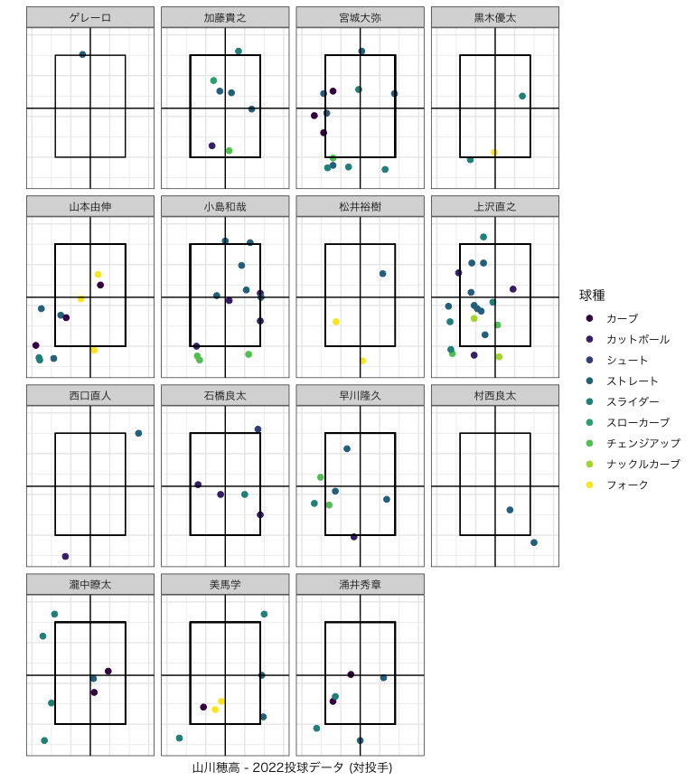

### 0.9.2 outcome

